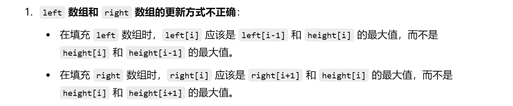
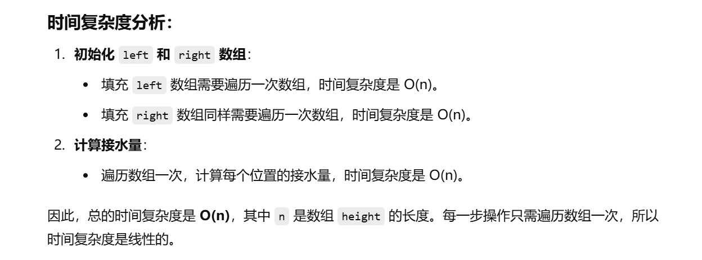

知识点：双指针


这个题之前做过


[42. 接雨水 - 力扣（LeetCode）](https://leetcode.cn/problems/trapping-rain-water/description/?envType=study-plan-v2&envId=top-100-liked)


这次思路完全没了


可以看 [42. 接雨水.md](..\入门算法题目\单调栈\42. 接雨水.md) 中的解法，很清晰，**尤其是基础想法怎么来的**


# 首先是基础想法，但下面犯了一个低级错误


```java
    class Solution {
        public int trap(int[] height) {
            int n = height.length;
            int[] left = new int[n];
            int[] right = new int[n];
            left[0] = height[0];
            right[n - 1] = height[n - 1];
            for (int i = 1; i < n; i++) {
                left[i] = Math.max(height[i], height[i - 1]);
            }

            for (int i = n - 2; i >= 0; i--) {
                right[i] = Math.max(height[i], height[i + 1]);
            }

            int ans = 0;
            for (int i = 1, curWater; i < n - 1; i++) {
                curWater = Math.max(0, Math.min(left[i - 1], right[i + 1]) - height[i]);
                ans += curWater;
            }
            return ans;
        }
    }
```





# 基础想法的正确写法


```java
class Solution {
    public int trap(int[] height) {
        int n = height.length; // 获取数组的长度
        // 如果数组为空，则无法接水，直接返回0
        if (n == 0) return 0;

        int[] left = new int[n];  // left[i] 表示从左侧到第i个位置的最高高度
        int[] right = new int[n]; // right[i] 表示从右侧到第i个位置的最高高度

        // 初始化 left[0] 和 right[n-1] 为数组的首尾元素
        left[0] = height[0];
        right[n - 1] = height[n - 1];

        // 填充 left 数组，从左到右更新每个位置的左侧最大高度
        for (int i = 1; i < n; i++) {
            left[i] = Math.max(height[i], left[i - 1]);  // left[i] 为左侧最大高度和当前高度的较大值
        }

        // 填充 right 数组，从右到左更新每个位置的右侧最大高度
        for (int i = n - 2; i >= 0; i--) {
            right[i] = Math.max(height[i], right[i + 1]); // right[i] 为右侧最大高度和当前高度的较大值
        }

        int ans = 0;  // 变量 ans 用来累加接到的雨水量
        // 从第二个位置到倒数第二个位置（即 i 从 1 到 n-2）
        for (int i = 1, curWater; i < n - 1; i++) {
            // 当前位置能够接到的水量：取当前高度与左右两侧最大高度的最小值减去当前高度
            // 如果计算出来的水量小于0，说明该位置不能接水，水量设为0
            curWater = Math.max(0, Math.min(left[i - 1], right[i + 1]) - height[i]);
            ans += curWater;  // 累加每个位置的接水量
        }
        return ans; // 返回接到的总雨水量
    }
}

```





# 双指针的优化写法


```java
class Solution {
    public int trap(int[] height) {
        int n = height.length;  // 获取数组的长度

        // 初始化双指针：左指针从位置1开始，右指针从倒数第二个位置开始
        int l = 1, r = n - 2;
        
        // 初始化左右边界的最大高度，lmax 为左侧最大高度，rmax 为右侧最大高度
        int lmax = height[0], rmax = height[n - 1];

        // 结果变量，记录接到的雨水总量
        int ans = 0;

        // 双指针遍历，直到左右指针相遇
        while (l <= r) {
            // 判断左边的最大高度 lmax 和右边的最大高度 rmax
            if (lmax <= rmax) {
                // 如果左边的最大高度小于等于右边的最大高度
                // 当前位置 l 能接到的水量是 lmax - height[l]（如果有水的话，水量为正）
                ans += Math.max(0, lmax - height[l]);
                // 更新左侧最大高度，取当前 l 和 lmax 中的较大值
                lmax = Math.max(lmax, height[l]);
                // 左指针向右移动
                l++;
            } else {
                // 如果右边的最大高度小于左边的最大高度
                // 当前位置 r 能接到的水量是 rmax - height[r]（如果有水的话，水量为正）
                ans += Math.max(0, rmax - height[r]);
                // 更新右侧最大高度，取当前 r 和 rmax 中的较大值
                rmax = Math.max(rmax, height[r]);
                // 右指针向左移动
                r--;
            }
        }

        // 返回接到的雨水总量
        return ans;
    }
}

```


### 代码解释：

1. **初始化阶段**：

   - `n` 是数组 `height` 的长度，表示有多少根柱子。
   - `l` 和 `r` 是双指针，分别指向数组的第二个元素和倒数第二个元素，初始化时分别设置为 `1` 和 `n-2`。
   - `lmax` 和 `rmax` 分别表示从左侧到当前位置和从右侧到当前位置的最大高度。初始化时，`lmax` 被设置为第一个柱子的高度，`rmax` 被设置为最后一个柱子的高度。
   - `ans` 用于记录接到的雨水总量，初始化为 0。

2. **双指针遍历**：

   - 双指针 `l` 和 `r` 分别从左边和右边开始向中间收缩，直到两个指针相遇为止。

   - 在每次迭代中，我们判断当前左边的最大高度 (

     ```
     lmax
     ```

     ) 和右边的最大高度 (

     ```
     rmax
     ```

     )。

     - **如果左边的最大高度小于等于右边的最大高度**，说明当前接水量是由左边的最大高度决定的。此时，我们计算左侧位置 `l` 的接水量，即 `lmax - height[l]`。如果这个值是负的，则说明当前位置不能接水，因此接水量为 0。
     - 然后，更新 `lmax` 为当前位置 `l` 和当前 `lmax` 中的较大值，并将左指针 `l` 向右移动。
     - **如果右边的最大高度小于左边的最大高度**，则类似地，计算右侧位置 `r` 的接水量，并更新 `rmax`，然后将右指针 `r` 向左移动。

3. **结束条件**：

   - 双指针遍历继续，直到 `l` 指针超过 `r` 指针，表示所有可能的接水量已经被计算出来。

4. **返回结果**：

   - 最后返回 `ans`，即接到的总雨水量。

### 时间复杂度分析：

- **时间复杂度**：
  - 由于双指针遍历是线性进行的，每个位置只会被访问一次，时间复杂度是 **O(n)**，其中 `n` 是数组 `height` 的长度。
- **空间复杂度**：
  - 该算法只使用了常数的额外空间（除了输入数组 `height`），如 `l`, `r`, `lmax`, `rmax` 和 `ans`。因此，空间复杂度是 **O(1)**。