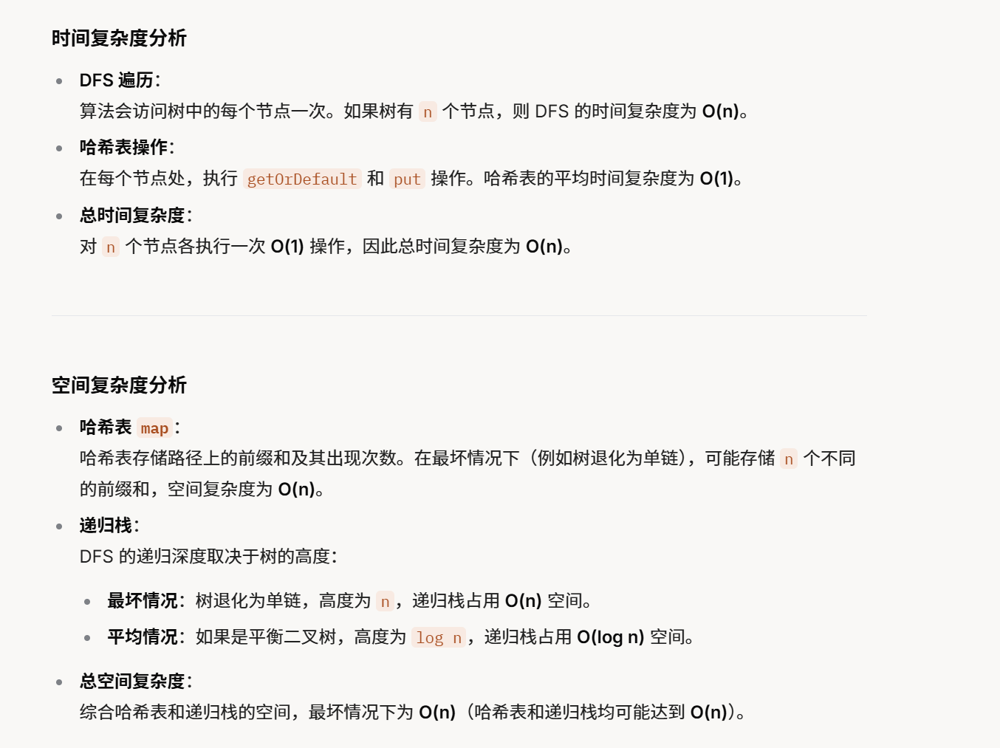

没做过


[437. 路径总和 III - 力扣（LeetCode）](https://leetcode.cn/problems/path-sum-iii/description/?envType=study-plan-v2&envId=top-100-liked)


不会

# 一种暴力遍历

```java
class Solution {
    int target; // 目标路径和
    int ans;    // 记录满足条件的路径数量

    public int pathSum(TreeNode root, int targetSum) {
        target = targetSum; // 初始化目标路径和
        dfs(root); // 对整棵树进行 DFS 遍历
        return ans; // 返回符合条件的路径总数
    }

    // 遍历整棵二叉树，每个节点都作为起点进行路径查找
    public void dfs(TreeNode root) {
        if (root == null) {
            return; // 递归终止条件：空节点
        }
        dfs2(root, 0); // 从当前节点出发查找路径和等于 target 的路径
        dfs(root.left); // 递归处理左子树
        dfs(root.right); // 递归处理右子树
    }

    // 计算从当前节点出发的所有可能路径和
    public void dfs2(TreeNode root, long sum) {
        if (root == null) {
            return; // 递归终止条件：空节点
        }
        sum += root.val; // 累加当前路径的和
        if (sum == target) { // 如果路径和等于 target，则计数加一
            ans++;
        }
        dfs2(root.left, sum); // 递归查找左子树
        dfs2(root.right, sum); // 递归查找右子树
    }
}

```


# 前缀和


```java
class Solution {
    int ans; // 全局变量，用于记录和为 targetSum 的路径数量

    /**
     * 主函数，用于计算二叉树中路径和为 targetSum 的路径数量
     * @param root 二叉树的根节点
     * @param targetSum 目标路径和
     * @return 满足条件的路径数量
     */
    public int pathSum(TreeNode root, int targetSum) {
        // 创建一个哈希表，用于存储路径上的前缀和及其出现次数
        Map<Long, Integer> map = new HashMap<>();
        // 初始化哈希表，放入前缀和 0 出现 1 次（用于处理从根节点开始的路径）
        map.put((long) 0, 1);
        // 调用 DFS 函数开始遍历整个树
        dfs(root, 0, targetSum, map);
        // 返回最终结果
        return ans;
    }

    /**
     * 深度优先搜索（DFS）函数，遍历树并统计满足条件的路径
     * @param root 当前处理的节点
     * @param sum 从根节点到当前节点的前缀和
     * @param target 目标和
     * @param map 存储前缀和及其出现次数的哈希表
     */
    public void dfs(TreeNode root, long sum, int target, Map<Long, Integer> map) {
        // 基本情况：如果当前节点为空，返回
        if (root == null) {
            return;
        }
        // 更新当前的前缀和，累加当前节点的值
        sum += root.val;
        // 检查是否存在一个前缀和，使得 (当前前缀和 - 该前缀和) 等于 target
        // 如果存在，说明从某个祖先节点到当前节点的路径和为 target
        ans += map.getOrDefault(sum - target, 0);
        // 将当前的前缀和加入哈希表，增加其出现次数
        map.put(sum, map.getOrDefault(sum, 0) + 1);
        // 递归处理左子树，传入更新后的前缀和
        dfs(root.left, sum, target, map);
        // 递归处理右子树，传入更新后的前缀和
        dfs(root.right, sum, target, map);
        // 回溯：将当前前缀和的出现次数减 1，确保不影响其他路径
        map.put(sum, map.getOrDefault(sum, 0) - 1);
    }
}
```


