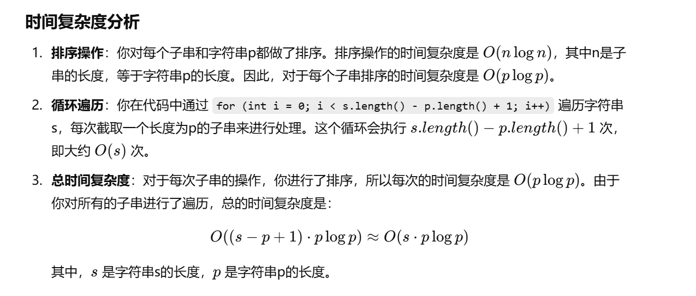
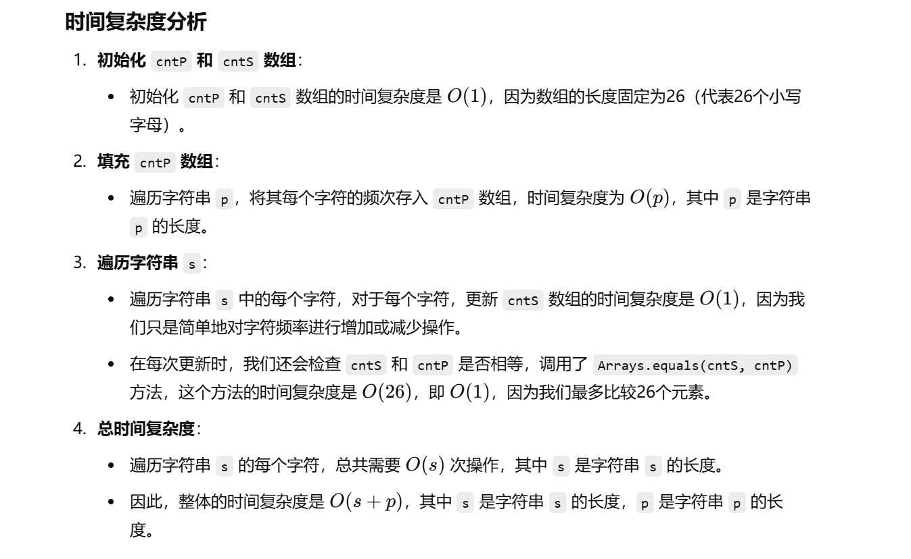

这个题之前做过


知识点：滑动窗口


[438. 找到字符串中所有字母异位词 - 力扣（LeetCode）](https://leetcode.cn/problems/find-all-anagrams-in-a-string/description/?envType=study-plan-v2&envId=top-100-liked)


忘了咋做了


# 暴力做法（会超时）


```java
class Solution {
    // 主方法：找出字符串s中所有与字符串p是字母异位词的子串的起始位置
    public List<Integer> findAnagrams(String s, String p) {
        // 结果列表，用于存储所有符合条件的起始位置
        ArrayList<Integer> ans = new ArrayList<>();
        
        // 将字符串p转化为字符数组
        char[] pc = p.toCharArray();
        // 对字符数组pc进行排序
        Arrays.sort(pc);
        // 将排序后的字符数组转化为字符串，这个字符串用来后续比较
        String p1 = Arrays.toString(pc);
        
        // 遍历字符串s，查找所有长度为p.length()的子串
        for (int i = 0; i < s.length() - p.length() + 1; i++) {
            // 提取当前子串
            String s1 = s.substring(i, i + p.length());
            // 将当前子串转化为字符数组
            char[] sc = s1.toCharArray();
            // 对当前子串的字符数组进行排序
            Arrays.sort(sc);
            // 将排序后的字符数组转化为字符串
            String s2 = Arrays.toString(sc);
            
            // 比较排序后的当前子串与p的排序结果是否相同
            if (s2.equals(p1)) {
                // 如果相同，说明当前子串是p的一个异位词，记录下该子串的起始位置
                ans.add(i);
            }
        }
        
        // 返回所有符合条件的子串起始位置
        return ans;
    }
}

```





# 正确做法，用滑动窗口


[438. 找到字符串中所有字母异位词 - 力扣（LeetCode）](https://leetcode.cn/problems/find-all-anagrams-in-a-string/solutions/2969498/liang-chong-fang-fa-ding-chang-hua-chuan-14pd/?envType=study-plan-v2&envId=top-100-liked)**左神讲解**


```java
class Solution {
    public List<Integer> findAnagrams(String s, String p) {
        // 结果列表，用于存储所有符合条件的起始位置
        List<Integer> ans = new ArrayList<>();
        
        // 统计 p 中每个字符的出现次数
        int[] cntP = new int[26]; // 统计 p 的每种字母的出现次数
        // 统计 s 中当前窗口内每个字符的出现次数
        int[] cntS = new int[26]; // 统计 s 的长为 p.length() 的子串 s' 的每种字母的出现次数
        
        // 填充 cntP 数组，统计 p 中每个字符的频次
        for (char c : p.toCharArray()) {
            cntP[c - 'a']++; // 统计 p 的字母
        }
        
        // 遍历字符串 s，通过滑动窗口的方式查找所有与 p 是字母异位词的子串
        for (int right = 0; right < s.length(); right++) {
            // 右端点字母进入窗口
            cntS[s.charAt(right) - 'a']++;
            
            // 计算左端点的位置，确保窗口大小为 p.length()
            int left = right - p.length() + 1;
            
            // 如果窗口的长度还不够 p.length()，跳过当前的情况
            if (left < 0) {
                continue;
            }
            
            // 如果当前窗口 cntS 和 p 的字符频率相同，说明这是一个异位词
            if (Arrays.equals(cntS, cntP)) {
                ans.add(left); // 将左端点的位置加入到结果中
            }
            
            // 让窗口左端点的字符离开窗口，更新 cntS
            cntS[s.charAt(left) - 'a']--;
        }
        
        // 返回所有符合条件的子串的起始位置
        return ans;
    }
}

```


### 详细注释解释

1. **`cntP` 和 `cntS` 数组**：
   - `cntP` 用于记录字符串 `p` 中每个字母出现的频次（大小为26，代表26个小写字母）。
   - `cntS` 用于记录字符串 `s` 中当前滑动窗口（长度为 `p.length()`）内每个字母出现的频次。
2. **统计 `p` 中每个字符的出现频次**：
   - 我们遍历字符串 `p` 中的每个字符，并将其在 `cntP` 数组中的对应位置加1，记录字符的出现次数。
3. **滑动窗口遍历 `s`**：
   - 通过 `right` 指针遍历字符串 `s`，这个指针代表窗口的右边界。
   - 每次右端点 `right` 字符进入窗口时，更新 `cntS` 中相应字符的频次。
   - 计算左端点 `left = right - p.length() + 1`，如果窗口的长度不足 `p.length()`，则跳过当前的操作。
   - 如果窗口内的字符频率（`cntS`）与 `p` 的字符频率（`cntP`）一致，说明当前窗口是 `p` 的一个异位词，记录下当前窗口的左端点 `left`。
4. **滑动窗口的左端点更新**：
   - 每次滑动窗口时，我们需要将窗口的左端点字符从窗口中移除。通过 `cntS[s.charAt(left) - 'a']--`，更新 `cntS` 数组，减少对应字符的频次。
5. **返回结果**：
   - 返回所有符合条件的子串的起始位置，这些位置存储在 `ans` 列表中。



