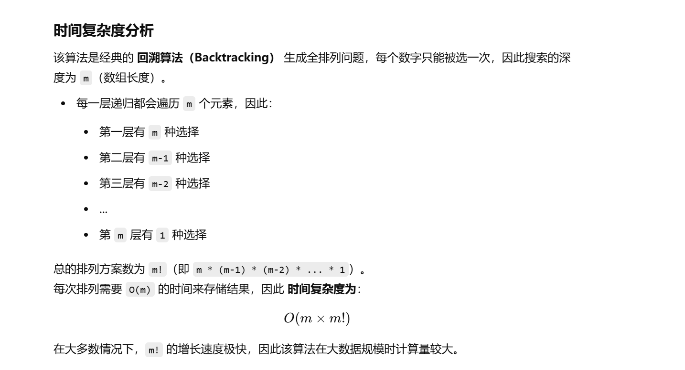

做过


[46. 全排列 - 力扣（LeetCode）](https://leetcode.cn/problems/permutations/description/?envType=study-plan-v2&envId=top-100-liked)


[代码随想录](https://www.programmercarl.com/0046.全排列.html#算法公开课)


# 自己想的回溯


```java
import java.util.ArrayList;
import java.util.List;

class Solution {
    // 存储所有的排列结果
    List<List<Integer>> ans = new ArrayList<>();

    public List<List<Integer>> permute(int[] nums) {
        int m = nums.length;  // 数组长度
        boolean[] visited = new boolean[m];  // 记录数组中元素是否被访问
        dfs(nums, visited, 0, m, 0, new ArrayList<>());  // 递归求解全排列
        return ans;  // 返回最终的排列结果
    }

    /**
     * 深度优先搜索（DFS）用于生成全排列
     *
     * @param nums    原始数组
     * @param visited 记录哪些元素已经被使用
     * @param index   当前递归的层级（实际上没有用到）
     * @param m       数组的长度
     * @param count   当前已经选择的元素个数
     * @param temp    当前排列的临时列表
     */
    public void dfs(int[] nums, boolean[] visited, int index, int m, int count, List<Integer> temp) {
        if (count == m) {  // 当所有元素都已选择，加入结果集
            ans.add(new ArrayList<>(temp));  // 注意要新建列表，否则会被后续修改
            return;
        }
        count++;  // 递归时，当前选择元素的数量 +1

        // 遍历所有元素，尝试加入当前排列
        for (int i = 0; i < m; i++) {
            if (visited[i]) {  // 如果当前元素已经被选择，则跳过
                continue;
            }

            visited[i] = true;  // 标记当前元素为已使用
            temp.add(nums[i]);  // 加入当前排列

            dfs(nums, visited, i, m, count, temp);  // 递归搜索下一层

            temp.remove(temp.size() - 1);  // 回溯：移除最后一个元素，尝试其他可能的排列
            visited[i] = false;  // 取消当前元素的访问标记
        }
    }
}

```

