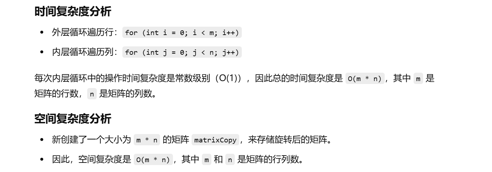

之前没做过


知识点：模拟


[48. 旋转图像 - 力扣（LeetCode）](https://leetcode.cn/problems/rotate-image/description/?envType=study-plan-v2&envId=top-100-liked)


# 自己想的算法，利用辅助数组


```java
class Solution {
    // 旋转矩阵的主函数
    public void rotate(int[][] matrix) {
        int m = matrix.length;    // 获取矩阵的行数
        int n = matrix[0].length;  // 获取矩阵的列数

        // 创建一个新的矩阵 matrixCopy 来存储旋转后的矩阵
        int[][] matrixCopy = new int[m][n];
        
        // 遍历原始矩阵，进行旋转操作
        for (int i = 0; i < m; i++) {       // 遍历行
            for (int j = 0; j < n; j++) {   // 遍历列
                // 旋转操作：将原矩阵的元素 matrix[i][j] 放入 matrixCopy[j][n - 1 - i]
                matrixCopy[j][n - 1 - i] = matrix[i][j];
            }
        }

        // 将旋转后的结果从 matrixCopy 复制回原始的 matrix
        for (int i = 0; i < m; i++) {       // 遍历行
            for (int j = 0; j < n; j++) {   // 遍历列
                matrix[i][j] = matrixCopy[i][j];  // 复制到原矩阵
            }
        }
    }
}

```




# 不借助辅助矩阵的算法


题解：[48. 旋转图像 - 力扣（LeetCode）](https://leetcode.cn/problems/rotate-image/solutions/526980/xuan-zhuan-tu-xiang-by-leetcode-solution-vu3m/?envType=study-plan-v2&envId=top-100-liked)


```java
class Solution {
    // 旋转二维矩阵 90 度
    public void rotate(int[][] matrix) {
        int n = matrix.length;  // 获取矩阵的行数（列数和行数相同，故用 n 表示）

        // 遍历矩阵的层数（总共有 n / 2 层）
        for (int i = 0; i < n / 2; i++) {
            // 遍历每一层的元素，处理每个环状层
            for (int j = 0; j < (n + 1) / 2; j++) {
                // 暂存当前元素，以便后续交换使用
                int tmp = matrix[i][j];
                
                //拿个4*4或者5*5的其中一个点画一下图就知道了
                matrix[i][j] = matrix[n - 1 - j][i];
                
          
                matrix[n - 1 - j][i] = matrix[n - 1 - i][n - 1 - j];
                
             
                matrix[n - 1 - i][n - 1 - j] = matrix[j][n - 1 - i];
                
           
                matrix[j][n - 1 - i] = tmp;
            }
        }
    }
}

```

