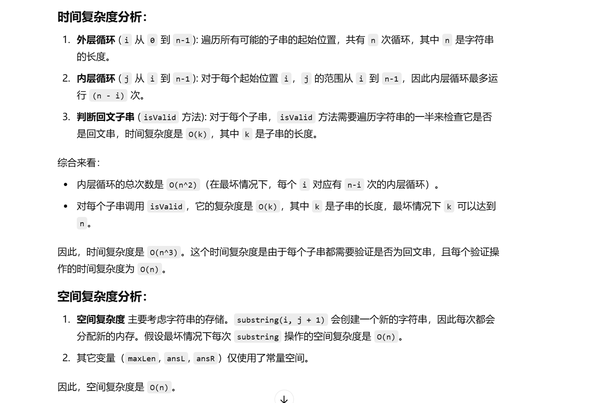
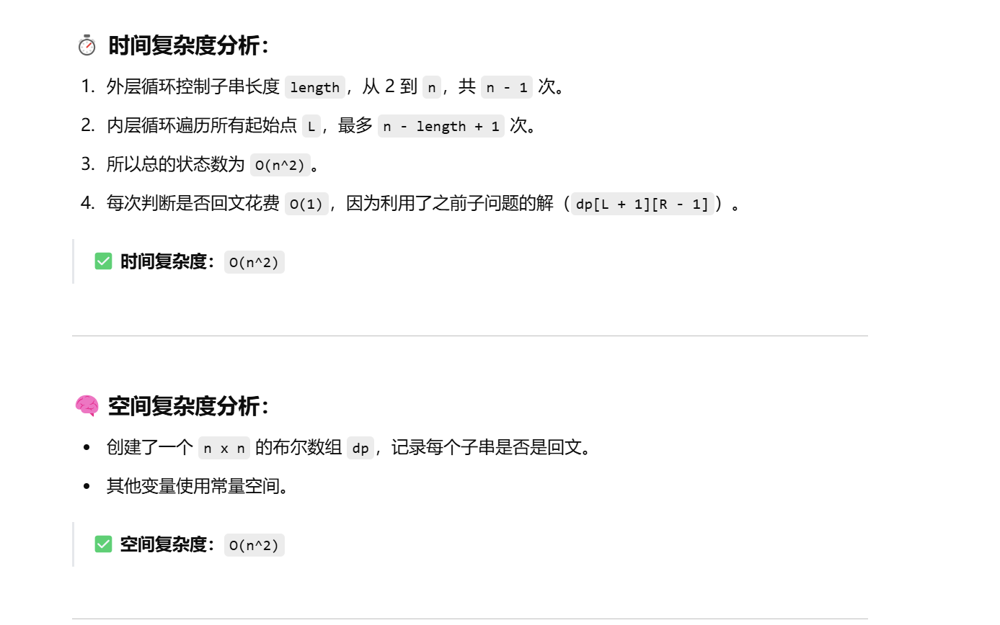

没做过


[5. 最长回文子串 - 力扣（LeetCode）](https://leetcode.cn/problems/longest-palindromic-substring/description/?envType=study-plan-v2&envId=top-100-liked)


# 自己写的暴力，最后一个用例超时了


```java
class Solution {
    // 方法：找到字符串中最长的回文子串
    public String longestPalindrome(String s) {
        // 初始化最大回文子串的长度为最小整数值，确保可以找到最大长度
        int maxLen = Integer.MIN_VALUE;
        // 初始化回文子串的左边界和右边界
        int ansL = 0, ansR = 0;

        // 外层循环：遍历字符串的每一个可能的起始位置 i
        for (int i = 0; i < s.length(); i++) {
            // 内层循环：遍历字符串的每一个可能的结束位置 j
            for (int j = i; j < s.length(); j++) {
                // 判断从 i 到 j 的子串是否为回文串
                if (isValid(s.substring(i, j + 1))) {
                    // 如果是回文串且长度大于当前最大回文串的长度
                    if (j - i + 1 > maxLen) {
                        // 更新最大回文串的长度
                        maxLen = j - i + 1;
                        // 更新回文串的左边界和右边界
                        ansL = i;
                        ansR = j + 1;
                    }
                }
            }
        }
        // 返回最大回文子串
        return s.substring(ansL, ansR);
    }

    // 方法：判断一个字符串是否是回文串
    public boolean isValid(String str) {
        int l = 0;
        int r = str.length() - 1;
        // 从两端向中间检查，若字符不相等则不是回文串
        while (l <= r) {
            if (str.charAt(l) == str.charAt(r)) {
                l++;  // 左指针向右移动
                r--;  // 右指针向左移动
            } else {
                // 如果字符不相等，返回 false
                return false;
            }
        }
        // 如果所有字符都相等，返回 true
        return true;
    }
}

```





# dp优化


```java
class Solution {
    public String longestPalindrome(String s) {
        // 如果字符串长度小于2，直接返回（空串或单字符一定是回文串）
        if (s.length() < 2) {
            return s;
        }

        int n = s.length();
        // 创建一个二维布尔数组 dp，dp[i][j] 表示子串 s[i...j] 是否为回文串
        boolean[][] dp = new boolean[n][n];

        // 所有长度为1的子串都是回文串（对角线为 true）
        for (int i = 0; i < n; i++) {
            dp[i][i] = true;
        }

        // 记录最长回文子串的起始位置
        int start = 0;
        // 记录最长回文子串的长度，初始为1
        int maxLen = 1;

        // 枚举子串长度从 2 到 n
        for (int length = 2; length <= n; length++) {
            // 枚举子串的左边界 L，右边界 R = L + length - 1
            for (int L = 0; L <= n - length; L++) {
                int R = L + length - 1;

                // 如果 s[L] == s[R]，并且子串 s[L+1...R-1] 是回文串，则 s[L...R] 是回文串
                if (s.charAt(L) == s.charAt(R)) {
                    // 特别地，当子串长度为2时，只要两端相等就是回文
                    if (length == 2 || dp[L + 1][R - 1]) {
                        dp[L][R] = true;

                        // 如果当前回文子串长度比之前记录的最大长度还大，则更新起始位置和长度
                        if (length > maxLen) {
                            start = L;
                            maxLen = length;
                        }
                    }
                }
                // 如果 s[L] != s[R]，则 dp[L][R] 默认为 false，无需显式赋值
            }
        }

        // 返回最长回文子串
        return s.substring(start, start + maxLen);
    }
}


```



