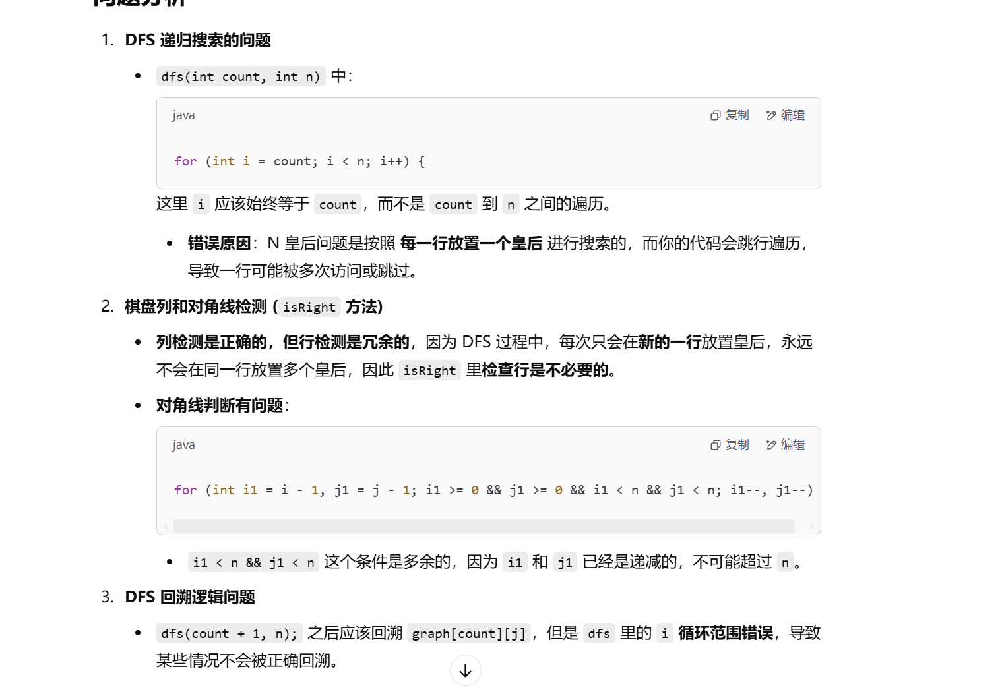

做过


[51. N 皇后 - 力扣（LeetCode）](https://leetcode.cn/problems/n-queens/?envType=study-plan-v2&envId=top-100-liked)


# 自己写的，有错误


```java
    class Solution {
        char[][] graph;
        List<List<String>> ans;
        int count = 0;

        public List<List<String>> solveNQueens(int n) {
            graph = new char[n][n];
            ans = new ArrayList<>();

            for (char[] chars : graph) {
                Arrays.fill(chars, '.');
            }

            dfs(0, n);

            return ans;

        }

        public void dfs(int count, int n) {
            if (count == n) {
                List<String> temp = new ArrayList<>();
                for (char[] chars : graph) {
                    temp.add(new String(chars));
                }
                ans.add(temp);
                return;
            }
            for (int i = count; i < n; i++) {
                for (int j = 0; j < n; j++) {
                    if (isRight(i, j, n)) {
                        graph[i][j] = 'Q';
                        dfs(count + 1, n);
                        graph[i][j] = '.';
                    }
                }
            }
        }

        public boolean isRight(int i, int j, int n) {
            for (int k = 0; k < n; k++) {
                if (k != i && graph[k][j] == 'Q') {
                    return false;
                }
            }
            for (int k = 0; k < n; k++) {
                if (k != j && graph[i][k] == 'Q') {
                    return false;
                }
            }
            for (int i1 = i - 1, j1 = j - 1; i1 >= 0 && j1 >= 0 && i1 < n && j1 < n; i1--, j1--) {
                if (graph[i1][j1] == 'Q') {
                    return false;
                }
            }

            for (int i1 = i - 1, j1 = j + 1; i1 >= 0 && j1 >= 0 && i1 < n && j1 < n; i1--, j1++) {
                if (graph[i1][j1] == 'Q') {
                    return false;
                }
            }

            for (int i1 = i + 1, j1 = j - 1; i1 >= 0 && j1 >= 0 && i1 < n && j1 < n; i1++, j1--) {
                if (graph[i1][j1] == 'Q') {
                    return false;
                }
            }

            for (int i1 = i + 1, j1 = j + 1; i1 >= 0 && j1 >= 0 && i1 < n && j1 < n; i1++, j1++) {
                if (graph[i1][j1] == 'Q') {
                    return false;
                }
            }

            return true;
        }
    }
```





# 正确解答


```java
import java.util.*;

class Solution {
    // 定义棋盘 graph，使用二维字符数组存储
    char[][] graph;
    // 存储最终的所有解
    List<List<String>> ans;

    // 主函数，求解 N 皇后问题
    public List<List<String>> solveNQueens(int n) {
        graph = new char[n][n]; // 初始化棋盘大小 n*n
        ans = new ArrayList<>(); // 存储结果的列表

        // 初始化棋盘，所有位置填充为 '.'
        for (char[] chars : graph) {
            Arrays.fill(chars, '.');
        }

        // 调用 DFS 进行回溯搜索
        dfs(0, n);

        return ans;
    }

    // 递归深度优先搜索 DFS，参数 i 表示当前处理的行数
    public void dfs(int i, int n) {
        // 递归终止条件：如果 i 达到 n，说明成功放置了 n 个皇后
        if (i == n) {
            // 构造一个解的列表，将棋盘当前状态转为字符串列表
            List<String> temp = new ArrayList<>();
            for (char[] chars : graph) {
                temp.add(new String(chars)); // 将每一行转换成字符串
            }
            ans.add(temp); // 将解添加到结果集
            return;
        }

        // 遍历当前行的每一列，尝试放置皇后
        for (int j = 0; j < n; j++) {
            // 检查当前位置 (i, j) 是否可以安全放置皇后
            if (isRight(i, j, n)) {
                graph[i][j] = 'Q'; // 放置皇后
                dfs(i + 1, n); // 递归进入下一行
                graph[i][j] = '.'; // 回溯，撤销皇后
            }
        }
    }

    // 检查当前位置 (i, j) 是否可以放置皇后
    public boolean isRight(int i, int j, int n) {
        // 1. 检查当前列是否有皇后
        for (int k = 0; k < n; k++) {
            if (k != i && graph[k][j] == 'Q') { // 遍历整列，检查是否已有皇后
                return false;
            }
        }


        // 2. 检查左上对角线
        for (int i1 = i - 1, j1 = j - 1; i1 >= 0 && j1 >= 0; i1--, j1--) {
            if (graph[i1][j1] == 'Q') {
                return false;
            }
        }

        // 3. 检查右上对角线
        for (int i1 = i - 1, j1 = j + 1; i1 >= 0 && j1 < n; i1--, j1++) {
            if (graph[i1][j1] == 'Q') {
                return false;
            }
        }

        return true; // 如果所有条件都满足，说明当前位置是安全的
    }
}

```

