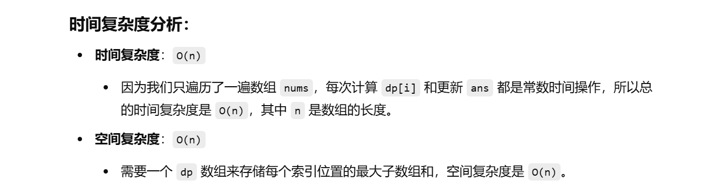

之前做过这题


知识点：动态规划


[53. 最大子数组和 - 力扣（LeetCode）](https://leetcode.cn/problems/maximum-subarray/description/?envType=study-plan-v2&envId=top-100-liked)


```java
class Solution {
    public int maxSubArray(int[] nums) {
        int n = nums.length; // 获取数组的长度
        int[] dp = new int[n]; // dp[i] 表示以 nums 数组中索引 i 结尾的连续子数组的最大和
        dp[0] = nums[0]; // 初始条件，第一个元素的最大子数组和就是它本身
        int ans = dp[0]; // 初始化答案为 dp[0]，即数组的第一个元素

        // 遍历数组，从第二个元素开始，计算以每个元素结尾的子数组的最大和
        for (int i = 1; i < n; i++) {
            // dp[i] 为当前元素 nums[i] 与以 nums[i-1] 结尾的最大子数组和相加，或是当前元素本身，
            // 我们取这两个值中的较大者，表示是否继续延续之前的子数组，还是重新以当前元素作为新子数组的开始
            dp[i] = Math.max(dp[i - 1] + nums[i], nums[i]);
            
            // 更新全局最大子数组和
            ans = Math.max(ans, dp[i]);
        }
        return ans; // 返回最终的最大子数组和
    }
}

```



