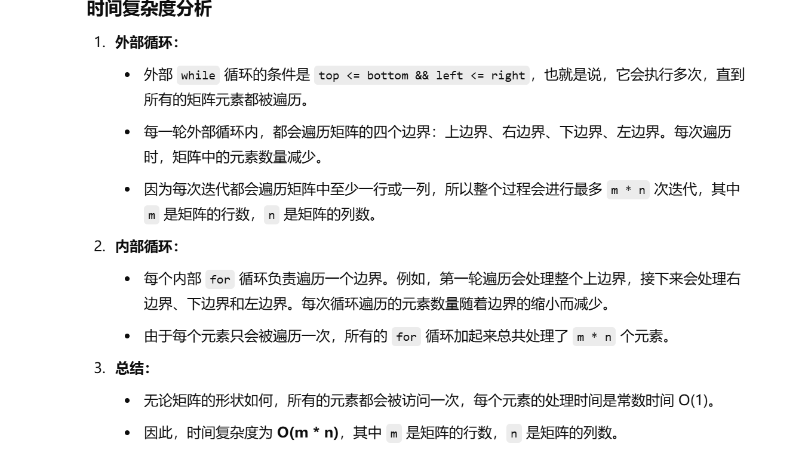
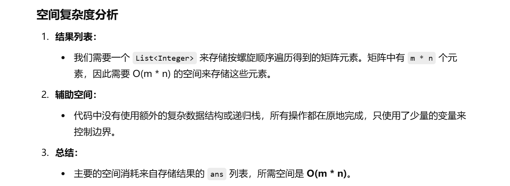
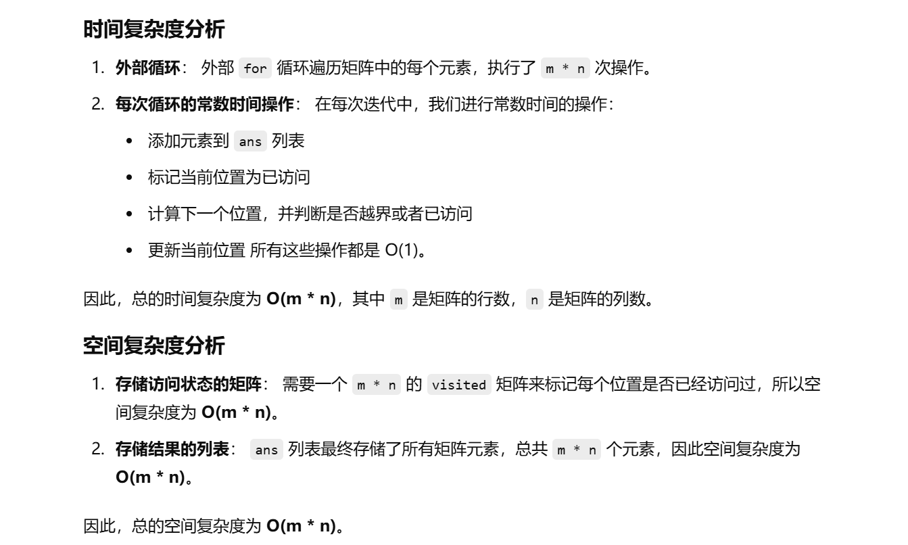

之前做过


[54. 螺旋矩阵 - 力扣（LeetCode）](https://leetcode.cn/problems/spiral-matrix/description/?envType=study-plan-v2&envId=top-100-liked)


知识点：模拟


这次没做出来


# gpt给的一种做法

```java
class Solution {
    public List<Integer> spiralOrder(int[][] matrix) {
        // 创建一个结果列表 ans，用于存储按螺旋顺序遍历的元素
        List<Integer> ans = new ArrayList<>();
        
        // 如果矩阵为空或者没有行，直接返回空列表
        if (matrix == null || matrix.length == 0) {
            return ans;
        }

        // 定义四个边界变量，top、bottom、left 和 right，分别表示矩阵的四个边界
        // 初始时，top 是第一行，bottom 是最后一行，left 是第一列，right 是最后一列
        int top = 0, bottom = matrix.length - 1;
        int left = 0, right = matrix[0].length - 1;

        // 当四个边界没有交错时，继续循环遍历矩阵
        while (top <= bottom && left <= right) {
            // 从左到右遍历上边界
            // 在上边界的每一列（从 left 到 right）依次取值
            for (int j = left; j <= right; j++) {
                ans.add(matrix[top][j]);
            }
            // 遍历完上边界后，top 增加，表示已经处理过这一行
            top++;

            // 从上到下遍历右边界
            // 在右边界的每一行（从 top 到 bottom）依次取值
            for (int i = top; i <= bottom; i++) {
                ans.add(matrix[i][right]);
            }
            // 遍历完右边界后，right 减少，表示已经处理过这一列
            right--;

            // 如果还剩有效的行，继续遍历下边界
            if (top <= bottom) {
                // 从右到左遍历下边界
                // 在下边界的每一列（从 right 到 left）依次取值
                for (int j = right; j >= left; j--) {
                    ans.add(matrix[bottom][j]);
                }
                // 遍历完下边界后，bottom 减少，表示已经处理过这一行
                bottom--;
            }

            // 如果还剩有效的列，继续遍历左边界
            if (left <= right) {
                // 从下到上遍历左边界
                // 在左边界的每一行（从 bottom 到 top）依次取值
                for (int i = bottom; i >= top; i--) {
                    ans.add(matrix[i][left]);
                }
                // 遍历完左边界后，left 增加，表示已经处理过这一列
                left++;
            }
        }

        // 返回按螺旋顺序遍历得到的所有元素
        return ans;
    }
}

```







# 灵神做法


```java
class Solution {
    public List<Integer> spiralOrder(int[][] matrix) {
        int m = matrix.length;  // 获取矩阵的行数
        int n = matrix[0].length;  // 获取矩阵的列数
        boolean[][] visited = new boolean[m][n];  // 创建一个布尔矩阵，用于标记已访问的元素

        // 方向数组：右、下、左、上
        int[] dx = new int[]{0, 1, 0, -1};  // dx数组表示在x方向的增量，顺时针方向依次是右、下、左、上
        int[] dy = new int[]{1, 0, -1, 0};  // dy数组表示在y方向的增量，顺时针方向依次是右、下、左、上

        int count = m * n;  // 计算矩阵中元素的总数
        int x = 0, y = 0;  // 当前的位置，初始化为矩阵的左上角 (0, 0)
        int dir = 0;  // 当前的方向，初始化为右（即dir = 0）
        List<Integer> ans = new ArrayList<>();  // 用于存放螺旋顺序遍历的结果

        // 遍历所有元素，总共遍历 m * n 次
        for (int k = 0; k < count; k++) {
            ans.add(matrix[x][y]);  // 将当前元素加入结果列表
            visited[x][y] = true;  // 标记当前位置为已访问

            // 计算下一个位置 (nx, ny)
            int nx = x + dx[dir];  // 计算下一个x坐标
            int ny = y + dy[dir];  // 计算下一个y坐标

            // 判断下一个位置是否越界或已经访问过
            if (nx < 0 || ny < 0 || nx >= m || ny >= n || visited[nx][ny]) {
                dir = (dir + 1) % 4;  // 如果越界或者已访问，改变方向，顺时针旋转
            }

            // 更新当前位置为下一个位置
            x = x + dx[dir];
            y = y + dy[dir];
        }

        return ans;  // 返回螺旋顺序遍历的结果
    }
}

```



