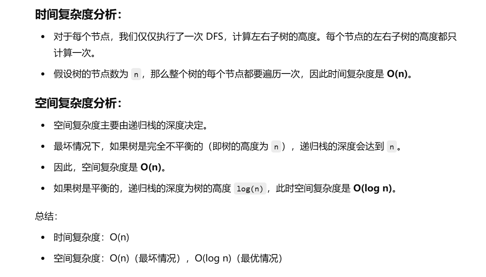

没做过


[543. 二叉树的直径 - 力扣（LeetCode）](https://leetcode.cn/problems/diameter-of-binary-tree/description/?envType=study-plan-v2&envId=top-100-liked)


```java
class Solution {
    // 存储最终的直径值（最大路径长度）
    int ans;

    // 主函数，调用 DFS 遍历树并返回最终的直径
    public int diameterOfBinaryTree(TreeNode root) {
        dfs(root);  // 执行深度优先搜索
        return ans;  // 返回最终的直径
    }

    // 深度优先搜索递归函数，计算每个节点的左右子树高度并更新最大直径
    public int dfs(TreeNode root) {
        if (root == null) {  // 如果当前节点为空，返回高度 0
            return 0;
        }

        // 递归计算左子树的高度
        int left = dfs(root.left);
        // 递归计算右子树的高度
        int right = dfs(root.right);

        // 更新最大直径。注意：当前节点的直径是左右子树的高度之和。
        ans = Math.max(ans, left + right);

        // 返回当前节点的高度，当前节点的高度是左右子树中较大的那个高度 + 1
        return Math.max(left, right) + 1;
    }
}

```


