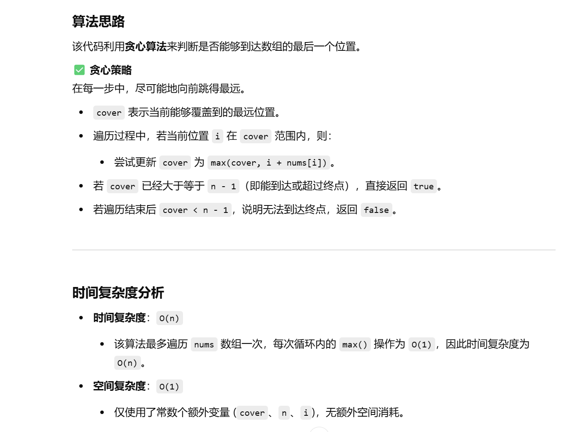

做过


[55. 跳跃游戏 - 力扣（LeetCode）](https://leetcode.cn/problems/jump-game/description/?envType=study-plan-v2&envId=top-100-liked)


[代码随想录](https://www.programmercarl.com/0055.跳跃游戏.html#算法公开课)


思路记得，忘了咋实现了


```java
class Solution {
    public boolean canJump(int[] nums) {
        // 变量 cover 表示当前能覆盖到的最远位置
        int cover = 0;
        // 获取数组的长度
        int n = nums.length;

        // 遍历数组，每次尝试更新能到达的最远位置
        // 注意：`i <= cover` 表示只遍历在可达范围内的元素
        for (int i = 0; i <= cover; i++) {
            // 更新当前能到达的最远位置
            cover = Math.max(cover, i + nums[i]);

            // 如果最远可达位置已覆盖最后一个元素，立即返回 true
            if (cover >= n - 1) {
                return true;
            }
        }

        // 如果遍历结束后仍无法覆盖终点，返回 false
        return false;
    }
}

```


