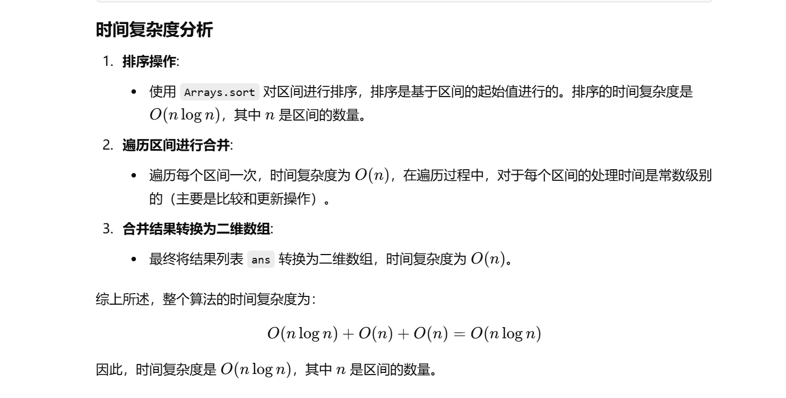

之前做过这题


[56. 合并区间 - 力扣（LeetCode）](https://leetcode.cn/problems/merge-intervals/description/?envType=study-plan-v2&envId=top-100-liked)


知识点：感觉就是模拟，主要是怎么把list转换为二维数组


没做出来


```java
class Solution {
    public int[][] merge(int[][] intervals) {
        
        // 按照每个区间的起始值进行排序
        Arrays.sort(intervals, new Comparator<int[]>() {
            @Override
            public int compare(int[] o1, int[] o2) {
                // 返回 o1 起始值与 o2 起始值的差，进行升序排序
                return o1[0] - o2[0];
            }
        });

        // 用一个列表来存储最终的合并结果
        List<int[]> ans = new ArrayList<>();
        
        // 遍历每个区间进行合并
        for (int[] interval : intervals) {
            // 如果结果列表为空，或者当前区间的起始值大于上一合并区间的结束值
            // 则说明当前区间与之前的区间不重合，可以直接加入结果列表
            if (ans.isEmpty() || ans.get(ans.size() - 1)[1] < interval[0]) {
                ans.add(interval);  // 直接添加当前区间
            } else {
                // 否则，当前区间和上一个区间有重叠，合并它们
                // 更新上一个区间的结束值为两者结束值中的较大值
                ans.get(ans.size() - 1)[1] = Math.max(ans.get(ans.size() - 1)[1], interval[1]);
            }
        }

        // 将列表转化为二维数组并返回
        return ans.toArray(new int[ans.size()][]);
    }
}

```





