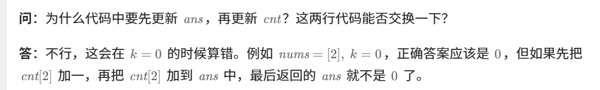

这个题没做过


知识点：前缀和


[560. 和为 K 的子数组 - 力扣（LeetCode）](https://leetcode.cn/problems/subarray-sum-equals-k/description/?envType=study-plan-v2&envId=top-100-liked)


灵神讲解：[560. 和为 K 的子数组 - 力扣（LeetCode）](https://leetcode.cn/problems/subarray-sum-equals-k/solutions/2781031/qian-zhui-he-ha-xi-biao-cong-liang-ci-bi-4mwr/?envType=study-plan-v2&envId=top-100-liked)，包括解释了为什么不能用滑动窗口


视频讲解：[算法面试实录-和为 k 的子数组_哔哩哔哩_bilibili](https://www.bilibili.com/video/BV1gN411E7Zx/?spm_id_from=333.337.search-card.all.click&vd_source=b5cc04f324fc9d6ee48a5febd77392fc)


# 自己想的暴力


```java
class Solution {
    // 定义一个方法来统计和为 k 的子数组的个数
    public int subarraySum(int[] nums, int k) {
        int n = nums.length;  // 获取数组的长度
        int ans = 0;  // 用于存储和为 k 的子数组的个数
        int temp = 0;  // 用于暂时存储从当前索引 i 到某个 j 索引的子数组的和

        // 外层循环遍历数组中的每个元素，作为子数组的终点
        for (int i = 0; i < n; i++) {
            temp = 0;  // 重置 temp，用于计算新的子数组和
            // 内层循环从 i 开始向前遍历，生成所有以 nums[i] 为终点的子数组
            for (int j = i; j >= 0; j--) {
                temp += nums[j];  // 累加当前子数组的元素
                if (temp == k) {  // 如果当前子数组的和等于 k
                    ans++;  // 结果增加 1
                }
            }
        }
        return ans;  // 返回和为 k 的子数组的总个数
    }
}

```


# 前缀和加哈希表做法


重点问题：




```java
class Solution {
    public int subarraySum(int[] nums, int k) {

        // 1. 定义一个前缀和数组 s，其中 s[i] 表示 nums[0..i-1] 的和。
        int[] s = new int[nums.length + 1];
        s[0] = 0; // 初始化 s[0] 为 0，表示空子数组的和为 0。

        // 2. 填充前缀和数组 s
        for (int i = 0; i < nums.length; i++) {
            s[i + 1] = s[i] + nums[i]; // s[i+1] = nums[0] + nums[1] + ... + nums[i]
        }

        // 3. 定义一个变量 ans 来存储符合条件的子数组个数
        int ans = 0;

        // 4. 使用一个哈希表 map 来记录前缀和出现的次数
        HashMap<Integer, Integer> map = new HashMap<>();
        map.put(s[0], 1); // 初始时，s[0]已经出现过一次（即空数组前缀和）

        // 5. 遍历前缀和数组 s，从 s[1] 开始，直到 s[nums.length]
        for (int i = 1; i < s.length; i++) {
            // 6. 检查是否有 s[i] - k 这个前缀和在 map 中出现过
            // 如果出现过，说明从某个索引到 i 之间的子数组和为 k
            ans += map.getOrDefault(s[i] - k, 0); // 获取差值 s[i] - k 在 map 中的出现次数

            // 7. 更新 map 中前缀和 s[i] 的出现次数
            map.put(s[i], map.getOrDefault(s[i], 0) + 1); // 如果 s[i] 之前没有出现过，则出现一次；如果出现过，次数 + 1
        }

        // 8. 返回符合条件的子数组总数
        return ans;
    }
}

```


# 前缀和模板题目


[303. 区域和检索 - 数组不可变 - 力扣（LeetCode）](https://leetcode.cn/problems/range-sum-query-immutable/description/)


```java
class NumArray {

    // 定义一个数组 s，其中 s[i] 表示 nums 数组中前 i 个元素的和
    int[] s;

    // 构造函数，初始化 NumArray 对象
    public NumArray(int[] nums) {
        // 初始化数组 s，长度为 nums.length + 1，便于计算
        s = new int[nums.length + 1];  
        s[0] = 0;  // s[0] = 0 代表前 0 个元素的和为 0
        // 遍历 nums 数组，计算前缀和并存储在 s 数组中
        for (int i = 1; i < nums.length + 1; i++) {
            s[i] = s[i - 1] + nums[i - 1];  // s[i] 记录前 i 个元素的和
        }
    }

    // sumRange 方法返回数组 nums 中从 left 到 right（包含左边和右边）的元素和
    public int sumRange(int left, int right) {
        // 利用前缀和来快速计算区间和：s[right + 1] - s[left]
        int ans = s[right + 1] - s[left];
        return ans;  // 返回结果
    }
}

```


