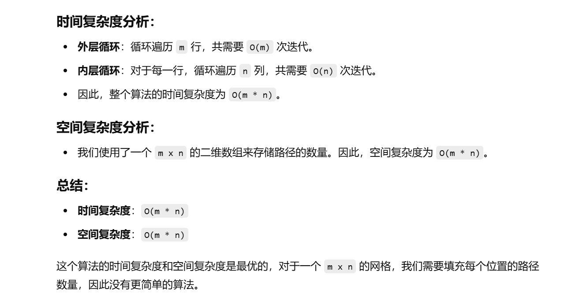

做过


[62. 不同路径 - 力扣（LeetCode）](https://leetcode.cn/problems/unique-paths/description/?envType=study-plan-v2&envId=top-100-liked)


知识点：动态规划


没记错的话，我当时使用bfs或者dfs做的，准备看看提交记录


忘了代码怎么写了


果然记错了，当时就是用dp做的


```java
class Solution {
    // uniquePaths 方法，返回从起点(0,0)到终点(m-1,n-1)的不同路径数量
    public int uniquePaths(int m, int n) {
        // 创建一个二维 dp 数组，用来存储每个位置的路径数量
        int[][] dp = new int[m][n];
        
        // 初始化第一行，所有位置的路径数都为 1，因为从任何位置到达第一行的路径只有一种（一直向右走）
        Arrays.fill(dp[0], 1);

        // 初始化第一列，所有位置的路径数都为 1，因为从任何位置到达第一列的路径只有一种（一直向下走）
        for (int i = 0; i < m; i++) {
            dp[i][0] = 1;
        }

        // 从第二行第二列开始，更新 dp 数组中的值
        for (int i = 1; i < m; i++) {
            for (int j = 1; j < n; j++) {
                // 每个位置的路径数量等于它上面和左边两个位置的路径数量之和
                dp[i][j] = dp[i - 1][j] + dp[i][j - 1];
            }
        }

        // 返回右下角的位置的路径数量，即从(0,0)到(m-1,n-1)的路径数
        return dp[m - 1][n - 1];
    }
}

```



