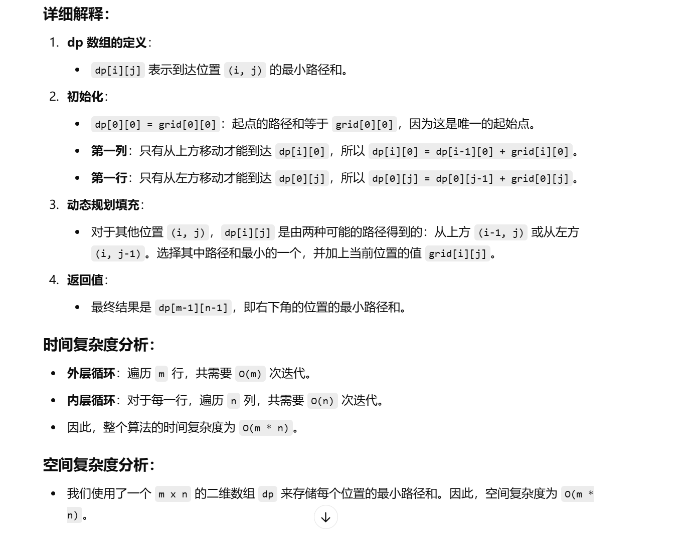

没做过


[64. 最小路径和 - 力扣（LeetCode）](https://leetcode.cn/problems/minimum-path-sum/description/?envType=study-plan-v2&envId=top-100-liked)


这题和62题感觉差不多，简单


```java
class Solution {
    // minPathSum 方法，返回从左上角到右下角的最小路径和
    public int minPathSum(int[][] grid) {
        // 获取 grid 的行数和列数
        int m = grid.length;
        int n = grid[0].length;

        // 创建一个二维 dp 数组，用来存储到达每个位置的最小路径和
        int[][] dp = new int[m][n];

        // 初始化起点的路径和，起点的路径和等于 grid[0][0]
        dp[0][0] = grid[0][0];

        // 填充第一列（只能从上方到达），dp[i][0] = dp[i-1][0] + grid[i][0]
        for (int i = 1; i < m; i++) {
            dp[i][0] = grid[i][0] + dp[i - 1][0];
        }

        // 填充第一行（只能从左方到达），dp[0][j] = dp[0][j-1] + grid[0][j]
        for (int j = 1; j < n; j++) {
            dp[0][j] = grid[0][j] + dp[0][j - 1];
        }

        // 填充剩下的 dp 数组，dp[i][j] 等于从上方或左方到达该点的最小路径和
        // dp[i][j] = min(dp[i-1][j], dp[i][j-1]) + grid[i][j]
        for (int i = 1; i < m; i++) {
            for (int j = 1; j < n; j++) {
                dp[i][j] = Math.min(dp[i - 1][j], dp[i][j - 1]) + grid[i][j];
            }
        }

        // 返回右下角位置的最小路径和，即从(0,0)到(m-1,n-1)的最小路径和
        return dp[m - 1][n - 1];
    }
}

```


