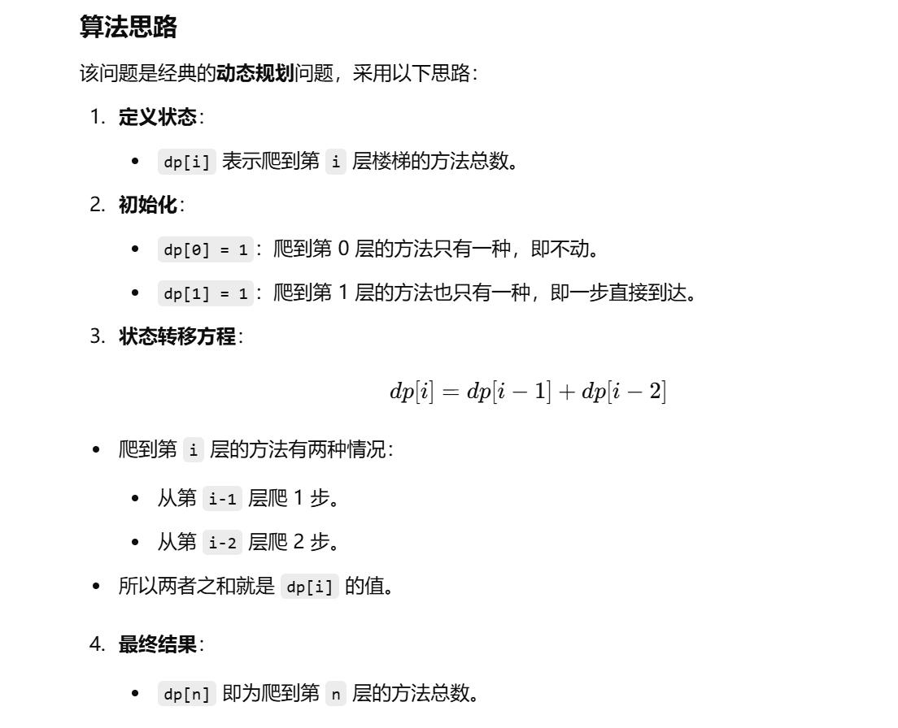

做过


[70. 爬楼梯 - 力扣（LeetCode）](https://leetcode.cn/problems/climbing-stairs/description/?envType=study-plan-v2&envId=top-100-liked)


# 自己做的


```java
class Solution {
    public int climbStairs(int n) {
        // dp[i] 表示爬到第 i 层楼梯的方法总数
        int[] dp = new int[n + 1];

        // 爬到第 0 层的方法只有 1 种（即不动）
        dp[0] = 1;

        // 爬到第 1 层的方法也只有 1 种（一步直接到 1 层）
        dp[1] = 1;

        // 从第 2 层开始，爬到每一层的方法数
        // 等于爬到前一层的方法数 + 爬到前两层的方法数
        for (int i = 2; i < n + 1; i++) {
            dp[i] = dp[i - 1] + dp[i - 2];
        }

        // 返回爬到第 n 层的方法总数
        return dp[n];
    }
}

```





