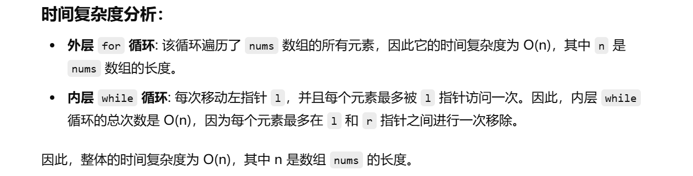

这个题目之前没做过


知识点：滑动窗口


[713. 乘积小于 K 的子数组 - 力扣（LeetCode）](https://leetcode.cn/problems/subarray-product-less-than-k/description/)


[滑动窗口【基础算法精讲 03】_哔哩哔哩_bilibili](https://www.bilibili.com/video/BV1hd4y1r7Gq/?vd_source=96c1635797a0d7626fb60e973a29da38)


```java
class Solution {
    public int numSubarrayProductLessThanK(int[] nums, int k) {
        // 如果 k <= 1，返回 0，因为所有的子数组乘积都不可能小于 1。
        if (k <= 1) {
            return 0;
        }
        
        // 初始化左右指针 l 和 r，prod 表示当前窗口内所有元素的乘积，ans 表示满足条件的子数组数量
        int l = 0;
        int prod = 1;
        int ans = 0;
        
        // 遍历数组，用右指针 r 扩展窗口
        for (int r = 0; r < nums.length; r++) {
            // 将右指针指向的元素乘到当前窗口的乘积中
            prod *= nums[r];
            
            // 如果窗口内的乘积大于或等于 k，则通过移动左指针 l 缩小窗口，直到乘积小于 k
            while (l <= r && prod >= k) {
                prod /= nums[l];
                l++;  // 左指针右移，减小窗口的乘积
            }
            
            // 当前窗口内所有子数组的数量是 r - l + 1，因为窗口内有 r - l + 1 个子数组
            ans += r - l + 1;
        }
        
        // 返回符合条件的子数组总数
        return ans;
    }
}

```


