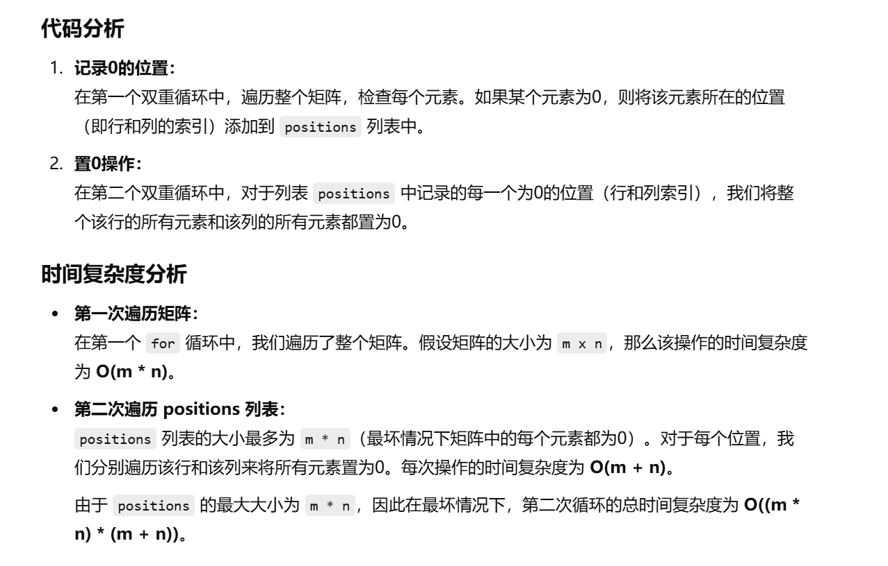
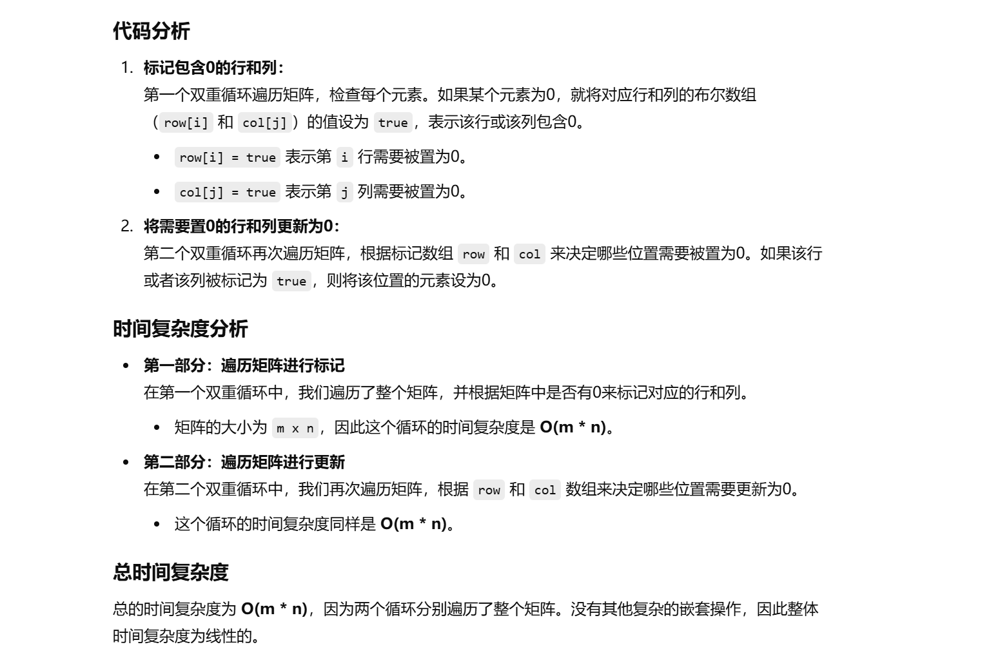
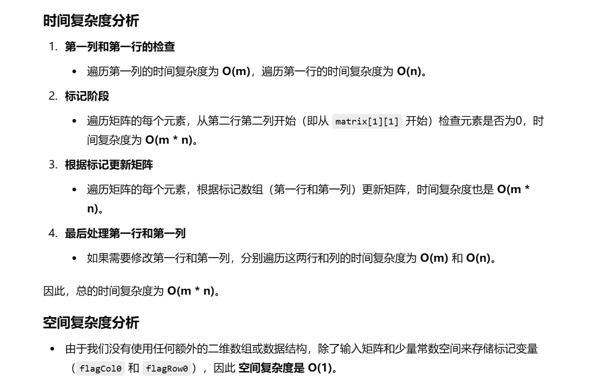

之前没做过


[73. 矩阵置零 - 力扣（LeetCode）](https://leetcode.cn/problems/set-matrix-zeroes/description/?envType=study-plan-v2&envId=top-100-liked)


知识点：模拟


[73. 矩阵置零 - 力扣（LeetCode）](https://leetcode.cn/problems/set-matrix-zeroes/solutions/669901/ju-zhen-zhi-ling-by-leetcode-solution-9ll7/?envType=study-plan-v2&envId=top-100-liked)


# 自己想的暴力（可以通过）


```java
class Solution {
    // 主方法：将矩阵中的所有包含0的行和列置为0
    public void setZeroes(int[][] matrix) {
        // 创建一个列表来存储所有值为0的位置
        List<int[]> positions = new ArrayList<>();
        
        // 获取矩阵的行数和列数
        int m = matrix.length;
        int n = matrix[0].length;
        
        // 遍历矩阵，找出所有值为0的位置，并将其存入positions列表
        for (int i = 0; i < m; i++) {
            for (int j = 0; j < n; j++) {
                // 如果当前元素是0，则记录该位置
                if (matrix[i][j] == 0) {
                    positions.add(new int[]{i, j});
                }
            }
        }

        // 遍历positions列表，逐一处理每个为0的位置
        for (int[] position : positions) {
            // 获取当前为0的位置的行和列
            int row = position[0];
            int col = position[1];

            // 将该行的所有元素都设为0
            for (int i = 0; i < m; i++) {
                matrix[i][col] = 0;
            }

            // 将该列的所有元素都设为0
            for (int j = 0; j < n; j++) {
                matrix[row][j] = 0;
            }
        }
    }
}

```




# 优化的做法


```java
class Solution {
    // 主方法：将矩阵中的所有包含0的行和列置为0
    public void setZeroes(int[][] matrix) {
        // 获取矩阵的行数和列数
        int m = matrix.length, n = matrix[0].length;
        
        // 创建两个布尔数组，分别用于标记哪些行和列包含0
        boolean[] row = new boolean[m];  // row[i] 表示第 i 行是否包含 0
        boolean[] col = new boolean[n];  // col[j] 表示第 j 列是否包含 0

        // 遍历矩阵，找出包含0的行和列
        for (int i = 0; i < m; i++) {
            for (int j = 0; j < n; j++) {
                // 如果当前位置为0，则将对应的行和列标记为true
                if (matrix[i][j] == 0) {
                    row[i] = col[j] = true;
                }
            }
        }

        // 重新遍历矩阵，使用标记数组将需要置为0的行和列的元素置为0
        for (int i = 0; i < m; i++) {
            for (int j = 0; j < n; j++) {
                // 如果该行或该列标记为包含0，则将当前位置设为0
                if (row[i] || col[j]) {
                    matrix[i][j] = 0;
                }
            }
        }
    }
}

```




# 上面的做法把空间复杂度再优化的做法


```java
class Solution {
    // 方法：将矩阵中包含0的行和列置为0
    public void setZeroes(int[][] matrix) {
        // 获取矩阵的行数（m）和列数（n）
        int m = matrix.length, n = matrix[0].length;
        
        // flagCol0 和 flagRow0 用于记录第一列和第一行是否包含0
        boolean flagCol0 = false, flagRow0 = false;

        // 检查第一列是否包含0
        for (int i = 0; i < m; i++) {
            if (matrix[i][0] == 0) {
                flagCol0 = true;  // 如果第一列中有0，设置 flagCol0 为 true
            }
        }

        // 检查第一行是否包含0
        for (int j = 0; j < n; j++) {
            if (matrix[0][j] == 0) {
                flagRow0 = true;  // 如果第一行中有0，设置 flagRow0 为 true
            }
        }

        // 从第二行和第二列开始，遍历整个矩阵
        // 如果发现元素为0，就将该行的第一列和该列的第一行元素设置为0
        for (int i = 1; i < m; i++) {
            for (int j = 1; j < n; j++) {
                if (matrix[i][j] == 0) {
                    matrix[i][0] = matrix[0][j] = 0;  // 标记该行和该列需要置零
                }
            }
        }

        // 根据第一行和第一列的标记，将其他元素置为0
        for (int i = 1; i < m; i++) {
            for (int j = 1; j < n; j++) {
                if (matrix[i][0] == 0 || matrix[0][j] == 0) {
                    matrix[i][j] = 0;  // 如果该行或该列被标记为0，则设置该位置为0
                }
            }
        }

        // 最后处理第一列，如果 flagCol0 为 true，则将第一列所有元素置为0
        if (flagCol0) {
            for (int i = 0; i < m; i++) {
                matrix[i][0] = 0;  // 设置第一列为0
            }
        }

        // 处理第一行，如果 flagRow0 为 true，则将第一行所有元素置为0
        if (flagRow0) {
            for (int j = 0; j < n; j++) {
                matrix[0][j] = 0;  // 设置第一行为0
            }
        }
    }
}

```


## 代码详解：


这段代码解决了一个经典的问题：**将一个矩阵中包含零的行和列设置为零**，并且要求**不使用额外的O(m * n)**的空间（除了输入矩阵之外）。它通过利用矩阵的第一行和第一列来作为标记，避免了使用额外的空间来存储行和列的标记。

我们来逐步解析这段代码。

### 1. **定义和初始化**

```
int m = matrix.length, n = matrix[0].length;
boolean flagCol0 = false, flagRow0 = false;
```

- `m` 是矩阵的行数，`n` 是矩阵的列数。
- `flagCol0` 和 `flagRow0` 是两个布尔变量，用来记录第一列和第一行是否包含零。我们需要特殊处理这两行和列，因为它们用作标记其它行列的状态。

### 2. **检查第一列是否包含零**

```
for (int i = 0; i < m; i++) {
    if (matrix[i][0] == 0) {
        flagCol0 = true;
    }
}
```

- 这里我们遍历矩阵的第一列（即 `matrix[i][0]`），如果某个位置为0，就将 `flagCol0` 设置为 `true`。表示第一列在后续需要被置为0。

### 3. **检查第一行是否包含零**

```
for (int j = 0; j < n; j++) {
    if (matrix[0][j] == 0) {
        flagRow0 = true;
    }
}
```

- 类似地，我们遍历矩阵的第一行（即 `matrix[0][j]`），如果某个位置为0，就将 `flagRow0` 设置为 `true`。表示第一行在后续需要被置为0。

### 4. **使用第一行和第一列作为标记**

```
java复制编辑for (int i = 1; i < m; i++) {
    for (int j = 1; j < n; j++) {
        if (matrix[i][j] == 0) {
            matrix[i][0] = matrix[0][j] = 0;
        }
    }
}
```

- 这个循环从矩阵的第二行第二列开始遍历（即从 

  ```
  matrix[1][1]
  ```

   开始）。如果遇到值为0的元素，

  我们将该行和该列的第一个元素设置为0，即 

  ```
  matrix[i][0] = 0
  ```

   和 

  ```
  matrix[0][j] = 0
  ```

  - 这样，我们就利用第一行和第一列来记录哪些行和列需要置零。
  - 这种做法的关键是：我们不直接修改 `matrix[i][j]` 位置的值，而是通过修改该行和列的第一个元素来做标记。

### 5. **根据标记设置0**

```
for (int i = 1; i < m; i++) {
    for (int j = 1; j < n; j++) {
        if (matrix[i][0] == 0 || matrix[0][j] == 0) {
            matrix[i][j] = 0;
        }
    }
}
```

- 现在我们遍历矩阵的剩余部分（从 

  ```
  matrix[1][1]
  ```

   开始），根据第一行和第一列的标记来决定是否将 

  ```
  matrix[i][j]
  ```

   设置为0。

  如果 `matrix[i][0] == 0` 或 `matrix[0][j] == 0`，说明该行或该列曾经有0，所以 `matrix[i][j]` 需要被置为0。

### 6. **特殊处理第一行和第一列**

```
if (flagCol0) {
    for (int i = 0; i < m; i++) {
        matrix[i][0] = 0;
    }
}
if (flagRow0) {
    for (int j = 0; j < n; j++) {
        matrix[0][j] = 0;
    }
}
```

- 最后，检查是否需要将第一列或第一行置为0。我们通过 

  ```
  flagCol0
  ```

   和 

  ```
  flagRow0
  ```

   来决定：

  - 如果 `flagCol0` 为 `true`，则第一列需要全部置为0。
  - 如果 `flagRow0` 为 `true`，则第一行需要全部置为0。





