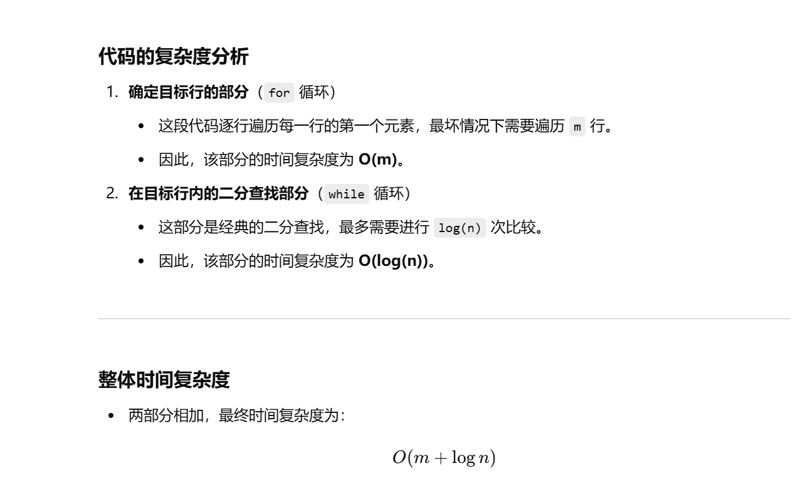
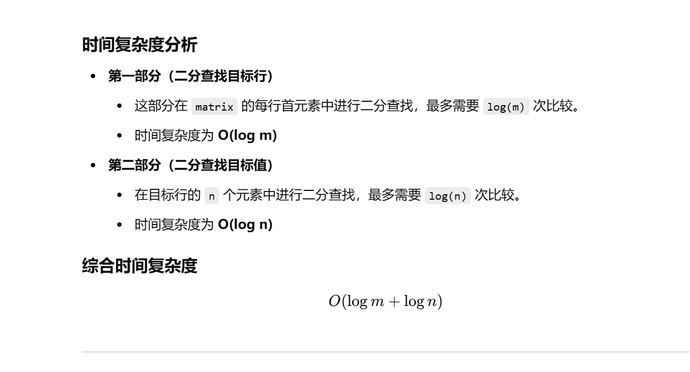

没做过


知识点：二分


[74. 搜索二维矩阵 - 力扣（LeetCode）](https://leetcode.cn/problems/search-a-2d-matrix/description/?envType=study-plan-v2&envId=top-100-liked)


# 我做的


**先对列进行一行一行的找，然后定位列，对行进行二分查找**


```java
class Solution {
    public boolean searchMatrix(int[][] matrix, int target) {
        // 先定位到具体哪一行
        int m = matrix.length;      // 获取矩阵的行数
        int n = matrix[0].length;   // 获取矩阵的列数
        int row = -1;               // 初始化行索引，默认为-1，表示未找到

        // 遍历每一行的起始元素，找到目标值所在的行
        for (int i = 0; i < m; i++) {
            if (matrix[i][0] > target) {  // 如果当前行的起始值大于目标值
                if (i == 0) {            // 如果是第一行，说明目标值比所有元素都小
                    return false;        // 直接返回 false
                }
                row = i - 1;             // 否则目标值位于前一行
                break;                   // 找到目标行后退出循环
            } else if (matrix[i][0] < target) {  // 如果当前行的起始值小于目标值
                if (i == m - 1) {               // 如果是最后一行
                    row = m - 1;                // 目标值应在最后一行
                }
            } else {                            // 如果当前行的起始元素等于目标值
                return true;                    // 目标值已找到，直接返回 true
            }
        }

        // 在确定的行内进行二分查找
        int l = 0, r = n;                      // 初始化左右指针
        while (l < r) {                        // 二分查找循环
            int mid = (r - l) / 2 + l;         // 计算中间索引，防止溢出
            if (matrix[row][mid] > target) {   // 中间元素大于目标值
                r = mid;                       // 收缩右边界
            } else if (matrix[row][mid] < target) { // 中间元素小于目标值
                l = mid + 1;                   // 收缩左边界
            } else {                           // 找到目标值
                return true;
            }
        }
        return false;                          // 未找到目标值
    }
}

```





# 更好的方法


**可以对可以对矩阵的第一列的元素也进行二分查找**


```java
class Solution {
    public boolean searchMatrix(int[][] matrix, int target) {
        // 先定位到具体哪一行
        int m = matrix.length;      // 获取矩阵的行数
        int n = matrix[0].length;   // 获取矩阵的列数

        // 二分查找，确定目标值可能所在的行
        int up = 0, down = m;       // 初始化上下边界，down 初始值为 m（开区间）
        while (up < down) {         // 当上边界小于下边界时继续循环
            int mid = (down - up) / 2 + up;  // 计算中点索引，防止溢出
            if (matrix[mid][0] > target) {   // 如果当前行的第一个元素大于目标值
                down = mid;                  // 缩小搜索区间，移动下边界
            } else if (matrix[mid][0] < target) { // 如果当前行的第一个元素小于目标值
                up = mid + 1;                // 缩小搜索区间，移动上边界
            } else {                         // 如果找到目标值，直接返回 true
                return true;
            }
        }

        // 确定目标值所在的行
        int row = up - 1;    // 由于循环结束时 `up` 指向第一个大于目标值的行，需回退一行
        // 或者 row = down - 1; 效果相同
        if (row < 0) {       // 如果 row < 0，说明目标值比矩阵中最小的元素还要小
            return false;    // 直接返回 false
        }

        // 在确定的行内进行二分查找
        int l = 0, r = n;     // 初始化左右边界，`r` 为 n（开区间）
        while (l < r) {       // 当左边界小于右边界时继续循环
            int mid = (r - l) / 2 + l;  // 计算中点索引，防止溢出
            if (matrix[row][mid] > target) {  // 中点元素大于目标值
                r = mid;                      // 缩小右边界
            } else if (matrix[row][mid] < target) { // 中点元素小于目标值
                l = mid + 1;                  // 缩小左边界
            } else {                          // 找到目标值
                return true;
            }
        }

        return false;  // 未找到目标值
    }
}

```



