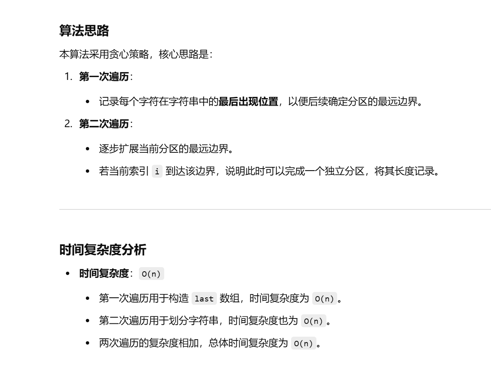
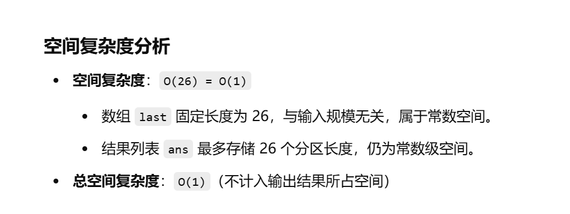

做过


[763. 划分字母区间 - 力扣（LeetCode）](https://leetcode.cn/problems/partition-labels/description/?envType=study-plan-v2&envId=top-100-liked)


[代码随想录](https://www.programmercarl.com/0763.划分字母区间.html)


灵神：[763. 划分字母区间 - 力扣（LeetCode）](https://leetcode.cn/problems/partition-labels/solutions/2806706/ben-zhi-shi-he-bing-qu-jian-jian-ji-xie-ygsn8/?envType=study-plan-v2&envId=top-100-liked)


不会了


```java
class Solution {
    public List<Integer> partitionLabels(String s) {
        // 将字符串转为字符数组，便于逐个字符访问
        char[] sc = s.toCharArray();

        // 数组 `last` 用于记录每个字母最后出现的下标
        // 由于题目限定 `s` 中只包含小写字母，数组大小为 26 即可
        int[] last = new int[26];  

        // 第一次遍历，记录每个字符最后出现的位置
        for (int i = 0; i < sc.length; i++) {
            // `sc[i] - 'a'` 计算当前字符在字母表中的索引位置
            // `last[sc[i] - 'a'] = i` 记录该字符最后出现的位置
            last[sc[i] - 'a'] = i;
        }

        // `start` 记录每个分区的起始位置
        // `end` 记录当前分区的最远边界
        int start = 0;
        int end = 0;

        // 存放每个分区长度的结果列表
        List<Integer> ans = new ArrayList<>();

        // 第二次遍历，按照规则进行分区
        for (int i = 0; i < sc.length; i++) {
            // 更新当前分区的最远边界
            end = Math.max(last[sc[i] - 'a'], end);

            // 当 `i` 到达当前分区的最远边界时，确定该分区的结束
            if (i == end) {
                // 计算当前分区的长度并加入结果列表
                ans.add(end - start + 1);

                // 更新 `start` 为下一个分区的起始位置
                start = i + 1;
            }
        }

        // 返回所有分区的长度
        return ans;
    }
}

```




