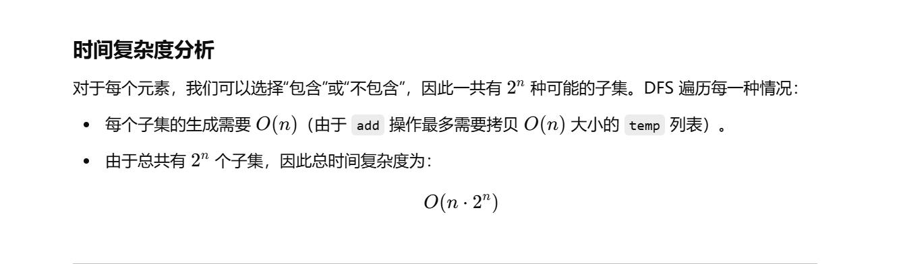
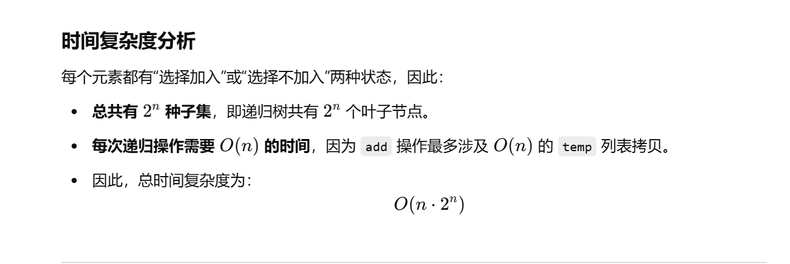
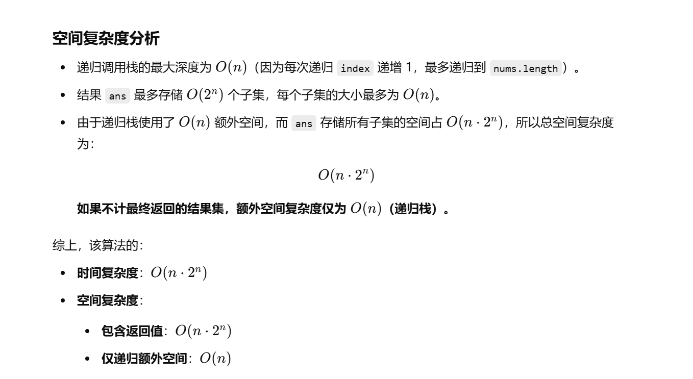

做过


[78. 子集 - 力扣（LeetCode）](https://leetcode.cn/problems/subsets/description/?envType=study-plan-v2&envId=top-100-liked)


[代码随想录](https://www.programmercarl.com/0078.子集.html)


# 自己先想的set去重

```java
import java.util.*;

class Solution {
    // 使用 Set 存储子集，确保唯一性（尽管本题输入无重复元素）
    Set<List<Integer>> ans = new HashSet<>();

    public List<List<Integer>> subsets(int[] nums) {
        // 通过深度优先搜索（DFS）生成所有子集
        dfs(nums, 0, new ArrayList<>());
        // 将结果转换为 List 并返回
        return new ArrayList<>(ans);
    }

    /**
     * 深度优先搜索（DFS）生成所有子集
     * @param nums   输入数组
     * @param index  当前处理的索引
     * @param temp   当前子集
     */
    public void dfs(int[] nums, int index, List<Integer> temp) {
        // 将当前子集（拷贝）加入结果集合
        ans.add(new ArrayList<>(temp));

        // 递归终止条件：当索引达到数组末尾时返回
        if (index == nums.length) {
            return;
        }

        // 选择当前索引的元素加入子集
        temp.add(nums[index]);
        dfs(nums, index+1, temp);
        // 回溯：移除刚加入的元素，以探索不包含该元素的情况
        temp.remove(temp.size() - 1);
        // 递归调用，跳过当前索引的元素，探索不包含该元素的子集
        dfs(nums, index+1, temp);
    }
}

```





# 灵神题解：最后收集答案


```java
import java.util.*;

class Solution {
    // 存储所有子集的列表
    List<List<Integer>> ans = new ArrayList<>();

    /**
     * 生成所有子集
     * @param nums 输入的整数数组
     * @return 所有可能的子集
     */
    public List<List<Integer>> subsets(int[] nums) {
        // 通过深度优先搜索（DFS）递归生成子集
        dfs(nums, 0, new ArrayList<>());
        // 返回所有子集
        return new ArrayList<>(ans);
    }

    /**
     * 深度优先搜索（DFS）遍历所有可能的子集
     * @param nums   输入数组
     * @param index  当前处理的索引位置
     * @param temp   当前子集（可变列表）
     */
    public void dfs(int[] nums, int index, List<Integer> temp) {
        // 递归终止条件：当索引超出数组范围时，将当前子集加入结果集
        if (index == nums.length) {
            ans.add(new ArrayList<>(temp)); // 需要拷贝，防止后续修改影响已有结果
            return;
        }

        // 选择当前索引的元素加入子集
        temp.add(nums[index]);
        // 递归调用，处理下一个索引（包含当前元素）
        dfs(nums, index + 1, temp);
        // 回溯：移除刚加入的元素，尝试不包含当前元素的情况
        temp.remove(temp.size() - 1);
        // 递归调用，跳过当前元素，探索不包含该元素的子集
        dfs(nums, index + 1, temp);
    }
}

```





