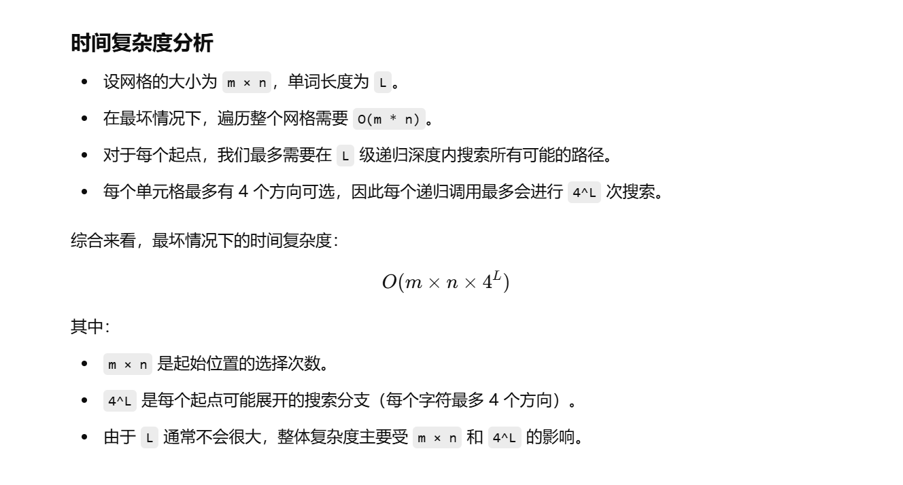
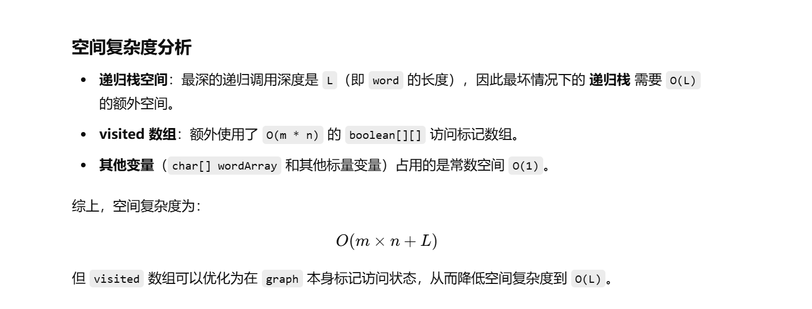
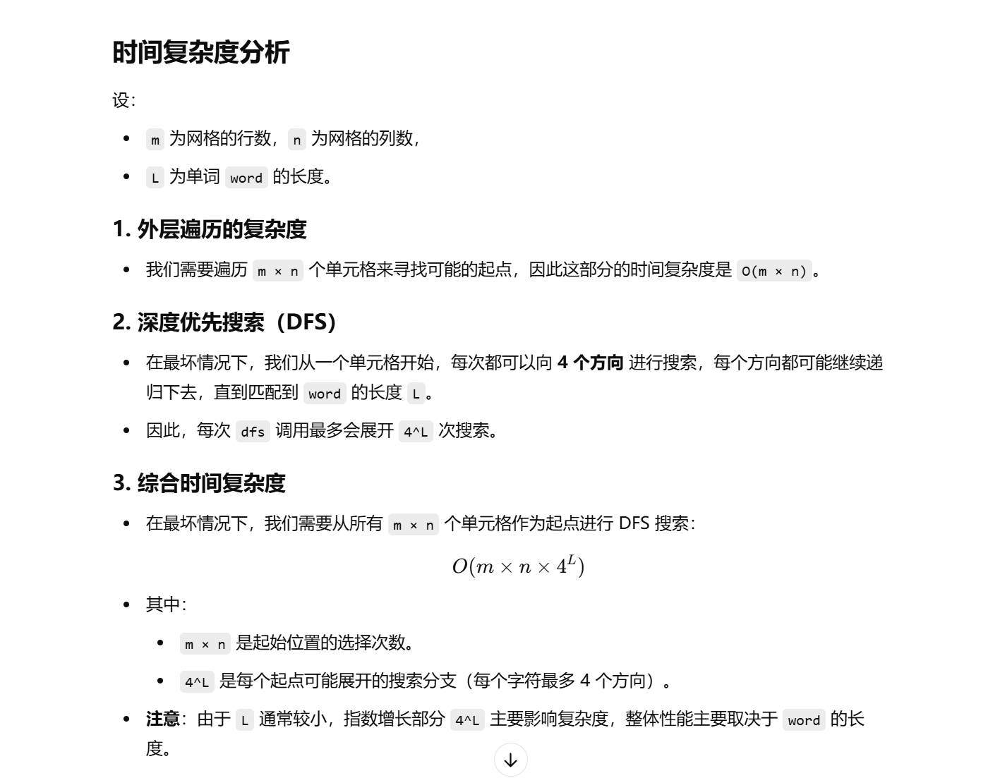
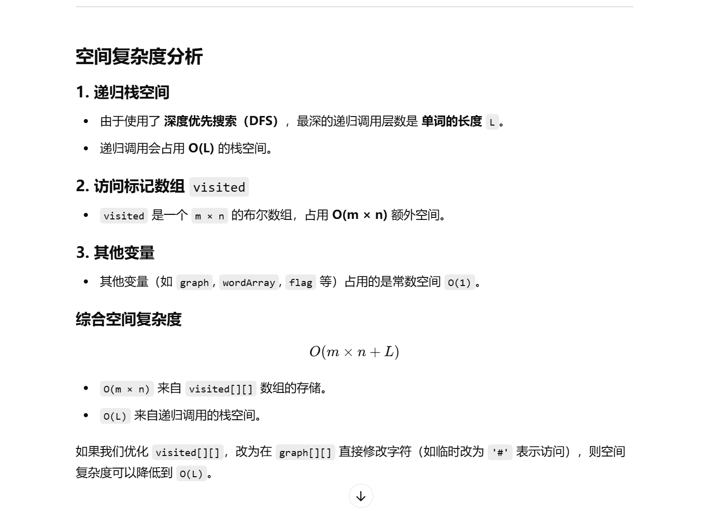

没做过


[79. 单词搜索 - 力扣（LeetCode）](https://leetcode.cn/problems/word-search/description/?envType=study-plan-v2&envId=top-100-liked)


# 自己写的


```java
class Solution {
    // 定义成员变量
    char[][] graph;  // 存储二维字符网格
    String word1;  // 目标单词
    int m, n;  // 网格的行数和列数
    char[] wordArray;  // 目标单词转换为字符数组，方便索引访问
    boolean flag;  // 标记是否找到目标单词
    boolean[][] visited;  // 记录网格中的单元格是否已被访问

    public boolean exist(char[][] board, String word) {
        flag = false;  // 初始化标志位
        graph = board;  // 赋值网格
        word1 = word;  // 赋值目标单词
        m = graph.length;  // 获取行数
        n = graph[0].length;  // 获取列数
        wordArray = word.toCharArray();  // 将目标单词转换为字符数组
        visited = new boolean[m][n];  // 初始化访问数组，默认值为 false

        // 遍历整个网格，寻找匹配 word 第一个字符的位置，作为起点进行深度优先搜索
        for (int i = 0; i < m; i++) {
            for (int j = 0; j < n; j++) {
                // 如果当前网格字符匹配 word 的首字母，尝试进行 DFS 搜索
                if (graph[i][j] == wordArray[0]) {
                    dfs(i, j, 0);
                    // 如果 flag 变为 true，说明找到了目标单词，直接返回 true
                    if (flag) {
                        return true;
                    }
                }
            }
        }
        return false;  // 遍历完整个网格仍未找到单词，返回 false
    }

    public void dfs(int i, int j, int index) {
        // 递归终止条件：如果已经匹配到了整个单词，标记 flag 为 true 并返回
        if (index == wordArray.length) {
            flag = true;
            return;
        }

        // 边界条件检查：如果坐标超出网格范围，或者当前位置已经访问过，直接返回
        if (i < 0 || j < 0 || i > m - 1 || j > n - 1 || visited[i][j]) {
            return;
        }

        // 当前字符匹配 wordArray[index]，继续搜索
        if (graph[i][j] == wordArray[index]) {
            visited[i][j] = true;  // 标记当前单元格已访问

            // 递归搜索四个方向：上、下、左、右
            dfs(i - 1, j, index + 1);  // 向上搜索
            dfs(i + 1, j, index + 1);  // 向下搜索
            dfs(i, j - 1, index + 1);  // 向左搜索
            dfs(i, j + 1, index + 1);  // 向右搜索

            visited[i][j] = false;  // 进行回溯，撤销访问标记，以便尝试其他路径
        }
    }
}

```








# gpt给的dfs的优化写法，更好理解了


```java
class Solution {
    // 定义成员变量
    char[][] graph;  // 存储二维字符网格
    String word1;  // 目标单词
    int m, n;  // 网格的行数和列数
    char[] wordArray;  // 目标单词转换为字符数组，方便索引访问
    boolean flag;  // 标记是否找到目标单词
    boolean[][] visited;  // 记录网格中的单元格是否已被访问

    public boolean exist(char[][] board, String word) {
        flag = false;  // 初始化标志位，表示尚未找到单词
        graph = board;  // 赋值网格
        word1 = word;  // 赋值目标单词
        m = graph.length;  // 获取行数
        n = graph[0].length;  // 获取列数
        wordArray = word.toCharArray();  // 将目标单词转换为字符数组
        visited = new boolean[m][n];  // 初始化访问数组，默认值为 false

        // 遍历整个网格，寻找匹配 word 第一个字符的位置，作为起点进行深度优先搜索
        for (int i = 0; i < m; i++) {
            for (int j = 0; j < n; j++) {
                // 如果当前网格字符匹配 word 的首字母，尝试进行 DFS 搜索
                if (graph[i][j] == wordArray[0]) {
                    dfs(i, j, 0);
                    // 如果 flag 变为 true，说明找到了目标单词，直接返回 true
                    if (flag) { // 找到即返回
                        return true;
                    }
                }
            }
        }
        return false;  // 遍历完整个网格仍未找到单词，返回 false
    }

    public void dfs(int i, int j, int index) {
        if (flag) return; // 已找到，直接返回，避免不必要的递归

        // 边界条件检查：如果坐标超出网格范围，或者当前位置已经访问过，或者字符不匹配，直接返回
        if (i < 0 || j < 0 || i >= m || j >= n || visited[i][j] || graph[i][j] != wordArray[index]) {
            return;
        }

        // 递归终止条件：如果已经匹配到了整个单词，标记 flag 为 true 并返回
        if (index == wordArray.length - 1) {
            flag = true;
            return;
        }

        visited[i][j] = true;  // 标记当前单元格已访问

        // 递归搜索四个方向：上、下、左、右
        dfs(i - 1, j, index + 1);  // 向上搜索
        dfs(i + 1, j, index + 1);  // 向下搜索
        dfs(i, j - 1, index + 1);  // 向左搜索
        dfs(i, j + 1, index + 1);  // 向右搜索

        visited[i][j] = false; // 进行回溯，撤销访问标记，以便尝试其他路径
    }
}


```





