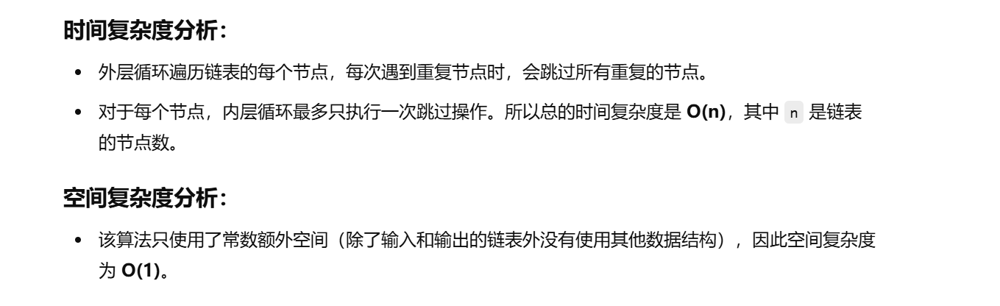

没做过


[82. 删除排序链表中的重复元素 II - 力扣（LeetCode）](https://leetcode.cn/problems/remove-duplicates-from-sorted-list-ii/description/)


不会做


[删除链表重复节点【基础算法精讲 08】_哔哩哔哩_bilibili](https://www.bilibili.com/video/BV1VP4y1Q71e/?vd_source=96c1635797a0d7626fb60e973a29da38)


```java
class Solution {
    public ListNode deleteDuplicates(ListNode head) {
        // 创建一个虚拟头节点，虚拟头节点的next指向原链表的头节点
        // 这样做的目的是为了处理删除头节点时更加方便
        ListNode dummy = new ListNode(-1, head);
        
        // cur 指向虚拟头节点
        ListNode cur = dummy;
        
        // 遍历链表
        while (cur.next != null && cur.next.next != null) {
            // 如果当前节点和下一个节点的值相同，表示有重复节点
            if (cur.next.val == cur.next.next.val) {
                // 记录当前重复的值
                int val = cur.next.val;
                
                // 进入内层循环，跳过所有值等于 val 的节点
                while (cur.next != null && cur.next.val == val) {
                    // 让 cur.next 指向下一个节点，从而跳过当前节点
                    cur.next = cur.next.next;
                }
            } else {
                // 如果当前节点的值和下一个节点的值不同，移动到下一个节点
                cur = cur.next;
            }
        }
        
        // 返回虚拟头节点的next，即原链表的头节点
        return dummy.next;
    }
}

```


