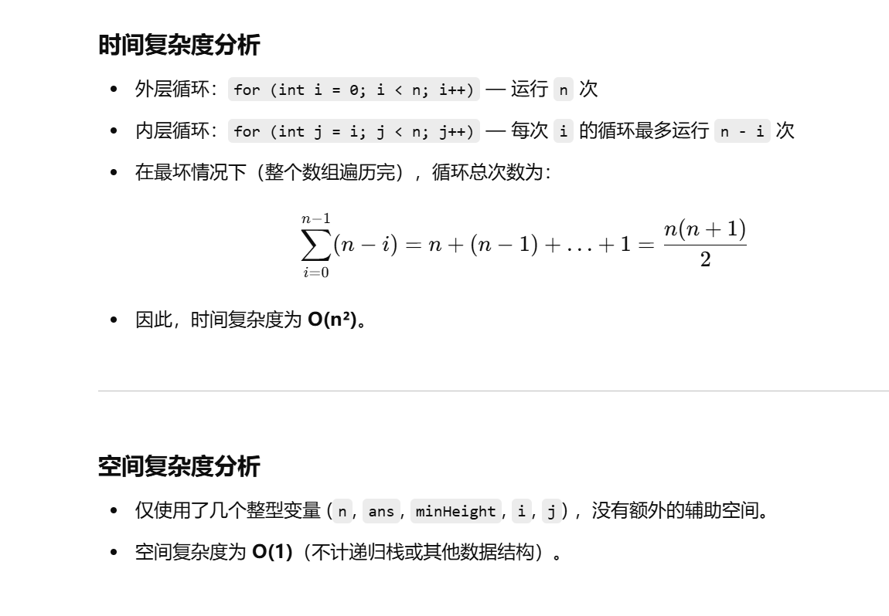
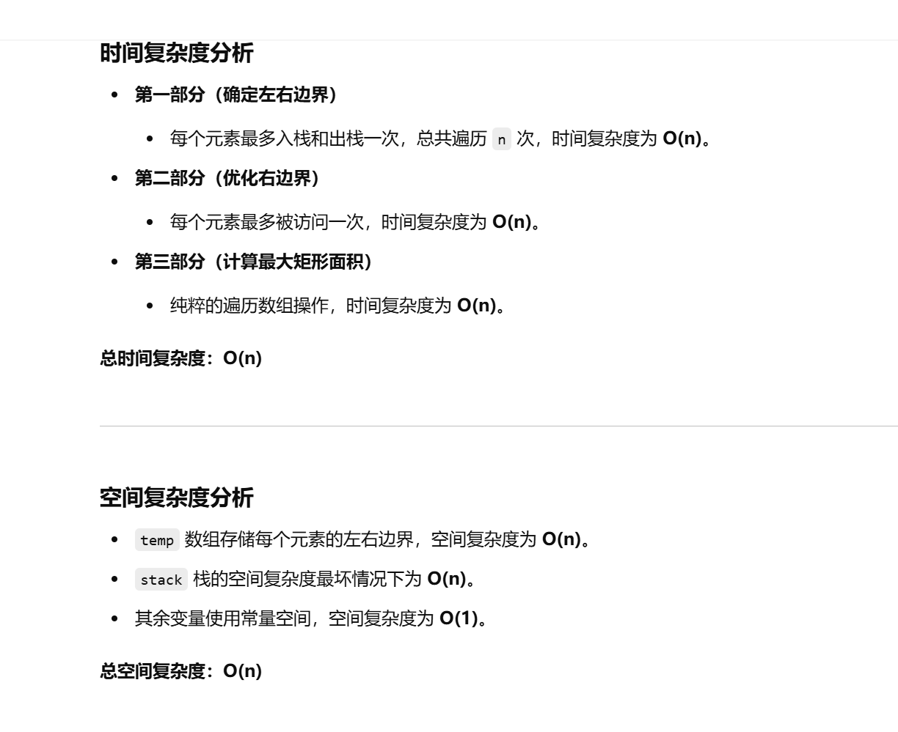

没做过


[84. 柱状图中最大的矩形 - 力扣（LeetCode）](https://leetcode.cn/problems/largest-rectangle-in-histogram/description/?envType=study-plan-v2&envId=top-100-liked)


# 自己想的暴力，部分超时了


```java
class Solution { 
    // 此方法用于计算柱状图中的最大矩形面积
    public int largestRectangleArea(int[] heights) {
        int n = heights.length;  // 获取数组的长度
        int ans = Integer.MIN_VALUE;  // 初始化最大面积，设置为最小整数值以便后续比较
        // 外层循环，固定左边界 i
        for (int i = 0; i < n; i++) {
            int minHeight = Integer.MAX_VALUE;  // 初始化最小高度为最大整数，便于寻找区间内最小高度
            // 内层循环，固定右边界 j
            for (int j = i; j < n; j++) {
                // 更新当前区间 [i, j] 内的最小高度
                minHeight = Math.min(minHeight, heights[j]);
                // 计算当前区间的矩形面积，并更新最大面积
                ans = Math.max(ans, (j - i + 1) * minHeight);
            }
        }
        return ans;  // 返回最大矩形面积
    }
}


```





# 单调栈优化


```java
import java.util.*;

class Solution {
    public int largestRectangleArea(int[] heights) {
        int n = heights.length;
        int ans = Integer.MIN_VALUE; // 记录最大矩形面积
        int[][] temp = new int[n][2]; // temp[i][0] 表示 i 左边第一个比 heights[i] 小的下标
                                      // temp[i][1] 表示 i 右边第一个比 heights[i] 小的下标
        Deque<Integer> stack = new ArrayDeque<>(); // 单调栈，用于快速找到左右两侧的边界
        
        // 第一遍遍历，找到每个元素的右边界
        for (int i = 0; i < n; i++) {
            // 当当前高度小于栈顶元素对应的高度时，表示找到了右边界
            while (!stack.isEmpty() && heights[i] <= heights[stack.peek()]) {
                int cur = stack.pop(); 
                // 如果栈为空，说明左边界是 -1，否则就是栈顶元素
                temp[cur][0] = stack.isEmpty() ? -1 : stack.peek();
                // 当前元素的右边界就是 i
                temp[cur][1] = i;
            }
            stack.push(i); // 将当前元素下标入栈
        }
        
        // 清理栈中剩余元素，更新其右边界
        while (!stack.isEmpty()) {
            int cur = stack.pop();
            temp[cur][0] = stack.isEmpty() ? -1 : stack.peek(); // 左边界
            temp[cur][1] = -1; // 右边界为 -1 表示没有比它更小的元素
        }
        
        // 第二遍遍历，优化右边界，处理相同高度元素的右边界
        for (int i = n - 2; i >= 0; i--) {
            if (temp[i][1] != -1 && heights[i] == heights[temp[i][1]]) {
                temp[i][1] = temp[temp[i][1]][1];
            }
        }
        
        // 计算最大矩形面积
        for (int i = 0; i < n; i++) {
            int left = temp[i][0];
            int right = temp[i][1];

            // 如果左边界为 -1，表示左侧无比其小的元素，视作边界
            if (left == -1) left = -1;
            // 如果右边界为 -1，表示右侧无比其小的元素，视作边界
            if (right == -1) right = n;

            // 面积计算公式：（右边界 - 左边界 - 1）* 高度
            ans = Math.max(ans, (right - left - 1) * heights[i]);
        }
        
        return ans; // 返回最大矩形面积
    }
}

```





