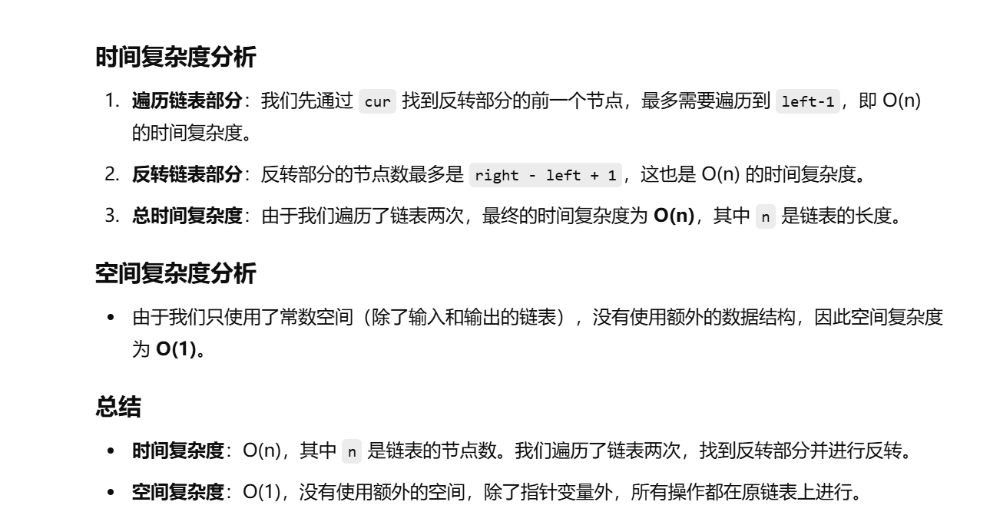

做过


[反转链表【基础算法精讲 06】_哔哩哔哩_bilibili](https://www.bilibili.com/video/BV1sd4y1x7KN/?vd_source=96c1635797a0d7626fb60e973a29da38)


[92. 反转链表 II - 力扣（LeetCode）](https://leetcode.cn/problems/reverse-linked-list-ii/description/)


# 自己想的

```java
class Solution {
    public ListNode reverseBetween(ListNode head, int left, int right) {

        // 创建虚拟头节点 dummy，指向原链表的头节点
        ListNode dummy = new ListNode(-1, head);
        
        // 用来定位反转开始节点的前一个节点
        int count = 0;
        ListNode cur = dummy;
        
        // 寻找反转开始的节点的前一个节点 (即 left-1)
        while (count != left - 1) {
            cur = cur.next;  // cur 向后移动
            count++;         // 计数器加1
        }
        
        // p1 指向反转开始节点的前一个节点
        ListNode p1 = cur;
        
        // cur 移动到反转的起始节点 (即 left)
        cur = cur.next;
        
        // 反转开始节点前计数器加1
        count++;
        
        // pre 用来反转链表，最开始它为 null
        ListNode pre = null;
        
        // 开始反转链表中的节点，直到反转完 right 个节点
        while (count <= right) {
            ListNode next = cur.next;  // 暂存当前节点的下一个节点
            cur.next = pre;            // 将当前节点的 next 指向 pre，完成反转
            pre = cur;                 // 移动 pre 到当前节点
            cur = next;                // cur 向后移动
            count++;                   // 计数器加1
        }
        
        // p2 指向反转部分的头节点
        ListNode p2 = p1.next;
        
        // 将 p1.next 指向反转后的部分的头节点
        p1.next = pre;
        
        // 将反转部分的尾部连接到反转部分后的节点
        p2.next = cur;
        
        // 返回虚拟头节点的 next，实际返回的是反转后的链表头
        return dummy.next;
    }
}

```





# for循环版本


```java
    class Solution {
        public ListNode reverseBetween(ListNode head, int left, int right) {

            ListNode dummy = new ListNode(-1, head);
            ListNode cur = dummy;
            for (int i = 0; i < left - 1; i++) {
                cur = cur.next;
            }
            ListNode p1 = cur;
            cur = cur.next;
            ListNode pre = null;
            for (int i = 0; i < right - left + 1; i++) {
                ListNode next = cur.next;
                cur.next = pre;
                pre = cur;
                cur = next;
            }
            ListNode p2 = p1.next;
            p1.next = pre;
            p2.next = cur;
            return dummy.next;
        }
    }
```

