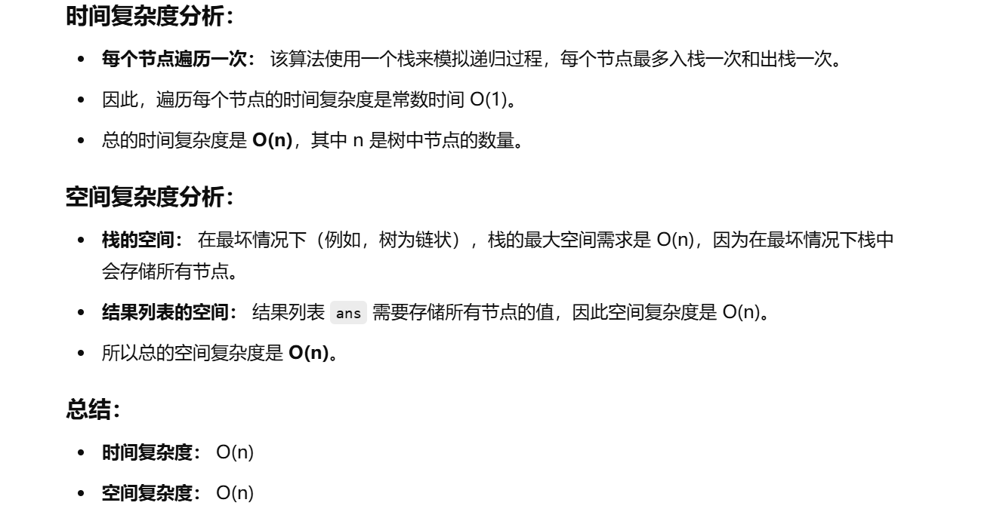

做过


[94. 二叉树的中序遍历 - 力扣（LeetCode）](https://leetcode.cn/problems/binary-tree-inorder-traversal/description/?envType=study-plan-v2&envId=top-100-liked)


[算法讲解018【入门】二叉树遍历的非递归实现和复杂度分析_哔哩哔哩_bilibili](https://www.bilibili.com/video/BV15P411t7e2/?spm_id_from=333.1387.search.video_card.click&vd_source=96c1635797a0d7626fb60e973a29da38)


# BFS写法（也重要）


```java
class Solution {
    // 定义方法，接收一个二叉树的根节点作为输入，返回二叉树的中序遍历结果（List<Integer>）
    public List<Integer> inorderTraversal(TreeNode root) {
        // 使用一个栈来模拟递归过程，栈存储节点
        Deque<TreeNode> stack = new ArrayDeque<>();
        
        // 用一个List来存储遍历的结果
        List<Integer> ans = new ArrayList<>();
        
        // 当当前节点为null且栈为空时，遍历结束
        while (root != null || !stack.isEmpty()) {
            // 先处理当前节点及其左子树
            while (root != null) {
                stack.push(root);  // 将当前节点压入栈
                root = root.left;  // 继续遍历左子树
            }
            
            // 当左子树遍历完成，开始处理栈中的节点
            root = stack.pop();  // 弹出栈顶元素（这是当前的中序遍历节点）
            ans.add(root.val);   // 将节点值添加到结果列表
            
            // 继续遍历右子树
            root = root.right;   // 将当前节点指向右子树
        }
        
        // 返回最终的遍历结果
        return ans;
    }
}

```





# DFS写法

```java
class Solution {
    // 主函数，接受一个二叉树的根节点，返回中序遍历的结果（一个整数列表）
    public List<Integer> inorderTraversal(TreeNode root) {
        // 创建一个列表用于存储中序遍历的结果
        List<Integer> ans = new ArrayList<>();
        // 调用辅助函数 dfs 执行深度优先遍历
        dfs(ans, root);
        // 返回遍历结果
        return ans;
    }

    // 辅助函数，执行深度优先遍历（递归）
    public void dfs(List<Integer> ans, TreeNode root) {
        // 如果当前节点为空，直接返回
        if (root == null) {
            return;
        }
        // 递归遍历左子树
        dfs(ans, root.left);
        // 访问当前节点的值，并将其添加到结果列表中
        ans.add(root.val);
        // 递归遍历右子树
        dfs(ans, root.right);
    }
}

```


