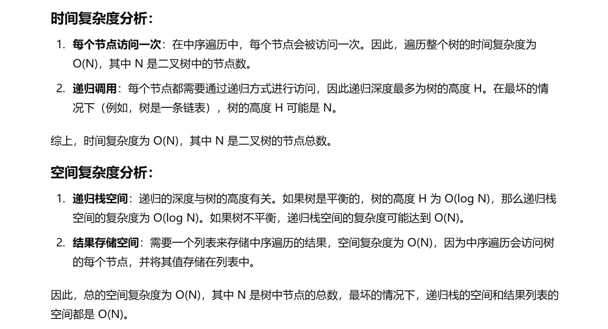

做过


[94. 二叉树的中序遍历 - 力扣（LeetCode）](https://leetcode.cn/problems/binary-tree-inorder-traversal/description/?envType=study-plan-v2&envId=top-100-liked)


```java
class Solution {
    // 主函数，接受一个二叉树的根节点，返回中序遍历的结果（一个整数列表）
    public List<Integer> inorderTraversal(TreeNode root) {
        // 创建一个列表用于存储中序遍历的结果
        List<Integer> ans = new ArrayList<>();
        // 调用辅助函数 dfs 执行深度优先遍历
        dfs(ans, root);
        // 返回遍历结果
        return ans;
    }

    // 辅助函数，执行深度优先遍历（递归）
    public void dfs(List<Integer> ans, TreeNode root) {
        // 如果当前节点为空，直接返回
        if (root == null) {
            return;
        }
        // 递归遍历左子树
        dfs(ans, root.left);
        // 访问当前节点的值，并将其添加到结果列表中
        ans.add(root.val);
        // 递归遍历右子树
        dfs(ans, root.right);
    }
}

```


