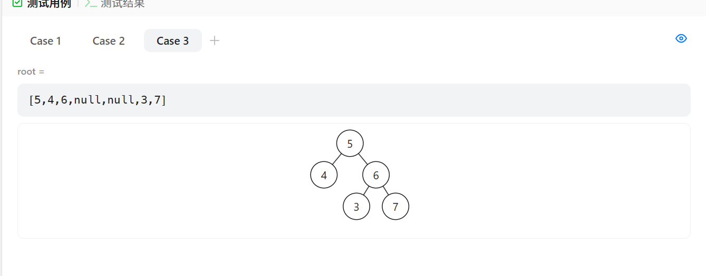

做过


[98. 验证二叉搜索树 - 力扣（LeetCode）](https://leetcode.cn/problems/validate-binary-search-tree/description/?envType=study-plan-v2&envId=top-100-liked)


# 自己写的一种错误解法


```java
class Solution {
    public boolean isValidBST(TreeNode root) {
        // 使用队列进行广度优先搜索（BFS）
        Deque<TreeNode> queue = new LinkedList<>();
        queue.offer(root);

        // BFS 循环
        while (!queue.isEmpty()) {
            TreeNode node = queue.poll();

            // 检查左子树
            if (node.left != null) {
                // 判断左子树的节点值是否小于当前节点值
                if (node.left.val < node.val) {
                    queue.offer(node.left); // 左子树符合条件，继续遍历
                } else {
                    return false; // 不符合条件，返回 false
                }
            }

            // 检查右子树
            if (node.right != null) {
                // 判断右子树的节点值是否大于当前节点值
                if (node.right.val > node.val) {
                    queue.offer(node.right); // 右子树符合条件，继续遍历
                } else {
                    return false; // 不符合条件，返回 false
                }
            }
        }

        // 如果遍历完所有节点都符合条件，返回 true
        return true;
    }
}

```


### 错误的地方：

1. **没有维护节点值的上下边界**：
   - 二叉搜索树的标准是：对于每个节点，左子树的所有节点值必须小于当前节点值，右子树的所有节点值必须大于当前节点值，并且这些约束条件是递归传递下去的。
   - 你现在的代码只检查了当前节点的左右子树相对于父节点的值是否满足 BST 条件，但是 **没有将这些条件传递到子树中**。这意味着，子树的节点值是否在父节点的范围内并没有得到验证。
2. **不能单纯依赖当前节点的值和其左右子树的比较**：
   - 比如，假设节点 A 的值是 5，左子树的节点 B 的值是 4，右子树的节点 C 的值是 6，这时候这些节点都符合当前的比较条件。但如果节点 B 的左子树有个节点 D，值是 8，那么它就违反了二叉搜索树的性质（因为 8 > 5）。

### 改进方法：

为了确保树是有效的二叉搜索树，应该维护一个每个节点的有效值范围，即每个节点的值必须在其父节点传递过来的限制范围内。


错误原因：



这个例子答案是false，而我的程序判断true


# 正确解法


灵神题解：[98. 验证二叉搜索树 - 力扣（LeetCode）](https://leetcode.cn/problems/validate-binary-search-tree/solutions/2020306/qian-xu-zhong-xu-hou-xu-san-chong-fang-f-yxvh/?envType=study-plan-v2&envId=top-100-liked)


[验证二叉搜索树【基础算法精讲 11】_哔哩哔哩_bilibili](https://www.bilibili.com/video/BV14G411P7C1/?vd_source=96c1635797a0d7626fb60e973a29da38)


做的时候想起来灵神之前讲的记录最大值最小值了，不过递归还是没写出来


# 中序遍历做法

```java
class Solution {
    // 主函数，检查二叉树是否是有效的二叉搜索树（BST）
    public boolean isValidBST(TreeNode root) {
        // 调用辅助函数 dfs，初始时左边界为 Long.MIN_VALUE，右边界为 Long.MAX_VALUE
        return dfs(root, Long.MIN_VALUE, Long.MAX_VALUE);
    }

    // 辅助函数，递归判断当前节点是否在有效的范围内，并检查其左右子树
    public boolean dfs(TreeNode root, long left, long right) {
        // 如果当前节点为空，直接返回 true，空树视为有效的二叉搜索树
        if (root == null) {
            return true;
        }

        // 当前节点的值
        int val = root.val;

        // 判断当前节点的值是否在有效范围内，并且递归判断左右子树
        return left < val && val < right // 当前节点值在左边界和右边界之间
            && dfs(root.left, left, val)  // 左子树的值应该小于当前节点的值
            && dfs(root.right, val, right); // 右子树的值应该大于当前节点的值
    }
}

```

