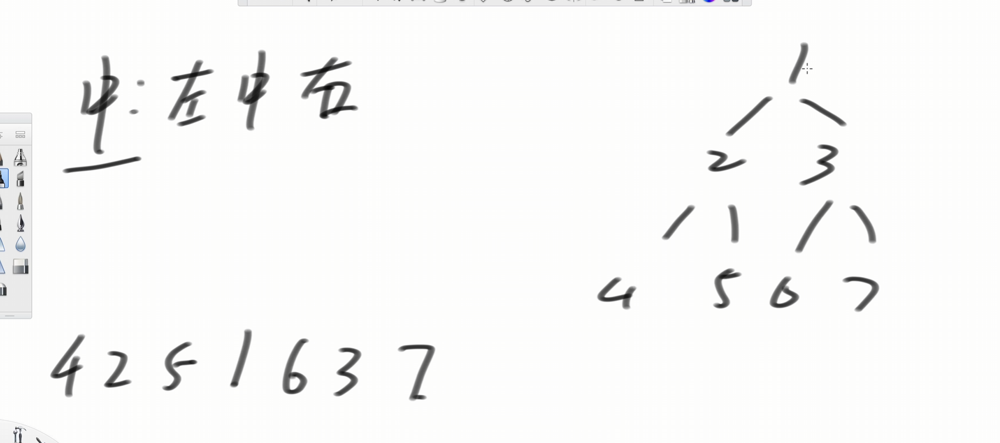
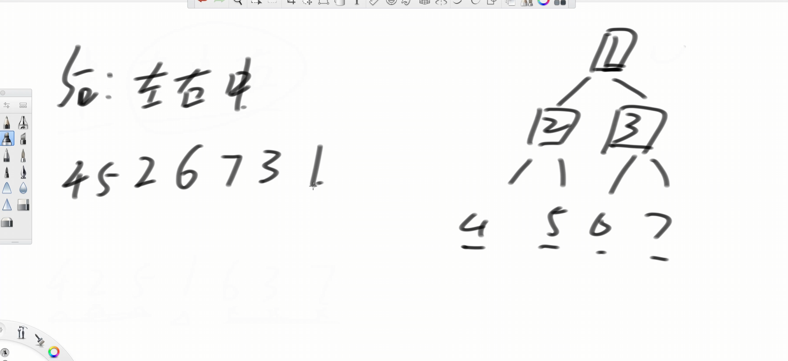
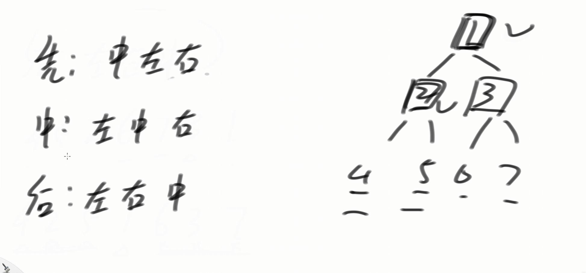
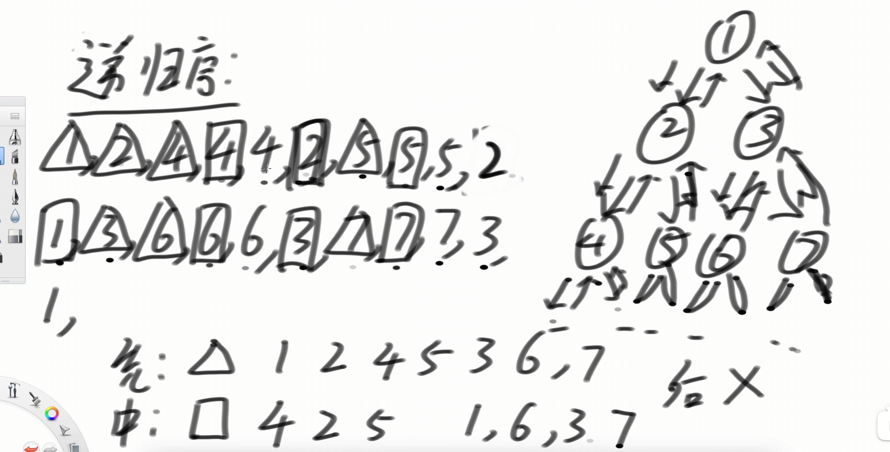

## 测试链接

[144. 二叉树的前序遍历 - 力扣（LeetCode）](https://leetcode.cn/problems/binary-tree-preorder-traversal/description/)

[94. 二叉树的中序遍历 - 力扣（LeetCode）](https://leetcode.cn/problems/binary-tree-inorder-traversal/description/)

[145. 二叉树的后序遍历 - 力扣（LeetCode）](https://leetcode.cn/problems/binary-tree-postorder-traversal/description/)


## 先序遍历


## 中序遍历




## 后序遍历




## 三种遍历方式




## 递归实现三种序

可以结合视频：[算法讲解017【入门】二叉树及其三种序的递归实现_哔哩哔哩_bilibili](https://www.bilibili.com/video/BV12p4y1V728/?spm_id_from=333.788.recommend_more_video.-1&vd_source=96c1635797a0d7626fb60e973a29da38)

```java
// 递归序的解释
// 用递归实现二叉树的三序遍历
public class BinaryTreeTraversalRecursion {

    public static class TreeNode {
       public int val;
       public TreeNode left;
       public TreeNode right;

       public TreeNode(int v) {
          val = v;
       }
    }

    // 递归基本样子，用来理解递归序
    public static void f(TreeNode head) {
       if (head == null) {
          return;
       }
       // 1
       f(head.left);
       // 2
       f(head.right);
       // 3
    }

    // 先序打印所有节点，递归版
    public static void preOrder(TreeNode head) {
       if (head == null) {
          return;
       }
       System.out.print(head.val + " ");
       preOrder(head.left);
       preOrder(head.right);
    }

    // 中序打印所有节点，递归版
    public static void inOrder(TreeNode head) {
       if (head == null) {
          return;
       }
       inOrder(head.left);
       System.out.print(head.val + " ");
       inOrder(head.right);
    }

    // 后序打印所有节点，递归版
    public static void posOrder(TreeNode head) {
       if (head == null) {
          return;
       }
       posOrder(head.left);
       posOrder(head.right);
       System.out.print(head.val + " ");
    }

    public static void main(String[] args) {
       TreeNode head = new TreeNode(1);
       head.left = new TreeNode(2);
       head.right = new TreeNode(3);
       head.left.left = new TreeNode(4);
       head.left.right = new TreeNode(5);
       head.right.left = new TreeNode(6);
       head.right.right = new TreeNode(7);

       preOrder(head);
       System.out.println();
       System.out.println("先序遍历递归版");

       inOrder(head);
       System.out.println();
       System.out.println("中序遍历递归版");

       posOrder(head);
       System.out.println();
       System.out.println("后序遍历递归版");

    }

}
```

