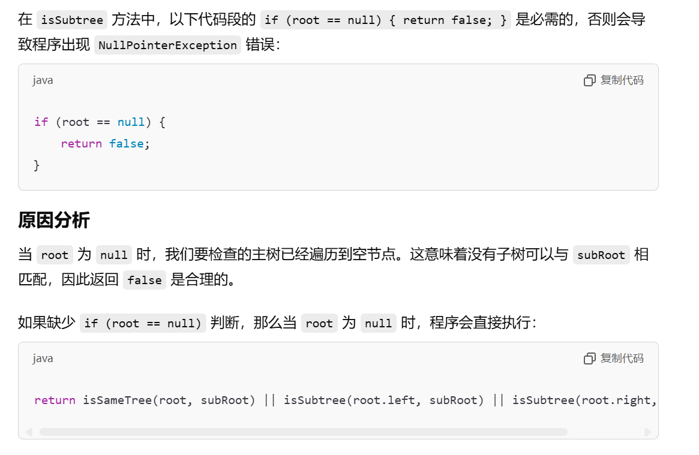
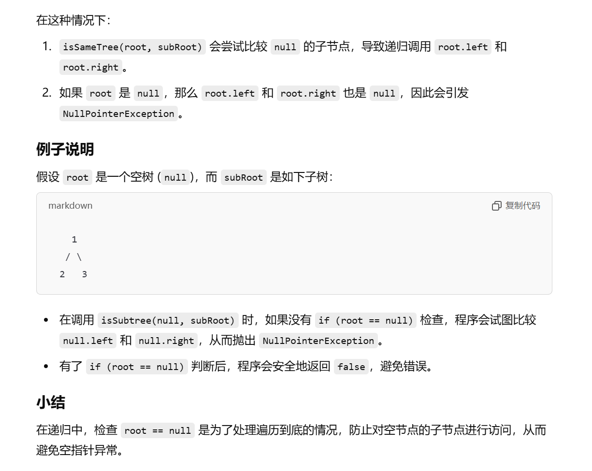

[572. 另一棵树的子树 - 力扣（LeetCode）](https://leetcode.cn/problems/subtree-of-another-tree/description/)

# kmp算法的运用

```java
    public class TreeNode {
        int val;
        TreeNode left;
        TreeNode right;

        TreeNode() {
        }

        TreeNode(int val) {
            this.val = val;
        }

        TreeNode(int val, TreeNode left, TreeNode right) {
            this.val = val;
            this.left = left;
            this.right = right;
        }
    }

    class Solution {
        public boolean isSubtree(TreeNode root, TreeNode subRoot) {

            //先进行先序序列化，然后进行kmp
            ArrayList<String> roots = new ArrayList<>();
            ArrayList<String> subRoots = new ArrayList<>();
            serial(root, roots);
            serial(subRoot, subRoots);
            return kmp(roots, subRoots);
        }


        //先序序列化
        public void serial(TreeNode root, ArrayList<String> arr) {
            if (root == null) {
                arr.add("null");
            } else {
                arr.add(String.valueOf(root.val));
                serial(root.left, arr);
                serial(root.right, arr);
            }
        }


        //kmp算法
        public boolean kmp(ArrayList<String> str, ArrayList<String> substr) {
            int m = str.size();
            int n = substr.size();
            int[] next = getnext(substr);
            int i = 0, j = 0;
            while (i < m && j < n) {
                if (str.get(i).equals(substr.get(j))) {
                    i++;
                    j++;
                } else if (j > 0) {
                    j = next[j];
                } else {
                    i++;
                }
            }
            return j == n ? true : false;
        }

        private int[] getnext(ArrayList<String> substr) {
            if (substr.size() == 1) {
                return new int[]{-1};
            }
            int n = substr.size();
            int[] next = new int[n];
            next[0] = -1;
            next[1] = 0;
            int i = 2, cn = 0;
            while (i < n) {
                if (substr.get(i - 1).equals(substr.get(cn))) {
                    cn++;
                    next[i++] = cn;
                } else if (cn > 0) {
                    cn = next[cn];
                } else {
                    next[i++] = 0;
                }
            }
            return next;
        }
    }
```


# 类似于100题和101题的方法（暴力遍历）

```java
class Solution {
    public boolean isSubtree(TreeNode root, TreeNode subRoot) {
        if (root == null) {
            return false;
        }
        return isSameTree(root, subRoot) || isSubtree(root.left, subRoot) || isSubtree(root.right, subRoot);
    }

    public boolean isSameTree(TreeNode p, TreeNode q) {
        if (p == null && q != null) {
            return false;
        }
        if (p != null && q == null) {
            return false;
        }
        if (p == null && q == null) {
            return true;
        }
        if (p.val != q.val) {
            return false;
        }
        boolean leftSame = isSameTree(p.left, q.left);  //判断左子树是否相同
        boolean rightSame = isSameTree(p.right, q.right);  //判断右子树是否相同
        return leftSame && rightSame;
    }
}
```




