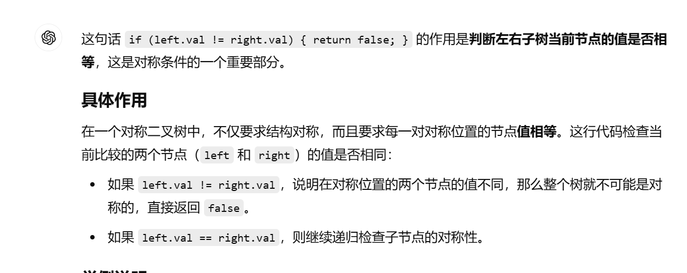
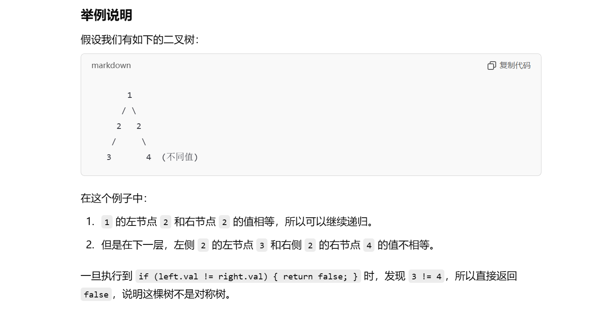

[101. 对称二叉树 - 力扣（LeetCode）](https://leetcode.cn/problems/symmetric-tree/description/)


# 递归写法

```java
class Solution {
    public boolean isSymmetric(TreeNode root) {
        return compare(root.left, root.right);
    }

    public boolean compare(TreeNode left, TreeNode right) {
        if (left == null && right != null) {
            return false;
        }
        if (left != null && right == null) {
            return false;
        }
        if (left == null && right == null) {
            return true;
        }
        if (left.val != right.val) {
            return false;
        }
        boolean outside = compare(left.left, right.right);
        boolean inside = compare(left.right, right.left);
        return outside && inside;
    }
}
```






# 迭代写法


```java
Deque<TreeNode> deque = new LinkedList<>();
deque.offerFirst(root.left);
deque.offerLast(root.right);
while (!deque.isEmpty()) {
    TreeNode leftNode = deque.pollFirst();
    TreeNode rightNode = deque.pollLast();
    if (leftNode == null && rightNode == null) {
        continue;
    }
    if (leftNode == null && rightNode != null) {
        return false;
    }
    if (leftNode != null && rightNode == null) {
        return false;
    }
    if (leftNode.val != rightNode.val) {
        return false;
    }
    deque.offerFirst(leftNode.right);
    deque.offerFirst(leftNode.left);
    deque.offerLast(rightNode.left);
    deque.offerLast(rightNode.right);
}
return true;
```

