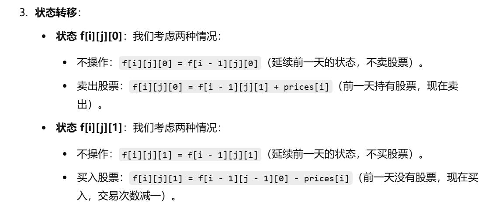

[代码随想录](https://www.programmercarl.com/0188.买卖股票的最佳时机IV.html)


[买卖股票的最佳时机【基础算法精讲 21】_哔哩哔哩_bilibili](https://www.bilibili.com/video/BV1ho4y1W7QK/?vd_source=96c1635797a0d7626fb60e973a29da38)


# 三维数组写法

```java
class Solution {
    public int maxProfit(int k, int[] prices) {
        int n = prices.length;  // 获取价格数组的长度

        // 创建一个三维数组 f，其中 f[i][j][0] 表示在第 i 天，最多进行 j 次交易并且不持有股票时的最大利润
        // f[i][j][1] 表示在第 i 天，最多进行 j 次交易并且持有股票时的最大利润
        int[][][] f = new int[n][k + 1][2];

        // 初始化第 0 天的状态
        // 第 0 天，最多进行 j 次交易且不持有股票的最大利润为 0
        // 第 0 天，最多进行 j 次交易且持有股票的最大利润为 -prices[0]（买入股票的最大利润）
        for (int j = 0; j <= k; j++) {
            f[0][j][0] = 0;                  // 第 0 天不持有股票的最大利润为 0
            f[0][j][1] = -prices[0];         // 第 0 天持有股票的最大利润是 -prices[0]，即买入股票
        }

        // 从第 1 天开始，逐步计算每一天的最大利润
        for (int i = 1; i < n; i++) {
            for (int j = 1; j <= k; j++) {
                // f[i][j][0]：在第 i 天，最多进行 j 次交易且不持有股票的最大利润
                // 选择不操作（即保持前一天的状态）或者今天卖出股票（即前一天持有股票并且卖掉）
                f[i][j][0] = Math.max(f[i - 1][j][0], f[i - 1][j][1] + prices[i]);

                // f[i][j][1]：在第 i 天，最多进行 j 次交易且持有股票的最大利润
                // 选择不操作（即保持前一天的状态）或者今天买入股票（即前一天没有股票并且今天买入）
                f[i][j][1] = Math.max(f[i - 1][j][1], f[i - 1][j - 1][0] - prices[i]);
            }
        }

        // 返回在第 n-1 天，最多进行 k 次交易并且不持有股票时的最大利润
        return f[n - 1][k][0];
    }
}

```





# 简化写法

```java
class Solution {
    public int maxProfit(int k, int[] prices) {
        int n = prices.length;
        int[][] f = new int[k + 1][2];

        for (int j = 0; j <= k; j++) {
            f[j][0] = 0;
            f[j][1] = -prices[0];
        }
        for (int i = 1; i < n; i++) {
            for (int j = 1; j <= k; j++) {
                f[j][0] = Math.max(f[j][0], f[j][1] + prices[i]);
                f[j][1] = Math.max(f[j][1], f[j - 1][0] - prices[i]);
            }
        }
        return f[k][0];
    }
}
```


# 题目变形


[买卖股票的最佳时机【基础算法精讲 21】_哔哩哔哩_bilibili](https://www.bilibili.com/video/BV1ho4y1W7QK/?vd_source=96c1635797a0d7626fb60e973a29da38)


[188. 买卖股票的最佳时机 IV - 力扣（LeetCode）](https://leetcode.cn/problems/best-time-to-buy-and-sell-stock-iv/solutions/2201488/shi-pin-jiao-ni-yi-bu-bu-si-kao-dong-tai-kksg/)

## 恰好交易k次

#### 变化：

1. 在**恰好交易 `k` 次**的情况下，最终结果需要考虑交易恰好为 `k` 的状态。
2. 在状态转移时，需要确保所有 `f[i][j][0]` 都是以恰好 `j` 次交易计算得出。

#### 修改步骤：

1. **初始化**：
   - 当 `j > 0` 时，`f[0][j][0]` 和 `f[0][j][1]` 应初始化为不可达值（如 `Integer.MIN_VALUE` 或 `-∞`），表示当天不可能完成 `j` 次交易。
   - 保持 `f[0][0][0] = 0` 和 `f[0][0][1] = -prices[0]` 不变。
2. **状态转移**：
   - 对于 `f[i][j][0]`，表示完成恰好 `j` 次交易后的状态。
   - 对于 `f[i][j][1]`，表示在进行第 `j` 次交易时持有股票的状态。
3. **最终结果**：
   - 返回 `f[n - 1][k][0]`，因为恰好交易 `k` 次时，必须在最后一天不持有股票。


## 代码实现


```java
class Solution {
    public int maxProfit(int k, int[] prices) {
        int n = prices.length;
        if (n == 0) return 0;

        int[][][] f = new int[n][k + 1][2];

        // 初始化
        for (int j = 0; j <= k; j++) {
            f[0][j][0] = (j == 0) ? 0 : Integer.MIN_VALUE;
            f[0][j][1] = (j == 1) ? -prices[0] : Integer.MIN_VALUE;
        }

        // 状态转移
        for (int i = 1; i < n; i++) {
            for (int j = 1; j <= k; j++) {
                f[i][j][0] = Math.max(f[i - 1][j][0], f[i - 1][j][1] + prices[i]);
                f[i][j][1] = Math.max(f[i - 1][j][1], f[i - 1][j - 1][0] - prices[i]);
            }
        }

        // 返回恰好交易 k 次且不持有股票时的最大利润
        return f[n - 1][k][0] == Integer.MIN_VALUE ? 0 : f[n - 1][k][0];
    }
}
```


## 至少交易k次

