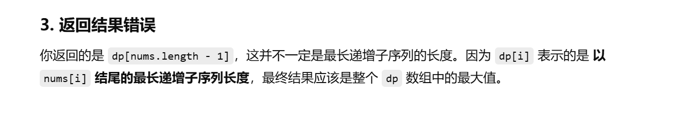

[代码随想录](https://www.programmercarl.com/0300.最长上升子序列.html#算法公开课)


```java
class Solution {
    public int lengthOfLIS(int[] nums) {

        //dp[i]表示数组的以nums[i]结尾（包括nums[i]）的最长递增子序列的长度
        int[] dp = new int[nums.length];

        // 初始化 dp 数组，每个元素最少可以单独成序列，长度为 1
        Arrays.fill(dp,1);

        for (int i = 1; i < nums.length; i++) {
            for (int j = 0; j < i; j++) {
                if (nums[i] > nums[j]) {
                    dp[i] = Math.max(dp[i], dp[j] + 1);
                }
            }
        }
        return dp[nums.length - 1];
    }
}
```





# 正确写法

```java
class Solution {
    public int lengthOfLIS(int[] nums) {

        //dp[i]表示数组的以nums[i]结尾（包括nums[i]）的最长递增子序列的长度
        int[] dp = new int[nums.length];

        // 初始化 dp 数组，每个元素最少可以单独成序列，长度为 1
        Arrays.fill(dp, 1);

        int maxLen = 1;
        for (int i = 1; i < nums.length; i++) {
            for (int j = 0; j < i; j++) {
                if (nums[i] > nums[j]) {
                    dp[i] = Math.max(dp[i], dp[j] + 1);
                }
            }
            maxLen = Math.max(maxLen, dp[i]);
        }
        return maxLen;
    }
}
```

