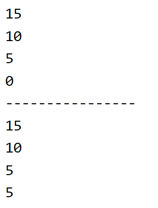

[39. 组合总和 - 力扣（LeetCode）](https://leetcode.cn/problems/combination-sum/description/)


# 不对的写法，这里程序本身也不对，只是看sum变量的用法

```java
class Solution {

    public List<List<Integer>> combinationSum(int[] candidates, int target) {

        List<List<Integer>> ans = new ArrayList<>();
        if (candidates.length == 0) {
            return ans;
        }
        Arrays.sort(candidates);  //对数组进行排序，这样结果中不会出现重复集合
        dfs(candidates, target, new ArrayList<>(), ans, 0);
        return ans;
    }

    public void dfs(int[] candidates, int target, List<Integer> path, List<List<Integer>> ans, int sum) {
        if (sum > target) {
            return;
        }
        if (sum == target) {
            ans.add(new ArrayList<>(path));
            return;
        }
        for (int i = 0; i < candidates.length; i++) {
            path.add(candidates[i]);
            sum += candidates[i];  //这里sum不能在外面直接加，这样递归返回后sum的值不会恢复
            //可以放在dfs里面加，例如 dfs(candidates, target, path, ans, sum+ candidates[i]);
            dfs(candidates, target, path, ans, sum);
            path.remove(path.size() - 1);
        }
    }
}
```


# 举例子

```java
public class codetest {


    public static void main(String[] args) {
        sumTest1(0);

        System.out.println("----------------");

        sumTest2(0);
    }

    public static void sumTest1(int sum) {
        if (sum == 20) {
            return;
        }

        sumTest1(sum + 5);
        System.out.println(sum);

    }

    public static void sumTest2(int sum) {
        if (sum == 20) {
            return;
        }

        sum += 5;
        sumTest1(sum);
        System.out.println(sum);

    }
}
```


# 输出结果



**可以看出，在最顶层的递归退出时，我们想要的是sum仍然为0，但是此时sum的值变为了5，所以回溯时要用第一种传递方式。**

# 正解1（将sum设为全局变量）

```java
class Solution {

    int sum = 0;

    public List<List<Integer>> combinationSum(int[] candidates, int target) {

        List<List<Integer>> ans = new ArrayList<>();
        if (candidates.length == 0) {
            return ans;
        }
        Arrays.sort(candidates);  //对数组进行排序，这样结果中不会出现重复集合
        dfs(candidates, target, new ArrayList<>(), ans, 0);
        return ans;
    }

    public void dfs(int[] candidates, int target, List<Integer> path, List<List<Integer>> ans, int startIndex) {
        if (sum > target) {
            return;
        }
        if (sum == target) {
            ans.add(new ArrayList<>(path));
            return;
        }
        for (int i = startIndex; i < candidates.length; i++) {
            path.add(candidates[i]);
            sum += candidates[i];
            dfs(candidates, target, path, ans, i);
            sum -= candidates[i];
            path.remove(path.size() - 1);
        }
    }
}
```


# 正解2（sum作为参数传递，注意传递方式）

```java
class Solution {

    public List<List<Integer>> combinationSum(int[] candidates, int target) {

        List<List<Integer>> ans = new ArrayList<>();
        if (candidates.length == 0) {
            return ans;
        }
        Arrays.sort(candidates);  //对数组进行排序，这样结果中不会出现重复集合
        dfs(candidates, target, new ArrayList<>(), ans, 0, 0);
        return ans;
    }

    public void dfs(int[] candidates, int target, List<Integer> path, List<List<Integer>> ans, int startIndex, int sum) {
        if (sum > target) {
            return;
        }
        if (sum == target) {
            ans.add(new ArrayList<>(path));
            return;
        }
        for (int i = startIndex; i < candidates.length; i++) {
            path.add(candidates[i]);
            dfs(candidates, target, path, ans, i, sum + candidates[i]);
            path.remove(path.size() - 1);
        }
    }
}
```