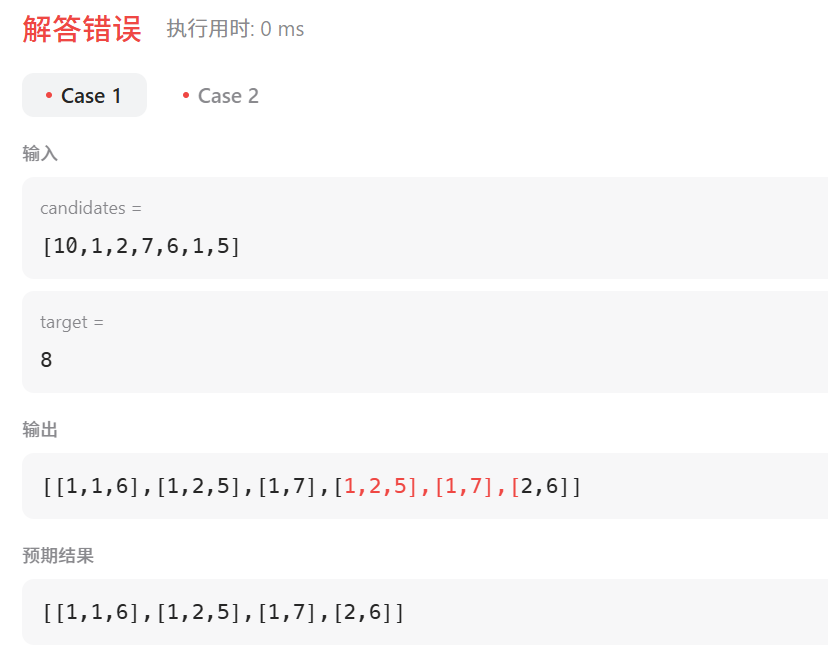

[40. 组合总和 II](https://leetcode.cn/problems/combination-sum-ii/)


# 错误解法

```java
class Solution {
    public List<List<Integer>> combinationSum2(int[] candidates, int target) {
        List<List<Integer>> ans = new ArrayList<>();
        List<Integer> path = new ArrayList<>();
        Arrays.sort(candidates);
        dfs(ans, path, candidates, target, 0, 0);
        return ans;
    }

    public void dfs(List<List<Integer>> ans, List<Integer> path, int[] candidates, int target, int sum, int startIndex) {
        if (sum == target) {
            ans.add(new ArrayList<>(path));
            return;
        }
        for (int i = startIndex; i < candidates.length; i++) {
            if (sum + candidates[i] > target) {
                break;
            }
            path.add(candidates[i]);
            dfs(ans, path, candidates, target, sum + candidates[i], i + 1);
            path.remove(path.size() - 1);
        }
    }
}
```




# 正确解法（去重复集合）

```java
class Solution {
    public List<List<Integer>> combinationSum2(int[] candidates, int target) {
        List<List<Integer>> ans = new ArrayList<>();
        List<Integer> path = new ArrayList<>();
        Arrays.sort(candidates);
        dfs(ans, path, candidates, target, 0, 0);
        return ans;
    }

    public void dfs(List<List<Integer>> ans, List<Integer> path, int[] candidates, int target, int sum, int startIndex) {
        if (sum == target) {
            ans.add(new ArrayList<>(path));
            return;
        }
        for (int i = startIndex; i < candidates.length; i++) {
            if (sum + candidates[i] > target) {
                break;
            }
            if (i > startIndex && candidates[i] == candidates[i - 1]) {  //关键点
                continue;
            }
            path.add(candidates[i]);
            dfs(ans, path, candidates, target, sum + candidates[i], i + 1);
            path.remove(path.size() - 1);
        }
    }
}
```