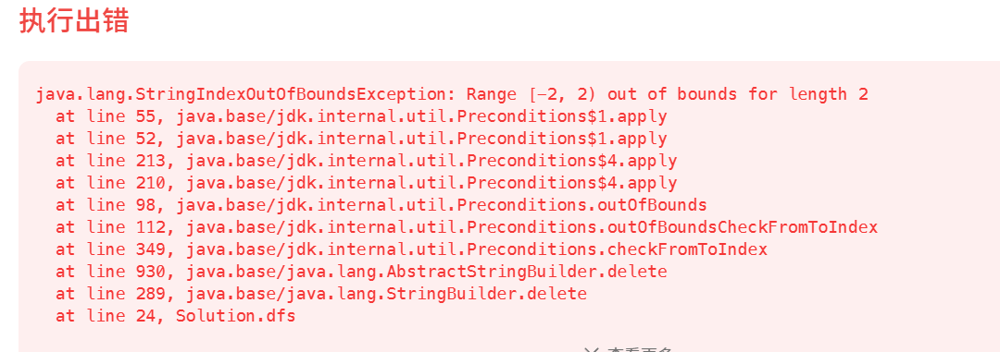

[93. 复原 IP 地址 - 力扣（LeetCode）](https://leetcode.cn/problems/restore-ip-addresses/description/)


# 自己想的一套解法

```java
    class Solution {
        public List<String> restoreIpAddresses(String s) {
            List<String> ans = new ArrayList<>();
            StringBuilder path = new StringBuilder();
            dfs(s, path, ans, 0, 0);  ///这里count计算当前有几个字段了
            return ans;
        }

        public void dfs(String s, StringBuilder path, List<String> ans, int startIndex, int count) {
            if (count == 4 && startIndex == s.length()) {
                //到这里，path在最后多了一个.，删去
                path.deleteCharAt(path.length() - 1);
                ans.add(path.toString());
                return;
            }
            for (int i = startIndex; i < s.length(); i++) {  //这里最多取3个字符作为ip地址的某个字段
                if (count > 4) {
                    break;
                }
                String str = s.substring(startIndex, i + 1);
                if (isAns(str)) {
                    int length=path.length();
                    path.append(str).append(".");
                    dfs(s, path, ans, i + 1, count + 1);
                   // path.delete(path.length() - str.length() - 1, path.length()); //回溯
                    path.setLength(length);
                }
            }
        }

        public boolean isAns(String str) {  //判断该段字符串是否可以作为ip地址的一部分
            if (str.length()>3){  //字段最多三位数
                return false;
            }
            if (str.length() >= 2 && str.charAt(0) == '0') {  //不含前导0
                return false;
            }
            int val = Integer.valueOf(str);
            if (val < 0 || val > 255) {
                return false;
            }
            return true;
        }
    }
```


# 以下解法报错，为什么？

```java
    class Solution {
        public List<String> restoreIpAddresses(String s) {
            List<String> ans = new ArrayList<>();
            StringBuilder path = new StringBuilder();
            dfs(s, path, ans, 0, 0);
            return ans;
        }

        public void dfs(String s, StringBuilder path, List<String> ans, int startIndex, int count) {
            if (count == 4 && startIndex == s.length()) {
                //到这里，path在最后多了一个.，删去
                path.deleteCharAt(path.length() - 1);
                ans.add(path.toString());
                return;
            }
            for (int i = startIndex; i < s.length(); i++) {  //这里最多取3个字符作为ip地址的某个字段
                if (count > 4) {
                    break;
                }
                String str = s.substring(startIndex, i + 1);
                if (isAns(str)) {
                    path.append(str).append(".");
                    dfs(s, path, ans, i + 1, count + 1);
                    path.delete(path.length() - str.length() - 1, path.length()); //回溯
                }
            }
        }

        public boolean isAns(String str) {  //判断该段字符串是否可以作为ip地址的一部分
            if (str.length()>3){  //字段最多三位数
                return false;
            }
            if (str.length() >= 2 && str.charAt(0) == '0') {  //不含前导0
                return false;
            }
            int val = Integer.valueOf(str);
            if (val < 0 || val > 255) {
                return false;
            }
            return true;
        }
    }
```



# 


通过调试，找出了问题，问题就出在最后收集的时候，删去的那个.，一但删去，后面回溯的时候，就会乱

```java
class Solution {
    public List<String> restoreIpAddresses(String s) {
        List<String> ans = new ArrayList<>();
        StringBuilder path = new StringBuilder();
        dfs(s, path, ans, 0, 0);
        return ans;
    }

    public void dfs(String s, StringBuilder path, List<String> ans, int startIndex, int count) {
        if (count == 4 && startIndex == s.length()) {
            //到这里，path在最后多了一个.，不要删除，删除之后，后面的回溯会乱,直接用substring
            ans.add(path.substring(0, path.length() - 1).toString());
            return;
        }
        for (int i = startIndex; i < s.length(); i++) {  //这里最多取3个字符作为ip地址的某个字段
            if (count > 4) {
                break;
            }
            String str = s.substring(startIndex, i + 1);
            if (isAns(str)) {
                path.append(str).append(".");
                dfs(s, path, ans, i + 1, count + 1);
                path.delete(path.length() - str.length() - 1, path.length()); //回溯，就在这出现的问题
            }
        }
    }

    public boolean isAns(String str) {  //判断该段字符串是否可以作为ip地址的一部分
        if (str.length() > 3) {  //字段最多三位数
            return false;
        }
        if (str.length() >= 2 && str.charAt(0) == '0') {  //不含前导0
            return false;
        }
        int val = Integer.valueOf(str);
        if (val < 0 || val > 255) {
            return false;
        }
        return true;
    }
}
```


# 力扣代码调试的方法

```java
public class codetest {


    public List<String> restoreIpAddresses(String s) {
        List<String> ans = new ArrayList<>();
        StringBuilder path = new StringBuilder();
        dfs(s, path, ans, 0, 0);
        return ans;
    }

    public void dfs(String s, StringBuilder path, List<String> ans, int startIndex, int count) {
        if (count == 4 && startIndex == s.length()) {
            //到这里，path在最后多了一个.，不要删除，删除之后，后面的回溯会乱,直接用substring
            ans.add(path.substring(0, path.length() - 1).toString());
            return;
        }
        for (int i = startIndex; i < s.length(); i++) {  //这里最多取3个字符作为ip地址的某个字段
            if (count > 4) {
                break;
            }
            String str = s.substring(startIndex, i + 1);
            if (isAns(str)) {
                path.append(str).append(".");
                dfs(s, path, ans, i + 1, count + 1);
                path.delete(path.length() - str.length() - 1, path.length()); //回溯，就在这出现的问题
            }
        }
    }

    public boolean isAns(String str) {  //判断该段字符串是否可以作为ip地址的一部分
        if (str.length() > 3) {  //字段最多三位数
            return false;
        }
        if (str.length() >= 2 && str.charAt(0) == '0') {  //不含前导0
            return false;
        }
        int val = Integer.valueOf(str);
        if (val < 0 || val > 255) {
            return false;
        }
        return true;
    }


    public static void main(String[] args) {
        codetest codetest = new codetest();
        List<String> ans = codetest.restoreIpAddresses("1234");


    }


}
```