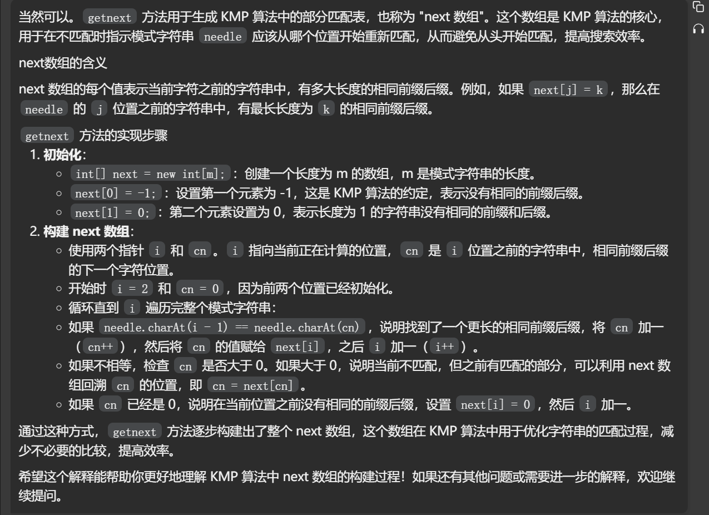

## KMP算法模板

```java
// KMP算法模版
// 测试链接 : https://leetcode.cn/problems/find-the-index-of-the-first-occurrence-in-a-string/
public class Code01_KMP {

	public static int strStr(String s1, String s2) {
		// return s1.indexOf(s2);
		return kmp(s1.toCharArray(), s2.toCharArray());
	}

	// KMP算法
	public static int kmp(char[] s1, char[] s2) {
		// s1中当前比对的位置是x
		// s2中当前比对的位置是y
		int n = s1.length, m = s2.length, x = 0, y = 0;
		// O(m)
		int[] next = nextArray(s2, m);
		// O(n)
		while (x < n && y < m) {
			if (s1[x] == s2[y]) {
				x++;
				y++;
			} else if (y == 0) {
				x++;
			} else {
				y = next[y];
			}
		}
		return y == m ? x - y : -1;
	}

	// 得到next数组
	public static int[] nextArray(char[] s, int m) {
		if (m == 1) {
			return new int[] { -1 };
		}
		int[] next = new int[m];
		next[0] = -1;
		next[1] = 0;
		// i表示当前要求next值的位置
		// cn表示当前要和前一个字符比对的下标
		int i = 2, cn = 0;
		while (i < m) {
			if (s[i - 1] == s[cn]) {
				next[i++] = ++cn;
			} else if (cn > 0) {
				cn = next[cn];
			} else {
				next[i++] = 0;
			}
		}
		return next;
	}

}

```


[28. 找出字符串中第一个匹配项的下标 - 力扣（LeetCode）](https://leetcode.cn/problems/find-the-index-of-the-first-occurrence-in-a-string/description/)

```java
class Solution {
    public int strStr(String haystack, String needle) {

        int n = haystack.length(), m = needle.length();
        int[] next = getnext(needle, m);
        int i = 0, j = 0;
        while (i < n && j < m) {
            if (haystack.charAt(i) == needle.charAt(j)) {
                i++;
                j++;
            } else if (j > 0) {
                j = next[j];
            } else {  //j=0
                i++;
            }
        }
        return j == m ? i - j : -1;
    }

    public int[] getnext(String needle, int m) {
        if (m == 1) {  //特判
            return new int[]{-1};
        }
        int[] next = new int[m];
        next[0] = -1;
        next[1] = 0;  //这里的next数组定义为不包含当前i的前面的字符串的最大公共前后缀长度
        int i = 2, cn = 0;
        while (i < m) {
            if (needle.charAt(i - 1) == needle.charAt(cn)) {
                cn++;
                next[i++] = cn;
            } else if (cn > 0) {
                cn = next[cn];
            } else {  //cn=0
                next[i++] = 0;
            }
        }
        return next;
    }
}
```


