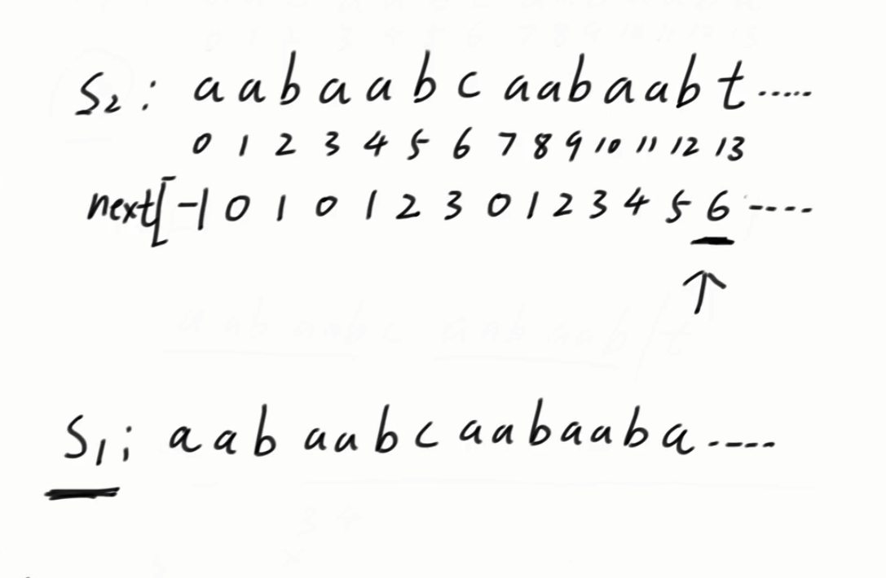

### java中有自己的api，类似于strcat，indexOf（）函数

```java
String str1="aaaavafadadaaaf";
String str2="aaf";
System.out.println(str1.indexOf(str2));
```


## next数组求法


现在，假设有一个这样的字符串，图中给出了其每个字符对应的下标。


next数组就是在每个下标的位置求出一个值，比如0下标处求出的值是-1，这个值的含义是**不包括当前下标**的前面的字符串的**最长公共前后缀**大小，前缀指的是包含第一个字母，但不能包含最后一个字母的所有字串，后缀指的是包含最后一个字母，但不能包含第一个字母的所有字串，举个例子，这里1下标处求next数组时，前缀和后缀为空字符串，因为前面只有一个a，这里a既是第一个字母，也是最后一个字母，而这里2下标处求next数组时，前缀有一个a，后缀有一个a，这里前后缀一样，那么这里求出来就是1。

所以可以看出来，next数组的前两位，即

```java
next[0] = -1;
next[1] = 0;
```

这是一定的。


 下标13是一个终止位置，一般用不上。


## 举例子



现在要在s1中找到匹配s2的字串，那么首先把s2的next数组求出来。

可以看出，从头开始匹配的过程中，当到了下标13处开始出现不匹配的情形，那么此时看下标13处的next数组的值，发现是6，那么此时s1下标不要动，把s2的下标移动到6处，也就是下图


然后就是从s1的下标7开头看看能不能把与s2匹配的字串找出来。


## 重点：为什么可以这么移动？

**为什么s1的下标0-6都可以断定匹配不出来s2呢？**

举个例子


s2是我们要从s1中匹配出来的字符串，s1从下标i出发，与s2的下标0开始一直往下匹配，发现在s1的下标j和s2的下标k位置处不匹配了，那么我们就看s2的下标k的next数组的值，假设为7，


那么我们应该把s2移动到s1的p位置开始往下配，但是我们假设i和p之间的某一个开头，从这个开头开始能往下配出s2，那么


从这个开头出发（记为m），到j位置这一段，可能与s2中从0出发的一段等长的字符串匹配，也就是上图，但现在就出现矛盾了，因为我们s1从i位置开始与s2的0位置开始往下一直都是匹配的，直接j和k才不匹配，那么我们s1的m到j-1位置这段字符串肯定与s2的下面的一段一样，也就是下图，此时，红色的框还要与下面黑色的框也一样，那这个才应该是我们的最长前后缀，但是我们之前求出的k位置的next数组为7，不是这个长度，就产生了矛盾，所以不成立。


**为什么直接可以从s1的下标13与s2的下标6开始匹配呢？**

主要是next数组的意义决定的，因为s2的索引13处next数组的值为6，那么意味着在索引13处的最长公共前后缀长度为6，而s2在索引13处的长度为6的后缀为aabaab，前缀一定也是aabaab，我们在匹配的过程中又知道s1的下标7-12这一段字串与s2的后缀的aabaab匹配上了，那么这一段就可以不用在重新匹配一次了，我们直接用s2的前缀aabaab开始把他匹配上，也就是上面两个图里的第二个图，那么我们就可以直接从s1的下标13处和s2的下标6处开始继续往下匹配。


## 继上一步继续匹配

继续之后的过程，我们发现s1的下标13位置和s2的下标6位置没有匹配上，我们去找s2的下标6位置的next数组值，发现是3，于是我们将s2的位置移动到下标3，如下图所示


然后我们继续拿s1的下标13处与s2的下标3处开始匹配，发现这时候相等了，那么我们继续往下走，流程还是这样的流程，知道找到结果。

注意一点：假如上面的图13位置如果一直匹配不上，next数组的值为-1了，那么此时要直接从s1的14位置和s2的0位置开始匹配了。


## next数组如何生成

首先默认

```java
next[0] = -1;
next[1] = 0;
```

这是一定的。
