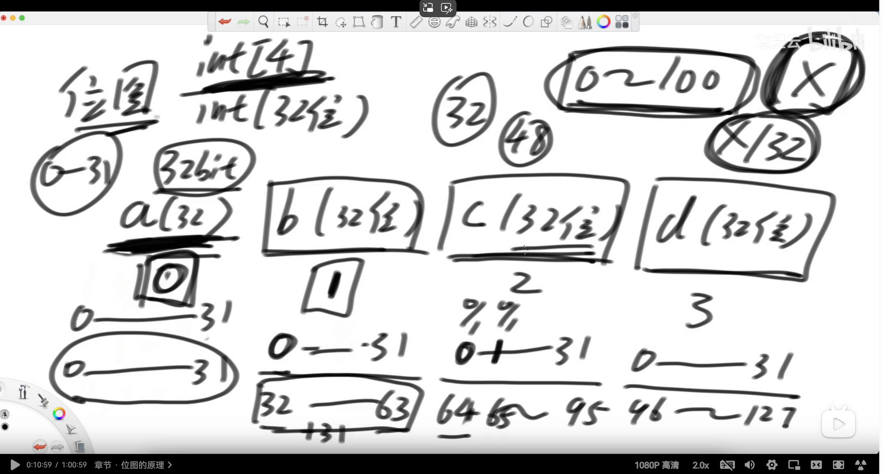
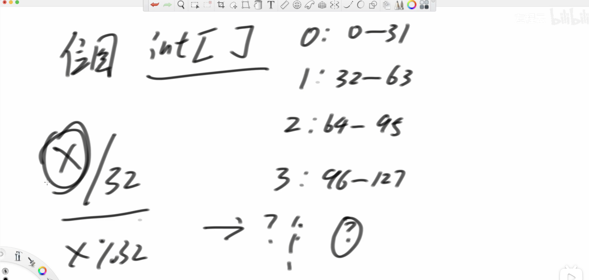

[2166. 设计位集 - 力扣（LeetCode）](https://leetcode.cn/problems/design-bitset/description/)


## 位图的方法（左神）

```java
class Bitset {
    private int[] set;
    private final int size;
    private int zeros;
    private int ones;
    private boolean reverse;

    public Bitset(int n) {
       set = new int[(n + 31) / 32];
       size = n;
       zeros = n;
       ones = 0;
       reverse = false;
    }

    // 把i这个数字加入到位图
    public void fix(int i) {
       int index = i / 32;
       int bit = i % 32;
       if (!reverse) {
          // 位图所有位的状态，维持原始含义
          // 0 : 不存在
          // 1 : 存在
          if ((set[index] & (1 << bit)) == 0) {
             zeros--;
             ones++;
             set[index] |= (1 << bit);
          }
       } else {
          // 位图所有位的状态，翻转了
          // 0 : 存在
          // 1 : 不存在
          if ((set[index] & (1 << bit)) != 0) {
             zeros--;
             ones++;
             set[index] ^= (1 << bit);
          }
       }
    }

    // 把i这个数字从位图中移除
    public void unfix(int i) {
       int index = i / 32;
       int bit = i % 32;
       if (!reverse) {
          if ((set[index] & (1 << bit)) != 0) {
             ones--;
             zeros++;
             set[index] ^= (1 << bit);
          }
       } else {
          if ((set[index] & (1 << bit)) == 0) {
             ones--;
             zeros++;
             set[index] |= (1 << bit);
          }
       }
    }

    public void flip() {
       reverse = !reverse;
       int tmp = zeros;
       zeros = ones;
       ones = tmp;
    }

    public boolean all() {
       return ones == size;
    }

    public boolean one() {
       return ones > 0;
    }

    public int count() {
       return ones;
    }

    public String toString() {
       StringBuilder builder = new StringBuilder();
       for (int i = 0, k = 0, number, status; i < size; k++) {
          number = set[k];
          for (int j = 0; j < 32 && i < size; j++, i++) {
             status = (number >> j) & 1;
             status ^= reverse ? 1 : 0;
             builder.append(status);
          }
       }
       return builder.toString();
    }

}
```

## 我的写法

```java
class Bitset {
    public static int[] set;
    int zero;
    int one;
    boolean reverse;
    int size;

    public Bitset(int size) {
        this.size = size;
        set = new int[(size + 32 - 1) / 32];
        zero = size;
        one = 0;
        reverse = false;
    }

    public void fix(int idx) {
        if (!reverse) {  //没反转过
            if ((set[idx / 32] & 1 << idx % 32) == 0) {
                set[idx / 32] |= 1 << idx % 32;
                one++;
                zero--;
            }
        } else if (reverse) {  //反转过
            if ((set[idx / 32] & 1 << idx % 32) != 0) {
                set[idx / 32] ^= 1 << idx % 32;
                one++;
                zero--;

            }
        }
    }

    public void unfix(int idx) {
        if (!reverse) {  //没反转过
            if ((set[idx / 32] & 1 << idx % 32) != 0) {
                set[idx / 32] ^= 1 << idx % 32;
                one--;
                zero++;
            }
        } else if (reverse) {  //反转过  
            if ((set[idx / 32] & 1 << idx % 32) == 0) {
                set[idx / 32] |= 1 << idx % 32;
                one--;
                zero++;

            }
        }
    }

    public void flip() {
        reverse = !reverse;
        int temp = one;
        one = zero;
        zero = temp;
    }

    public boolean all() {
        return one == size;
    }

    public boolean one() {
        return one >= 1;
    }

    public int count() {
        return one;
    }

    public String toString() {
        StringBuilder sb = new StringBuilder();
        for (int i = 0, k = 0; i < set.length && k < size; i++) { //用一个变量k确保不会超过size
            for (int j = 0; j < 32 && k < size; j++, k++) {
                if (!reverse) {
                    sb.append((set[i] >> j) & 1);
                } else if (reverse) {
                    sb.append((set[i] >> j & 1) ^ 1);
                }
            }
        }
        return sb.toString();
    }

}
```


## 哈希表的方法
