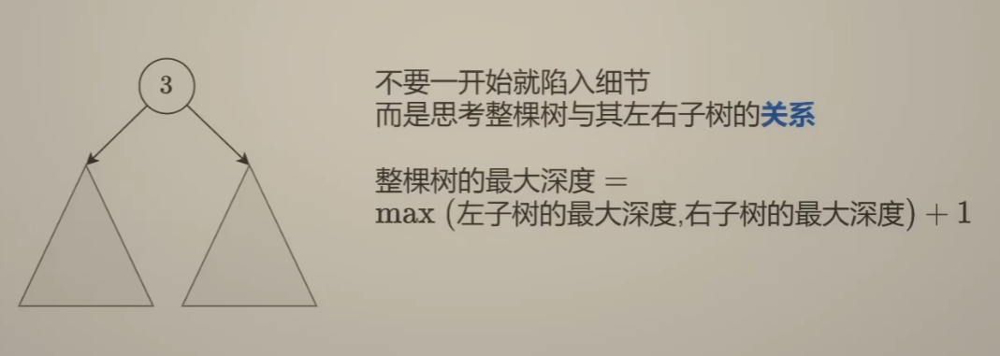

[104. 二叉树的最大深度 - 力扣（LeetCode）](https://leetcode.cn/problems/maximum-depth-of-binary-tree/description/)




## 递归方法

```java
class Solution {
    public int maxDepth(TreeNode root) {
        if (root == null) {
            return 0;
        }
        int left = maxDepth(root.left) ;  
        int right = maxDepth(root.right) ;
        return Math.max(left, right)+1;  //+1是加上当前节点
    }
}
```