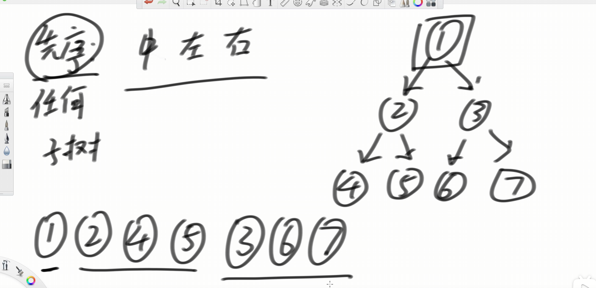

[144. 二叉树的前序遍历 - 力扣（LeetCode）](https://leetcode.cn/problems/binary-tree-preorder-traversal/description/)

[94. 二叉树的中序遍历 - 力扣（LeetCode）](https://leetcode.cn/problems/binary-tree-inorder-traversal/description/)

[145. 二叉树的后序遍历 - 力扣（LeetCode）](https://leetcode.cn/problems/binary-tree-postorder-traversal/description/)

# 递归写法

```java
public class TreeNode {
    int val;
    TreeNode left;
    TreeNode right;

    TreeNode() {
    }

    TreeNode(int val) {
        this.val = val;
    }

    TreeNode(int val, TreeNode left, TreeNode right) {
        this.val = val;
        this.left = left;
        this.right = right;
    }
}

class Solution {
    public List<Integer> preorderTraversal(TreeNode root) {
        List<Integer> ans = new ArrayList<>();
        preorder(root, ans);
        return ans;
    }

    public void preorder(TreeNode root, List<Integer> ans) {
        if (root == null) {
            return;
        } else {
            ans.add(root.val);
            preorder(root.left, ans);
            preorder(root.right, ans);
        }
    }
}
```

# 中序、后序同上


# 迭代写法




## 前序

```java
public class TreeNode {
    int val;
    TreeNode left;
    TreeNode right;

    TreeNode() {
    }

    TreeNode(int val) {
        this.val = val;
    }

    TreeNode(int val, TreeNode left, TreeNode right) {
        this.val = val;
        this.left = left;
        this.right = right;
    }
}

class Solution {
    public List<Integer> preorderTraversal(TreeNode root) {
        List<Integer> ans = new ArrayList<>();
        if (root == null){
            return ans;
        }
        Stack<TreeNode> stack = new Stack<>();
        stack.push(root);
        while (!stack.isEmpty()) {
            TreeNode node = stack.pop();
            ans.add(node.val);
            if (node.right != null) {
                stack.push(node.right);
            }
            if (node.left != null) {
                stack.push(node.left);
            }
        }
        return ans;
    }
}
```


## 中序

```java
public class TreeNode {
    int val;
    TreeNode left;
    TreeNode right;

    TreeNode() {
    }

    TreeNode(int val) {
        this.val = val;
    }

    TreeNode(int val, TreeNode left, TreeNode right) {
        this.val = val;
        this.left = left;
        this.right = right;
    }
}

class Solution {
    public List<Integer> inorderTraversal(TreeNode root) {
        List<Integer> ans = new ArrayList<>();
        TreeNode cur = root;
        Stack<TreeNode> stack = new Stack<>();
        while (cur != null || !stack.isEmpty()) {
            if (cur != null) {
                stack.push(cur);
                cur = cur.left;
            } else {
                cur = stack.pop();
                ans.add(cur.val);
                cur = cur.right;
            }

        }
        return ans;
    }
}
```


## 后序

### 需要翻转写法

我们在压栈的时候可以中左右，这样出栈的顺序是中右左，最后对list翻转，就是左右中。

```java
public class TreeNode {
    int val;
    TreeNode left;
    TreeNode right;

    TreeNode() {
    }

    TreeNode(int val) {
        this.val = val;
    }

    TreeNode(int val, TreeNode left, TreeNode right) {
        this.val = val;
        this.left = left;
        this.right = right;
    }
}

// 后序遍历顺序 左-右-中 入栈顺序：中-左-右 出栈顺序：中-右-左， 最后翻转结果
class Solution {
    public List<Integer> postorderTraversal(TreeNode root) {
        List<Integer> result = new ArrayList<>();
        if (root == null){
            return result;
        }
        Stack<TreeNode> stack = new Stack<>();
        stack.push(root);
        while (!stack.isEmpty()){
            TreeNode node = stack.pop();
            result.add(node.val);
            if (node.left != null){
                stack.push(node.left);
            }
            if (node.right != null){
                stack.push(node.right);
            }
        }
        Collections.reverse(result);
        return result;
    }
}
```

### 不需要翻转写法

这里说不需要翻转，其实和翻转差不多，这里多了一个栈2，这个栈2的顺序是中右左，那么最后在栈2弹出的时候就是左右中。

```java
public class TreeNode {
    int val;
    TreeNode left;
    TreeNode right;

    TreeNode() {
    }

    TreeNode(int val) {
        this.val = val;
    }

    TreeNode(int val, TreeNode left, TreeNode right) {
        this.val = val;
        this.left = left;
        this.right = right;
    }
}

class Solution {
    public List<Integer> postorderTraversal(TreeNode root) {
        List<Integer> result = new ArrayList<>();

        // 如果树为空，直接返回空结果
        if (root == null) {
            return result;
        }

        // 使用两个栈，一个用于遍历，另一个保存节点的结果
        Stack<TreeNode> stack1 = new Stack<>();
        Stack<TreeNode> stack2 = new Stack<>();
        stack1.push(root);
        while (!stack1.isEmpty()) {
            // 从stack1弹出节点并推入stack2
            TreeNode node = stack1.pop();
            stack2.push(node);
            // 先左后右压栈，保证stack2中的节点顺序是后序遍历
            if (node.left != null) {
                stack1.push(node.left);
            }
            if (node.right != null) {
                stack1.push(node.right);
            }
        }

        // stack2中的节点顺序即为后序遍历
        while (!stack2.isEmpty()) {
            result.add(stack2.pop().val);
        }

        return result;
    }
}
```