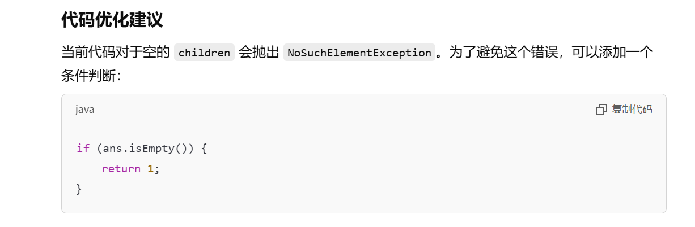
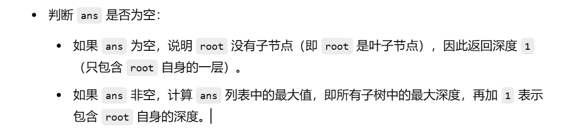

[559. N 叉树的最大深度 - 力扣（LeetCode）](https://leetcode.cn/problems/maximum-depth-of-n-ary-tree/description/)


# 错误写法

```
class Solution {
    public int maxDepth(Node root) {
        if (root == null) {
            return 0;
        }
        List<Integer> ans = new ArrayList<>();
        for (Node child : root.children) {
            ans.add(maxDepth(child));
        }
        return Collections.max(ans) + 1;
    }
}
```



上面的原因解释：假如递归到了叶子节点，叶子节点的孩子是空，但是这次递归已经创建了一个ans，这个ans就会是空，那么就会报出没有元素的的错误。也就是下面图片的解释



# 正确写法

```java
class Solution {
    public int maxDepth(Node root) {
        if (root == null) {
            return 0;
        }
        List<Integer> ans = new ArrayList<>();
        for (Node child : root.children) {
            ans.add(maxDepth(child));
        }
        return ans.isEmpty() ? 1 : Collections.max(ans) + 1;
    }
}
```


# 正确写法2（推荐的写法）

```java
class Solution {
    public int maxDepth(Node root) {
        if (root == null) {
            return 0;
        }
        int maxChildDepth = 0;
        List<Node> children = root.children;
        for (Node child : children) {
            int childDepth = maxDepth(child);
            maxChildDepth = Math.max(maxChildDepth, childDepth);
        }
        return maxChildDepth + 1;
    }
}
```


