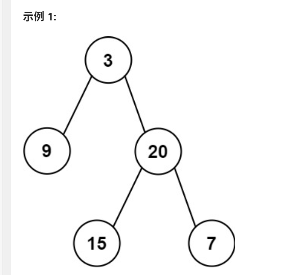
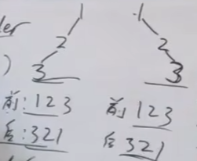

[106. 从中序与后序遍历序列构造二叉树 - 力扣（LeetCode）](https://leetcode.cn/problems/construct-binary-tree-from-inorder-and-postorder-traversal/)


可以参考视频：

[算法讲解036【必备】二叉树高频题目-上-不含树型dp_哔哩哔哩_bilibili](https://www.bilibili.com/video/BV1Rp4y1g7ys/?spm_id_from=333.999.0.0&vd_source=96c1635797a0d7626fb60e973a29da38)




中序：9 3 15 20 7

后序：9 15 7 20 3

首先要找到二叉树的根节点，很明显，是后序数组的最后一个值，3

然后在中序数组中找到3的位置（这里就可以用hashmap），然后切割中序数组

切割完之后，分别是 9 ，15 20 7，这里分别命名为左中序数组和左后序数组

此时，根节点的左子树就是一个节点9，右子树就是三个节点15 20 7

之后，切割后序数组，因为左子树一个节点，右子树就是三个节点，所以后序数组直接分别按照长度为1和3切割，切割完之后分别就是 9，15 7 20，这里分别命名为右中序数组和右后序数组

之后，递归处理左右区间，此时，root的左子树就用切割完后的左中序数组和左后序数组递归，root的右子树就用切割完后的右中序数组和右后序数组递归。

注意，这里递归切割数组时，要遵循不变量的原则，切割中序和后序都要遵循一个原则，比如左闭右开，或者左闭右闭等。




如上图，知道前序数组和后序数组不能完全确定一个二叉树，因为前序中root节点在第一个，后序中root节点在最后一个，但是root的左子树和右子树的切割点在这两个数组中都体现不出来，这就是中序数组重要的地方。


# 左闭右开写法

```java
class Solution {
    public TreeNode buildTree(int[] inorder, int[] postorder) {
        HashMap<Integer, Integer> map = new HashMap<>();
        for (int i = 0; i < inorder.length; i++) {
            map.put(inorder[i], i);  //将中序数组中的元素对应的索引放入map中，方便切割时查找
        }
        return dfs(map, inorder, 0, inorder.length, postorder, 0, postorder.length);
    }

    public TreeNode dfs(HashMap<Integer, Integer> map, int[] inorder, int inLeft, int inRight, int[] postorder, int postLeft, int postRight) {
        if (inLeft >= inRight || postLeft >= postRight) { //这里采用左闭右开的不变规则，这样结束条件就是>=，而不是>。
            return null;
        }
        int val = postorder[postRight-1];  //这里为什么-1？ 下午思考一下，
        // 思考的原因应该是：由于我一直设置左闭右开区间，所以postRight这个索引取不到，因为右开
        TreeNode root = new TreeNode(val); //后序数组的最后一个数作为root
        int index = map.get(val); //获取后序数组最后一个数在中序数组中的位置，方便切割。
        int length = index - inLeft;  //获取左子树的length
        root.left = dfs(map, inorder, inLeft, index, postorder, postLeft, postLeft + length);
        root.right = dfs(map, inorder, index + 1, inRight, postorder, postLeft + length, postRight - 1);
        return root;

    }
}
```


# 左闭右闭写法

```java
class Solution {
    public TreeNode buildTree(int[] inorder, int[] postorder) {
        HashMap<Integer, Integer> map = new HashMap<>();
        for (int i = 0; i < inorder.length; i++) {
            map.put(inorder[i], i);  //将中序数组中的元素对应的索引放入map中，方便切割时查找
        }
        //这里由于左闭右闭，右边界的值要为数组长度-1
        return dfs(map, inorder, 0, inorder.length - 1, postorder, 0, postorder.length - 1);
    }

    public TreeNode dfs(HashMap<Integer, Integer> map, int[] inorder, int inLeft, int inRight, int[] postorder, int postLeft, int postRight) {
        if (inLeft > inRight || postLeft > postRight) { //这里采用左闭右闭的不变规则，这样结束条件就是>=，而不是>。
            return null;
        }
        int val = postorder[postRight];
        TreeNode root = new TreeNode(val); //后序数组的最后一个数作为root
        int index = map.get(val); //获取后序数组最后一个数在中序数组中的位置，方便切割。
        int length = index - inLeft;  //获取左子树的length
        root.left = dfs(map, inorder, inLeft, index - 1, postorder, postLeft, postLeft + length - 1);
        root.right = dfs(map, inorder, index + 1, inRight, postorder, postLeft + length, postRight - 1);
        return root;

    }
}
```
