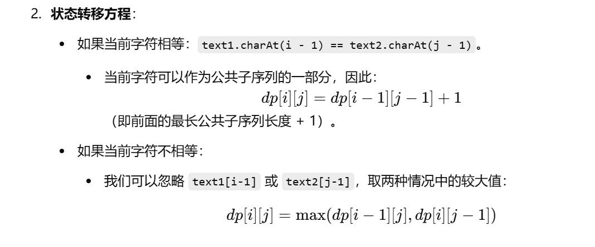

[代码随想录](https://www.programmercarl.com/1143.最长公共子序列.html)


```java
class Solution {
    public int longestCommonSubsequence(String text1, String text2) {

        //dp[i][j]表示前text1的以第i个字符为结尾与text2的第j个字符为结尾最长公共子序列
        int[][] dp = new int[text1.length() + 1][text2.length() + 1];

        //根据定义，dp数组的第一行与第一列无意义，默认为0


        for (int i = 1; i < text1.length() + 1; i++) {
            for (int j = 1; j < text2.length() + 1; j++) {
                if (text1.charAt(i - 1) == text2.charAt(j - 1)) {
                    dp[i][j] = dp[i - 1][j - 1] + 1;
                } else {
                    dp[i][j] = Math.max(dp[i - 1][j], dp[i][j - 1]);
                }
            }
        }

        return dp[text1.length()][text2.length()];
    }
}
```


------

### 问题背景

**题目**：最长公共子序列问题。

**目标**：在两个字符串 `text1` 和 `text2` 中，找到它们的最长公共子序列的长度。

**公共子序列**：是指两个字符串中都包含的一部分字符，并且这些字符的相对顺序不变。

------

### 代码结构分析

```
class Solution {
    public int longestCommonSubsequence(String text1, String text2) {
        int m = text1.length(); // 获取字符串 text1 的长度
        int n = text2.length(); // 获取字符串 text2 的长度
        
        // 定义 dp 数组，大小为 (m+1) x (n+1)
        int[][] dp = new int[m + 1][n + 1];
```

#### 动态规划数组的定义

1. **`dp[i][j]` 的含义**：
   - `dp[i][j]` 表示 **text1 的前 i 个字符** 和 **text2 的前 j 个字符** 的最长公共子序列的长度。
   - 注意：前 i 个字符是指从 `text1` 的第 1 个字符到第 `i` 个字符（包括第 `i` 个字符）。
2. **为什么是 `m+1` 和 `n+1`？**
   - 为了方便处理边界情况，`dp[0][*]` 和 `dp[*][0]` 都表示一个字符串为空时的情况。这样，数组的下标和字符串的长度对齐。

------

#### 初始化

```
     // dp 数组在这里其实已经初始化为全 0
        // 因为 Java 中，int 类型的二维数组创建后，默认值就是 0。
```

1. 当 `i == 0` 或 `j == 0` 时：
   - 即当一个字符串是空字符串时，最长公共子序列长度显然为 0。
   - 所以 `dp[0][*] = 0` 和 `dp[*][0] = 0` 都成立。
   - Java 默认数组值是 `0`，所以我们不需要手动初始化。

------

#### 填充 `dp` 数组

```
    // 逐步填充 dp 数组
        for (int i = 1; i <= m; i++) { // 遍历 text1 的每个字符
            for (int j = 1; j <= n; j++) { // 遍历 text2 的每个字符
                // 如果当前字符相等
                if (text1.charAt(i - 1) == text2.charAt(j - 1)) {
                    dp[i][j] = dp[i - 1][j - 1] + 1;
                } else {
                    dp[i][j] = Math.max(dp[i - 1][j], dp[i][j - 1]);
                }
            }
        }
```

1. **双重循环**：

   - 外层循环：遍历 `text1` 的每个字符。
   - 内层循环：遍历 `text2` 的每个字符。

2. **状态转移方程**：

   

------

#### 返回结果

```
   // 返回结果
        return dp[m][n];
    }
}
```

1. 最终结果：
   - `dp[m][n]` 表示 `text1` 的前 `m` 个字符和 `text2` 的前 `n` 个字符的最长公共子序列的长度。

------

### 示例运行过程

#### 输入

```


text1 = "abcde", text2 = "ace"
```

#### 初始化

- `m = 5`，`n = 3`。

- 初始 `dp` 数组：
  $$
  \begin{bmatrix} 0 & 0 & 0 & 0 \\ 0 & 0 & 0 & 0 \\ 0 & 0 & 0 & 0 \\ 0 & 0 & 0 & 0 \\ 0 & 0 & 0 & 0 \\ 0 & 0 & 0 & 0 \\ \end{bmatrix}
  $$
  

#### 填充 `dp`

1. `i = 1`，`j = 1`：

   - `text1[0] = 'a'`，`text2[0] = 'a'`，字符相等。

   - $$
     dp[1][1]=dp[0][0]+1=1
     $$

     

   - 更新 `dp`： 

   - $$
     \begin{bmatrix} 0 & 0 & 0 & 0 \\ 0 & 1 & 0 & 0 \\ 0 & 0 & 0 & 0 \\ 0 & 0 & 0 & 0 \\ 0 & 0 & 0 & 0 \\ 0 & 0 & 0 & 0 \\ \end{bmatrix}
     $$

     

2. `i = 1`，`j = 2`：

   - `text1[0] = 'a'`，`text2[1] = 'c'`，字符不相等。 

   - $$
     dp[1][2]=max⁡(dp[0][2],dp[1][1])=1
     $$

     

3. 继续计算，最终 `dp` 填充为：
   $$
   \begin{bmatrix} 0 & 0 & 0 & 0 \\ 0 & 1 & 1 & 1 \\ 0 & 1 & 1 & 1 \\ 0 & 1 & 2 & 2 \\ 0 & 1 & 2 & 2 \\ 0 & 1 & 2 & 3 \\ \end{bmatrix}
   $$
   

#### 输出

最终结果为 `dp[5][3] = 3`。
