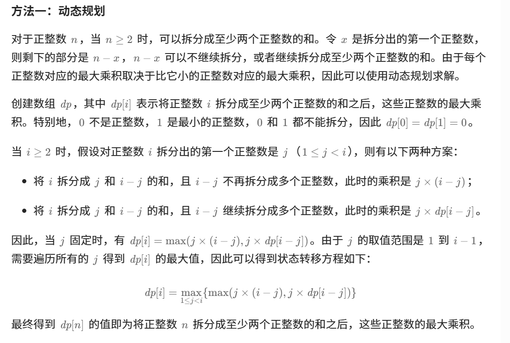

[代码随想录](https://www.programmercarl.com/0343.整数拆分.html#算法公开课)





```java
    class Solution {
        public int integerBreak(int n) {
            //dp[i]表示拆分i得到的乘积最大值
            int[] dp = new int[n + 1];
            dp[2] = 1;
            for (int i = 3; i < n + 1; i++) {
                for (int j = 1; j < i; j++) {
                    dp[i] = Math.max(dp[i], Math.max(j * (i - j), j * dp[i - j]));
                }
            }
            //打印dp数组
            for (int i = 0; i < dp.length; i++) {
                System.out.println(i + " " + dp[i]);
            }
            return dp[n];
        }
    }
```