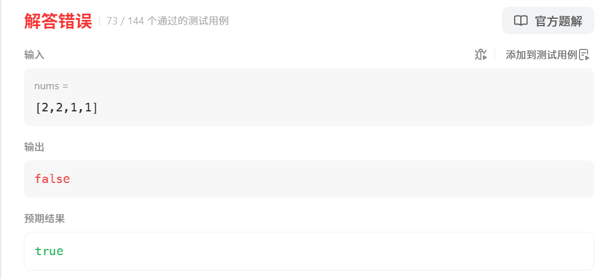

[代码随想录](https://www.programmercarl.com/0416.分割等和子集.html#算法公开课)


# 我的错误写法

我想的是直接对数组排序，然后求和再除以2，从后往前遍历数组，如果和等于这个值就返回true，但是下面这个测试用例不通过

```java
    class Solution {
        public boolean canPartition(int[] nums) {
            Arrays.sort(nums);
            int sum = 0;
            for (int num : nums) {
                sum += num;
            }
            if (sum % 2 == 1) {  //sum是奇数，返回false
                return false;
            }
            sum /= 2;
            int cur = 0;
            for (int i = nums.length - 1; i >= 0; i--) {
                cur += nums[i];
                if (cur == sum) {
                    return true;
                } else if (cur > sum) {
                    return false;
                }
            }
            return false;
        }
    }
```




# 正确写法，转换为0-1背包问题

```java
class Solution {
    public boolean canPartition(int[] nums) {
        int sum = 0;
        for (int num : nums) {
            sum += num;
        }
        if (sum % 2 == 1) {
            return false;
        }
        sum /= 2;  //要达到的目标值
        int N = nums.length;
        //0-1背包问题
        //nums[i] 表示物品i的重量
        //dp[j]表示容量为j的背包所承载的最大重量
        int[] dp = new int[sum + 1];
        dp[0] = 0;
        for (int i = 0; i < N; i++) {
            for (int j = dp.length - 1; j >= nums[i]; j--) {
                dp[j] = Math.max(dp[j], dp[j - nums[i]] + nums[i]);
            }
        }
        return dp[sum] == sum;
    }
}
```


# 剪枝一下

```java
class Solution {
    public boolean canPartition(int[] nums) {
        int sum = 0;
        for (int num : nums) {
            sum += num;
        }
        if (sum % 2 == 1) {
            return false;
        }
        sum /= 2;  //要达到的目标值
        int N = nums.length;
        //0-1背包问题
        //nums[i] 表示物品i的重量
        //dp[j]表示容量为j的背包所承载的最大重量
        int[] dp = new int[sum + 1];
        dp[0] = 0;
        for (int i = 0; i < N; i++) {
            for (int j = dp.length - 1; j >= nums[i]; j--) {
                dp[j] = Math.max(dp[j], dp[j - nums[i]] + nums[i]);
            }
            if (dp[sum] == sum) {
                return true;
            }
        }
        return dp[sum] == sum;
    }
}
```