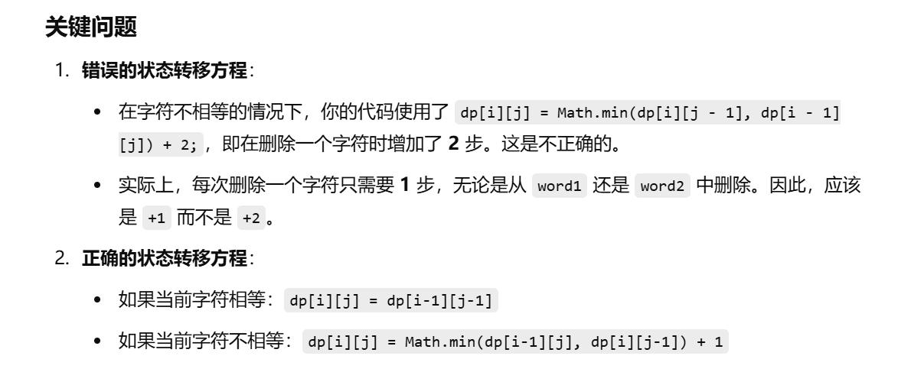

[代码随想录](https://www.programmercarl.com/0583.两个字符串的删除操作.html)


# 错误写法

```java
class Solution {
    public int minDistance(String word1, String word2) {

        int m = word1.length();
        int n = word2.length();

        //dp[i][j]表示和word1的前i个字符和word2的前j个字符达到相等需要删除的最小步数
        int[][] dp = new int[m + 1][n + 1];

        for (int i = 0; i < dp.length; i++) {
            dp[i][0] = i;
        }

        for (int j = 0; j < dp[0].length; j++) {
            dp[0][j] = j;
        }

        for (int i = 1; i < m + 1; i++) {
            for (int j = 1; j < n + 1; j++) {
                if (word1.charAt(i - 1) == word2.charAt(j - 1)) {
                    dp[i][j] = dp[i - 1][j - 1];
                } else {
                    dp[i][j] = Math.min(dp[i][j - 1], dp[i - 1][j]) + 2;
                }
            }
        }
        return dp[m][n];
    }
}
```





### **详细解释**

#### 1. **状态定义**

- `dp[i][j]` 表示将 `word1` 的前 `i` 个字符和 `word2` 的前 `j` 个字符变得相同所需的最小删除步数。

#### 2. **初始化**

- 将 `word1` 的前 `i` 个字符变为 `""`：
  - 需要删除 `i` 个字符，因此 `dp[i][0] = i`。
- 将 `""` 变为 `word2` 的前 `j` 个字符：
  - 需要删除 `j` 个字符，因此 `dp[0][j] = j`。

#### 3. **状态转移**

- 如果 `word1[i-1] == word2[j-1]`：

  - 这意味着当前字符已经匹配，无需删除。因此：
    $$
     dp[i][j]=dp[i−1][j−1]
    $$
    

- 如果 `word1[i-1] != word2[j-1]`：

  - 我们有两种选择：

    1. 删除 `word1[i-1]`，则需要处理 `word1` 的前 `i-1` 个字符和 `word2` 的前 `j` 个字符，因此：
       $$
       dp[i][j]=dp[i−1][j]+1
       $$
       
    2. 删除 `word2[j-1]`，则需要处理 `word1` 的前 `i` 个字符和 `word2` 的前 `j-1` 个字符，因此：
       $$
        dp[i][j]=dp[i][j−1]+1
       $$
       
    
  - 我们选择两者中的最小值： 
    $$
    dp[i][j]=min⁡(dp[i−1][j],dp[i][j−1])+1
    $$
    

#### 4. **最终结果**

- `dp[m][n]` 表示将整个 `word1` 和 `word2` 变得相同所需的最小删除步数。

### **时间和空间复杂度**

- **时间复杂度**：`O(m * n)`，其中 `m` 和 `n` 分别是 `word1` 和 `word2` 的长度。
- **空间复杂度**：`O(m * n)`，用于存储 `dp` 表。


# 正确写法

```java
class Solution {
    public int minDistance(String word1, String word2) {

        int m = word1.length();
        int n = word2.length();

        //dp[i][j]表示和word1的前i个字符和word2的前j个字符达到相等需要删除的最小步数
        int[][] dp = new int[m + 1][n + 1];

        for (int i = 0; i < dp.length; i++) {
            dp[i][0] = i;
        }

        for (int j = 0; j < dp[0].length; j++) {
            dp[0][j] = j;
        }

        for (int i = 1; i < m + 1; i++) {
            for (int j = 1; j < n + 1; j++) {
                if (word1.charAt(i - 1) == word2.charAt(j - 1)) {
                    dp[i][j] = dp[i - 1][j - 1];
                } else {
                    dp[i][j] = Math.min(dp[i][j - 1], dp[i - 1][j]) + 1;
                }
            }
        }
        return dp[m][n];
    }
}
```

