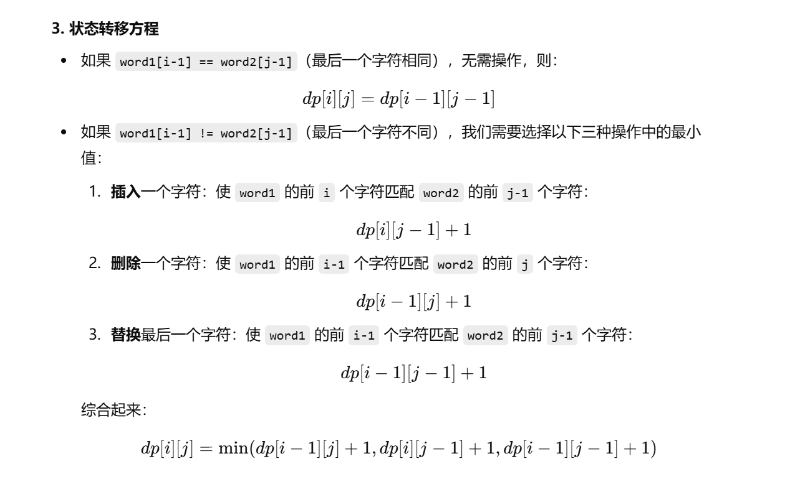
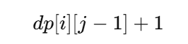

[代码随想录](https://www.programmercarl.com/0072.编辑距离.html#算法公开课)


[动态规划终极绝杀！ LeetCode：72.编辑距离_哔哩哔哩_bilibili](https://www.bilibili.com/video/BV1qv4y1q78f/?vd_source=96c1635797a0d7626fb60e973a29da38)


```java
class Solution {
    public int minDistance(String word1, String word2) {
        int m = word1.length();
        int n = word2.length();

        //dp[i][j]表示和word1的前i个字符转换为word2的前j个字符需要删除的最小步数
        int[][] dp = new int[m + 1][n + 1];

        for (int i = 0; i < dp.length; i++) {
            dp[i][0] = i;
        }

        for (int j = 0; j < dp[0].length; j++) {
            dp[0][j] = j;
        }

        for (int i = 1; i < m + 1; i++) {
            for (int j = 1; j < n + 1; j++) {
                if (word1.charAt(i - 1) == word2.charAt(j - 1)) {
                    dp[i][j] = dp[i - 1][j - 1];
                } else {
                    dp[i][j] = Math.min(Math.min(dp[i - 1][j], dp[i][j - 1]), // 删除或插入
                            dp[i - 1][j - 1]                     // 替换
                    ) + 1;  //这里的+1就代表删除、插入、替换等操作
                }
            }
        }
        return dp[m][n];
    }
}
```





其实插入和删除这里都可以用



或者


因为插入可以看作删除的一种逆向操作