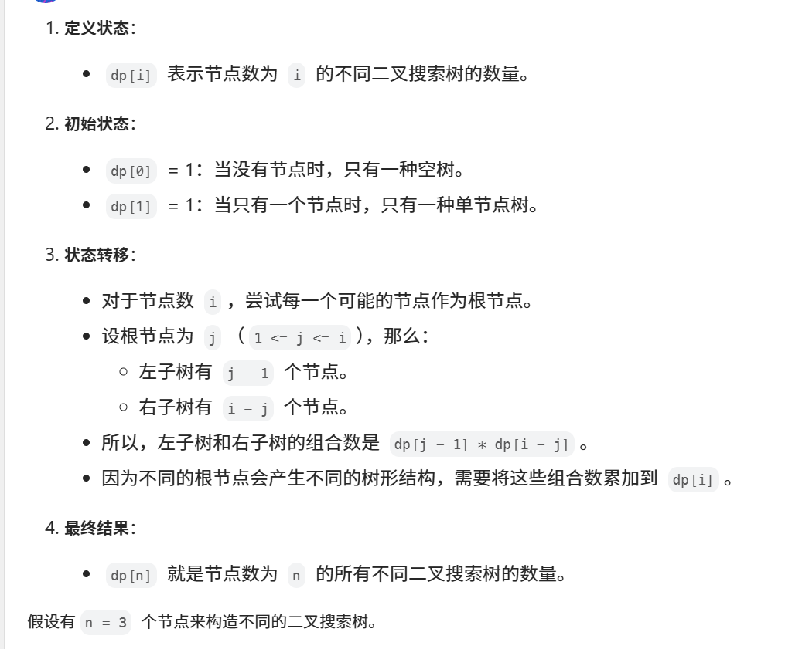

[代码随想录](https://www.programmercarl.com/0096.不同的二叉搜索树.html#算法公开课)





```java
class Solution {
    public int numTrees(int n) {
        if (n < 2) {
            return 1;
        }
        //dp[i]表示i个元素能构成的不同搜索二叉树数目
        int[] dp = new int[n + 1];
        dp[0] = 1;  //空树
        dp[1] = 1;
        dp[2] = 2;
        for (int i = 3; i < dp.length; i++) {
            for (int j = 1; j <= i; j++) {  //对根节点进行枚举
                dp[i] += dp[j - 1] * dp[i - j];
            }
        }
        return dp[n];
    }
}
```