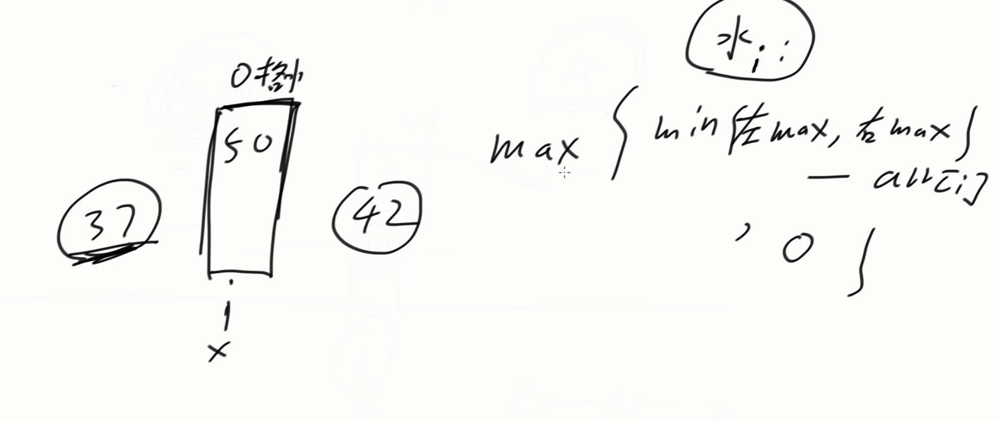
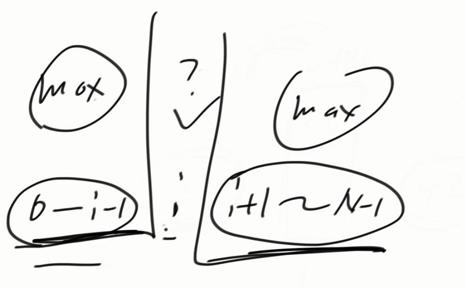

[代码随想录](https://www.programmercarl.com/0042.接雨水.html#算法公开课)


[单调栈，经典来袭！LeetCode:42.接雨水_哔哩哔哩_bilibili](https://www.bilibili.com/video/BV1uD4y1u75P/?vd_source=96c1635797a0d7626fb60e973a29da38)


[算法讲解050【必备】双指针技巧与相关题目_哔哩哔哩_bilibili](https://www.bilibili.com/video/BV1V841167Rg/?spm_id_from=333.1387.upload.video_card.click&vd_source=96c1635797a0d7626fb60e973a29da38)，讲了接雨水的双指针思路，讲的比较详细


# 一种基础且直观的做法

对于每一个位置来说，当前位置的存水量就是相当于当前位置左边的最大高度与右边位置的最大高度的最小值减去当前位置的高度，但是如果当前位置的高度大于左边的最大高度与右边位置的最大高度，此时当前位置的存水量就是0





所以我们只需要找到满足下面图片的一个结构，每来到一个位置i，计算0到i-1位置的高度的最大值，与i+1到n-1位置的高度的最大值，然后根据上图的计算公式计算一下就出来结果了。




```java
class Solution {
    public int trap(int[] height) {
        int n = height.length;

        //分别记录左边的最大高度和右边的最大高度
        int[] left = new int[n];
        int[] right = new int[n];
        left[0] = height[0];
        right[n - 1] = height[n - 1];
        for (int i = 1; i < n; i++) {
            left[i] = Math.max(height[i], left[i - 1]);
        }

        for (int i = n - 2; i >= 0; i--) {
            right[i] = Math.max(height[i], right[i + 1]);
        }

        //上面这样遍历完后，对于每一个i，left[i-1]和right[i+1]就是左边和右边的最大高度

        //最左边和最右边不存雨水，所以不遍历他们
        int sum = 0;
        for (int i = 1; i < n - 1; i++) {
            sum += Math.max(0, Math.min(left[i - 1], right[i + 1]) - height[i]);
        }

        return sum;
    }
}
```


# 双指针优化


双指针算法就是在上述基础算法中进行的优化


```java
class Solution {
    public int trap(int[] height) {
        int n = height.length;

        int sum = 0;
        int l = 1, r = n - 2;  //设置双指针的位置
        int lmax = height[0], rmax = height[n - 1];
        while (l <= r) {
            if (lmax > rmax) {
                sum += Math.max(0, rmax - height[r]);
                rmax = Math.max(height[r], rmax);
                r--;
            } else if (lmax < rmax) {
                sum += Math.max(0, lmax - height[l]);
                lmax = Math.max(height[l], lmax);
                l++;
            } else {
                //如果lmax=rmax，那么两边的水量都可以结算了，也可以结算一次
                //但是有个bug，就是当l=r时，且此时lmax=rmax，这样对于最后这个l=r的位置会结算两次，所以最好就结算一次
                sum += Math.max(0, lmax - height[l]);
                lmax = Math.max(height[l], lmax);
                l++;
            }
        }
        return sum;
    }
}
```
